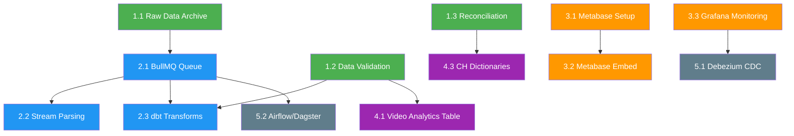

# Analytics Architecture Upgrade Plan

## Overview

Nâng cấp hệ thống phân tích dữ liệu cho nền tảng phân phối nhạc AG Release, từ kiến trúc hiện tại (NestJS custom ETL + PG + ClickHouse) lên hệ thống analytics production-grade với data quality, ETL orchestration, BI self-service, và monitoring.

**Project Type**: BACKEND (Infrastructure + Data Engineering)

### Hiện trạng

| Layer | Hiện tại | Đánh giá |
|-------|---------|----------|
| OLTP | PostgreSQL + TypeORM | ✅ Tốt |
| OLAP | ClickHouse (single node) | ✅ Tốt, cần thêm tables + cubes |
| ETL | NestJS custom (etl, report-import modules) | ⚠️ Hoạt động nhưng thiếu retry, archive, validation |
| Sync | Outbox Pattern + PG LISTEN/NOTIFY | ⚠️ OK cho scale hiện tại, cần reconciliation |
| Cache | Redis (ioredis) | ✅ Tốt |
| BI | Custom NestJS API endpoints | ⚠️ Mọi báo cáo mới = code mới |
| Monitoring | Basic Logger | ❌ Thiếu metrics, alerting, dashboards |

### Assumptions

- Data volume: 10-100M rows/tháng trong fact tables
- Team: 1-3 developers, chủ yếu TypeScript
- Budget: Ưu tiên self-hosted, open-source
- Scale: Growth stage (chưa cần Kafka cluster)

> Nếu khác thực tế, hãy điều chỉnh plan tương ứng.

---

## Success Criteria

| # | Metric | Target |
|---|--------|--------|
| 1 | Raw data archive | 100% DSP reports được lưu S3/GCS trước khi xử lý |
| 2 | ETL reliability | Retry + dead-letter cho mọi import job, <1% failure rate |
| 3 | Data freshness | Alert khi data trễ >24h so với expected |
| 4 | PG↔CH consistency | Daily reconciliation, drift <0.1% |
| 5 | BI self-service | Team nội bộ tự tạo dashboard trên Metabase |
| 6 | Query performance | P95 analytics API <500ms (cached), <3s (uncached) |
| 7 | Monitoring coverage | ETL metrics + CH metrics + API metrics trên Grafana |

---

## Tech Stack

### Giữ nguyên (đã có)

| Tech | Vai trò | Lý do giữ |
|------|---------|-----------|
| **PostgreSQL** | OLTP, business data | Stable, đã có schema + migrations |
| **ClickHouse** | OLAP, analytics | Đang dùng tốt, phù hợp workload |
| **Redis** | Cache, queues | Đã tích hợp sâu |
| **NestJS** | API server, simple cron jobs | Core framework, team quen thuộc |
| **TypeORM** | PG ORM | Đã có entities + migrations |

### Bổ sung mới

| Tech | Vai trò | Lý do chọn | Alternative đã cân nhắc |
|------|---------|------------|------------------------|
| **S3/GCS** | Raw data archive (Data Lake) | Rẻ, bền, serverless | MinIO (self-hosted) — chọn nếu muốn on-premise |
| **Metabase** | BI self-service | Free, ClickHouse native driver, embed được | Superset — mạnh hơn nhưng phức tạp |
| **Grafana + Prometheus** | Ops monitoring | Industry standard, free | Datadog — tốt hơn nhưng tốn phí |
| **BullMQ** (Redis-based) | Job queue cho ETL | Đã có Redis, TypeScript native, NestJS plugin | Airflow — overkill cho scale hiện tại |
| **dbt-core** | SQL transformations | Declarative, testable, version control | Custom TypeScript — đang dùng, khó maintain |

> **Tại sao BullMQ thay vì Airflow?**
> Team chủ yếu TypeScript, Airflow yêu cầu Python + infra riêng. BullMQ chạy trên Redis đang có,
> tích hợp NestJS native (`@nestjs/bullmq`). Khi scale lên → migrate sang Airflow/Dagster sau.

---

## File Structure (Dự kiến thay đổi/thêm mới)

```
src/
├── modules/
│   ├── analytics/
│   │   ├── services/
│   │   │   ├── analytics-cache.service.ts        ← [MODIFY] Multi-level cache
│   │   │   └── ...
│   │   └── ...
│   ├── clickhouse/
│   │   ├── clickhouse.constants.ts               ← [MODIFY] Thêm tables mới
│   │   ├── clickhouse-migration.service.ts       ← [MODIFY] Thêm migrations
│   │   └── ...
│   ├── data-quality/                             ← [NEW] Module
│   │   ├── data-quality.module.ts
│   │   ├── validators/
│   │   │   ├── schema-validator.service.ts       ← Validate DSP report schema
│   │   │   ├── dedup.service.ts                  ← Deduplication logic
│   │   │   └── range-check.service.ts            ← Business rule validation
│   │   └── reconciliation/
│   │       ├── reconciliation.service.ts         ← PG↔CH daily comparison
│   │       └── reconciliation.scheduler.ts       ← Cron trigger
│   ├── data-lake/                                ← [NEW] Module
│   │   ├── data-lake.module.ts
│   │   └── services/
│   │       ├── archive.service.ts                ← Upload raw to S3/GCS
│   │       └── retrieval.service.ts              ← Re-download for re-processing
│   ├── etl/
│   │   ├── services/
│   │   │   ├── import/                           ← [MODIFY] Thêm validation + archive
│   │   │   └── job/                              ← [MODIFY] BullMQ integration
│   │   └── ...
│   ├── metabase/                                 ← [NEW] Module
│   │   ├── metabase.module.ts
│   │   └── services/
│   │       ├── metabase-embed.service.ts         ← JWT signed embedding
│   │       └── metabase-sync.service.ts          ← Auto-sync new tables
│   └── monitoring/                               ← [NEW] Module
│       ├── monitoring.module.ts
│       ├── metrics/
│       │   ├── prometheus.service.ts             ← Export metrics
│       │   ├── etl-metrics.interceptor.ts        ← Track ETL job metrics
│       │   └── api-metrics.interceptor.ts        ← Track API latency
│       └── alerting/
│           ├── data-freshness.service.ts         ← Alert stale data
│           └── anomaly-detection.service.ts      ← View/revenue spikes
│
├── dbt/                                          ← [NEW] dbt project
│   ├── dbt_project.yml
│   ├── profiles.yml                              ← ClickHouse connection
│   ├── models/
│   │   ├── staging/
│   │   │   ├── stg_dsp_reports.sql               ← Clean raw DSP data
│   │   │   └── stg_exchange_rates.sql
│   │   └── marts/
│   │       ├── mart_track_performance.sql        ← Track views/revenue aggregated
│   │       ├── mart_release_analytics.sql        ← Release-level analytics
│   │       ├── mart_artist_royalties.sql         ← Artist revenue splits
│   │       ├── mart_video_analytics.sql          ← Video performance
│   │       └── mart_territory_breakdown.sql      ← Geographic distribution
│   └── tests/
│       ├── assert_no_negative_revenue.sql
│       └── assert_unique_isrc_per_period.sql
│
docker/
├── docker-compose.monitoring.yml                 ← [NEW] Grafana + Prometheus
└── grafana/
    └── dashboards/
        ├── clickhouse-overview.json              ← CH monitoring dashboard
        └── etl-pipeline.json                     ← ETL metrics dashboard
```

---

## Task Breakdown

### Phase 1: Data Quality Foundation (Tuần 1-4)

> Mục tiêu: Đảm bảo data chính xác trước khi xử lý, archive raw data, phát hiện drift.

---

#### Task 1.1: Raw Data Archive (Data Lake)

| Field | Detail |
|-------|--------|
| **Agent** | `backend-specialist` |
| **Skills** | `@clean-code`, `@nodejs-best-practices` |
| **Priority** | P0 — Blocker cho mọi task khác |
| **Dependencies** | None |
| **Estimated** | 2-3 ngày |

**INPUT**: DSP report files (CSV/XLSX) downloaded từ FTP
**OUTPUT**: Mọi raw file được upload lên S3/GCS TRƯỚC KHI parse, với path: `s3://ag-raw-reports/{dsp}/{year}/{month}/{filename}`
**VERIFY**: 
- [ ] File được upload thành công trước khi ETL parse
- [ ] Có metadata tracking: `file_path`, `uploaded_at`, `file_hash` (MD5)
- [ ] Re-download API hoạt động cho re-processing

**Tech nghiên cứu**:

| Công cụ | Tìm hiểu gì | Resource |
|---------|-------------|----------|
| **AWS S3 SDK** | `@aws-sdk/client-s3` (đã có trong package.json) | [AWS S3 SDK v3 docs](https://docs.aws.amazon.com/AWSJavaScriptSDK/v3/latest/client/s3/) |
| **GCS** | `@google-cloud/storage` (đã có trong package.json) | [GCS Node.js docs](https://cloud.google.com/storage/docs/reference/libraries#client-libraries-install-nodejs) |
| **Partitioned Storage** | Hive-style partitioning `dsp=spotify/year=2026/month=06/` | Tìm: "S3 hive partitioning best practices" |
| **Lifecycle Policies** | Auto-move sang cold storage sau 90 ngày | S3 Lifecycle Rules / GCS Object Lifecycle |

---

#### Task 1.2: Data Validation Layer

| Field | Detail |
|-------|--------|
| **Agent** | `backend-specialist` |
| **Skills** | `@clean-code`, `@testing-patterns` |
| **Priority** | P0 |
| **Dependencies** | None (parallel với 1.1) |
| **Estimated** | 3-4 ngày |

**INPUT**: Parsed DSP report data (trước khi INSERT ClickHouse)
**OUTPUT**: Validation service reject bad data, log violations, alert on high error rate
**VERIFY**:
- [ ] Schema validation: required columns exist, data types correct
- [ ] Range check: no negative views, revenue within expected bounds
- [ ] Null check: ISRC, report_date, DSP code not null
- [ ] Duplicate check: same ISRC + period + DSP = reject/merge
- [ ] Validation report lưu vào `import_jobs` table

**Tech nghiên cứu**:

| Công cụ | Tìm hiểu gì | Resource |
|---------|-------------|----------|
| **Joi** (đã có) | Schema validation cho DSP report fields | [Joi API docs](https://joi.dev/api/) |
| **ClickHouse ReplacingMergeTree** | Dedup strategy trên fact tables | [ReplacingMergeTree docs](https://clickhouse.com/docs/en/engines/table-engines/mergetree-family/replacingmergetree) |
| **Data quality patterns** | Great Expectations (Python) hoặc custom validation | Tìm: "data quality validation patterns typescript" |

---

#### Task 1.3: PG↔ClickHouse Reconciliation

| Field | Detail |
|-------|--------|
| **Agent** | `backend-specialist` |
| **Skills** | `@clean-code`, `@systematic-debugging` |
| **Priority** | P1 |
| **Dependencies** | None |
| **Estimated** | 2-3 ngày |

**INPUT**: PG dimension tables (tracks, artists, labels, DSPs) + CH sync tables
**OUTPUT**: Daily cron so sánh row counts + checksums, tự động re-sync missing records
**VERIFY**:
- [ ] Reconciliation chạy daily 3AM UTC
- [ ] Report: PG count vs CH count, missing IDs, stale records
- [ ] Auto re-sync nếu drift <100 records
- [ ] Alert (Telegram) nếu drift >100 records hoặc >0.1%

**Tech nghiên cứu**:

| Concept | Tìm hiểu gì | Resource |
|---------|-------------|----------|
| **Checksum comparison** | MD5/SHA1 trên sorted ID lists | Tìm: "database reconciliation checksum pattern" |
| **Outbox improvements** | Retry + dead-letter pattern | Tìm: "transactional outbox pattern retry dead letter" |
| **Eventual consistency** | Monitoring cho eventual consistent systems | Martin Fowler - "Eventual Consistency" article |

---

### Phase 2: ETL Maturity (Tuần 5-10)

> Mục tiêu: ETL pipeline robust với retry, monitoring, queue management.

---

#### Task 2.1: BullMQ Job Queue Integration

| Field | Detail |
|-------|--------|
| **Agent** | `backend-specialist` |
| **Skills** | `@nodejs-best-practices`, `@clean-code` |
| **Priority** | P0 |
| **Dependencies** | Task 1.1 (archive trước khi process) |
| **Estimated** | 4-5 ngày |

**INPUT**: Current cron-based ETL jobs
**OUTPUT**: ETL jobs chạy qua BullMQ với retry, concurrency control, progress tracking
**VERIFY**:
- [ ] DSP import jobs chạy qua BullMQ queue
- [ ] Failed jobs retry 3 lần với exponential backoff
- [ ] Dead-letter queue cho permanent failures
- [ ] Bull Board UI accessible cho monitoring
- [ ] Job progress trackable (% complete)

**Tech nghiên cứu**:

| Công cụ | Tìm hiểu gì | Resource |
|---------|-------------|----------|
| **BullMQ** | Queue, Worker, Job lifecycle, retry strategies | [BullMQ docs](https://docs.bullmq.io/) |
| **@nestjs/bullmq** | NestJS integration, decorators | [NestJS Queue docs](https://docs.nestjs.com/techniques/queues) |
| **Bull Board** | Web UI cho monitoring queues | [Bull Board GitHub](https://github.com/felixmosh/bull-board) |
| **Rate Limiting** | Throttle concurrent imports | BullMQ Rate Limiter docs |
| **Job Patterns** | Parent-child jobs, flows | BullMQ Flows docs |

---

#### Task 2.2: Stream Parsing (thay in-memory)

| Field | Detail |
|-------|--------|
| **Agent** | `backend-specialist` |
| **Skills** | `@nodejs-best-practices`, `@performance-profiling` |
| **Priority** | P1 |
| **Dependencies** | Task 2.1 |
| **Estimated** | 3-4 ngày |

**INPUT**: Large DSP CSV files (100MB-1GB)
**OUTPUT**: Stream-based parsing không load toàn bộ file vào RAM
**VERIFY**:
- [ ] Parse file 500MB+ mà memory usage <200MB
- [ ] Backpressure handling khi CH insert chậm hơn parse speed
- [ ] Progress reporting (rows processed / estimated total)

**Tech nghiên cứu**:

| Concept | Tìm hiểu gì | Resource |
|---------|-------------|----------|
| **Node.js Streams** | Readable, Writable, Transform, Pipeline | [Node.js Stream docs](https://nodejs.org/api/stream.html) |
| **csv-parse streaming** | `csv-parse` stream mode (đã có dependency) | [csv-parse stream docs](https://csv.js.org/parse/api/stream/) |
| **Backpressure** | `highWaterMark`, `.pause()`, `.resume()` | Tìm: "node.js stream backpressure explained" |
| **Pipeline** | `stream.pipeline()` for error propagation | Node.js `stream.pipeline` docs |

---

#### Task 2.3: dbt Transformations (từng bước)

| Field | Detail |
|-------|--------|
| **Agent** | `backend-specialist` (hoặc data engineer nếu có) |
| **Skills** | `@architecture`, `@database-design` |
| **Priority** | P2 |
| **Dependencies** | Task 1.2 (validation), Task 2.1 (queue) |
| **Estimated** | 5-7 ngày (setup + first models) |

**INPUT**: Raw fact data trong ClickHouse
**OUTPUT**: dbt models cho staging (clean) + marts (aggregated) — chạy được qua CLI
**VERIFY**:
- [ ] `dbt run` thành công trên ClickHouse
- [ ] `dbt test` pass (unique, not_null, accepted_values)
- [ ] Staging models: clean DSP data, normalize currencies
- [ ] Mart models: track performance, release analytics, territory breakdown
- [ ] dbt docs site accessible

**Tech nghiên cứu**:

| Công cụ | Tìm hiểu gì | Resource |
|---------|-------------|----------|
| **dbt-core** | Installation, project setup, CLI | [dbt docs](https://docs.getdbt.com/docs/introduction) |
| **dbt-clickhouse** | ClickHouse adapter cho dbt | [dbt-clickhouse GitHub](https://github.com/ClickHouse/dbt-clickhouse) |
| **dbt models** | `ref()`, `source()`, materializations | [dbt best practices](https://docs.getdbt.com/best-practices) |
| **dbt tests** | Schema tests, custom tests | dbt testing docs |
| **Jinja SQL** | Templating trong dbt | dbt Jinja docs |

> **Bắt đầu nhỏ**: Tạo 2-3 staging models trước (stg_dsp_reports, stg_exchange_rates).
> Khi đã quen → mở rộng sang mart models. Không cần migrate toàn bộ TypeScript logic sang dbt cùng lúc.

---

### Phase 3: BI & Monitoring (Tuần 8-14)

> Mục tiêu: Self-service BI cho team nội bộ, monitoring cho ETL + ClickHouse.

---

#### Task 3.1: Metabase Setup + ClickHouse Connection

| Field | Detail |
|-------|--------|
| **Agent** | `backend-specialist` |
| **Skills** | `@deployment-procedures`, `@server-management` |
| **Priority** | P1 |
| **Dependencies** | None (parallel với Phase 2) |
| **Estimated** | 1-2 ngày |

**INPUT**: ClickHouse database với existing tables
**OUTPUT**: Metabase running, connected to ClickHouse, basic dashboards created
**VERIFY**:
- [ ] Metabase chạy trên Docker (đã bắt đầu: `docker-compose.metabase.yml`)
- [ ] ClickHouse datasource connected
- [ ] 3 sample dashboards: Overview, Track Performance, Revenue by DSP
- [ ] User accounts cho team members

**Tech nghiên cứu**:

| Công cụ | Tìm hiểu gì | Resource |
|---------|-------------|----------|
| **Metabase** | Setup, administration, question builder | [Metabase docs](https://www.metabase.com/docs/latest/) |
| **Metabase ClickHouse driver** | Native driver setup | [Metabase CH driver](https://github.com/enqueue/metabase-clickhouse-driver) |
| **Metabase Collections** | Organize dashboards per team/tenant | Metabase Collections docs |
| **Metabase Embedding** | JWT signed embedding | [Embedding docs](https://www.metabase.com/docs/latest/embedding/signed-embedding) |

---

#### Task 3.2: Metabase Embedded trong NestJS

| Field | Detail |
|-------|--------|
| **Agent** | `backend-specialist` |
| **Skills** | `@api-patterns`, `@clean-code` |
| **Priority** | P2 |
| **Dependencies** | Task 3.1 |
| **Estimated** | 2-3 ngày |

**INPUT**: Metabase dashboards + NestJS auth system
**OUTPUT**: API endpoint tạo signed JWT → frontend embed Metabase dashboard đã filter theo tenant
**VERIFY**:
- [ ] `GET /analytics/embed/:dashboardId` trả về signed iframe URL
- [ ] Dashboard auto-filter theo `tenant_id` của authenticated user
- [ ] Token expire sau 10 phút
- [ ] Tenant A không thể thấy data tenant B

---

#### Task 3.3: Grafana + Prometheus Monitoring

| Field | Detail |
|-------|--------|
| **Agent** | `backend-specialist` |
| **Skills** | `@server-management`, `@deployment-procedures` |
| **Priority** | P1 |
| **Dependencies** | None |
| **Estimated** | 3-4 ngày |

**INPUT**: NestJS app + ClickHouse + ETL jobs
**OUTPUT**: Grafana dashboards cho ETL metrics, CH performance, API latency
**VERIFY**:
- [ ] Prometheus scrape NestJS `/metrics` endpoint
- [ ] ETL metrics: `etl_job_duration_seconds`, `etl_rows_processed_total`, `etl_job_failures_total`
- [ ] CH metrics: query latency P50/P95/P99, active queries, merge operations
- [ ] API metrics: request count, latency histogram, error rate
- [ ] Data freshness alert: notify khi last report date > 48h ago

**Tech nghiên cứu**:

| Công cụ | Tìm hiểu gì | Resource |
|---------|-------------|----------|
| **Prometheus** | Metrics collection, PromQL basics | [Prometheus docs](https://prometheus.io/docs/introduction/overview/) |
| **prom-client** | Node.js Prometheus client | [prom-client npm](https://www.npmjs.com/package/prom-client) |
| **Grafana** | Dashboard creation, alerting | [Grafana docs](https://grafana.com/docs/grafana/latest/) |
| **ClickHouse exporter** | CH metrics cho Prometheus | [clickhouse-exporter](https://github.com/ClickHouse/clickhouse_exporter) |
| **Grafana alerting** | Alert rules, notification channels | Grafana Alerting docs |

---

### Phase 4: ClickHouse Advanced (Tuần 12-18)

> Mục tiêu: Tối ưu ClickHouse cho performance và mở rộng analytics domain.

---

#### Task 4.1: Video Analytics Table

| Field | Detail |
|-------|--------|
| **Agent** | `backend-specialist` |
| **Skills** | `@database-design`, `@architecture` |
| **Priority** | P1 |
| **Dependencies** | Task 1.2 (validation) |
| **Estimated** | 3-4 ngày |

**INPUT**: Video view data từ DSPs (YouTube Content ID, etc.)
**OUTPUT**: `fact_video_analytics` table + materialized views cho aggregation
**VERIFY**:
- [ ] Table created với proper partitioning (by month) và ordering key
- [ ] ETL pipeline import video data
- [ ] Materialized views cho daily/monthly aggregation
- [ ] API endpoints cho video analytics

**Tech nghiên cứu**:

| Concept | Tìm hiểu gì | Resource |
|---------|-------------|----------|
| **ClickHouse table design** | Partition key, ORDER BY, PRIMARY KEY | [CH table design guide](https://clickhouse.com/docs/en/guides/creating-tables) |
| **Materialized Views** | Auto-aggregate on INSERT | [CH Materialized Views](https://clickhouse.com/docs/en/guides/developer/cascading-materialized-views) |
| **MergeTree tuning** | `index_granularity`, `min_bytes_for_wide_part` | CH MergeTree settings docs |

---

#### Task 4.2: Multi-level Cache Strategy

| Field | Detail |
|-------|--------|
| **Agent** | `backend-specialist` |
| **Skills** | `@performance-profiling`, `@clean-code` |
| **Priority** | P2 |
| **Dependencies** | None |
| **Estimated** | 2-3 ngày |

**INPUT**: Current single-layer Redis cache
**OUTPUT**: 3-tier cache: in-memory (LRU) → Redis → ClickHouse query cache
**VERIFY**:
- [ ] L1: In-process LRU cache (10s TTL) cho hot queries
- [ ] L2: Redis cache (5min TTL) cho dashboard data
- [ ] L3: ClickHouse query cache (built-in, 1h TTL)
- [ ] Cache invalidation khi ETL import mới
- [ ] Cache hit rate metric exposed to Prometheus

**Tech nghiên cứu**:

| Concept | Tìm hiểu gì | Resource |
|---------|-------------|----------|
| **LRU Cache** | `lru-cache` (đã có dependency) | [lru-cache npm](https://www.npmjs.com/package/lru-cache) |
| **Cache-aside pattern** | Read-through, write-through, invalidation | Tìm: "cache-aside pattern explained" |
| **CH query cache** | `use_query_cache = 1` setting | [CH Query Cache](https://clickhouse.com/docs/en/operations/query-cache) |

---

#### Task 4.3: ClickHouse Dictionaries (Dimension Lookup)

| Field | Detail |
|-------|--------|
| **Agent** | `backend-specialist` |
| **Skills** | `@database-design` |
| **Priority** | P2 |
| **Dependencies** | Task 1.3 (reconciliation đảm bảo data đúng) |
| **Estimated** | 2 ngày |

**INPUT**: PG dimension tables synced vào CH (pg_tracks_sync, pg_dsps_sync)
**OUTPUT**: ClickHouse Dictionaries cho fast lookup thay vì JOIN
**VERIFY**:
- [ ] Dictionary cho: countries, DSPs, currencies
- [ ] Query dùng `dictGet()` thay vì JOIN → nhanh hơn 5-10x
- [ ] Auto-refresh dictionary khi source data update

**Tech nghiên cứu**:

| Concept | Tìm hiểu gì | Resource |
|---------|-------------|----------|
| **CH Dictionaries** | External dictionaries, sources, layouts | [CH Dictionaries docs](https://clickhouse.com/docs/en/sql-reference/dictionaries) |
| **dictGet()** | Function thay thế JOIN | CH SQL reference |

---

### Phase 5: Scale Preparation (Tuần 16-24, khi cần)

> Mục tiêu: Chuẩn bị scale khi data volume tăng. CHỈ thực hiện khi metrics cho thấy cần.

---

#### Task 5.1: Debezium CDC (thay Outbox Pattern)

| Field | Detail |
|-------|--------|
| **Agent** | `backend-specialist` |
| **Skills** | `@architecture`, `@deployment-procedures` |
| **Priority** | P3 — CHỈ khi outbox pattern bắt đầu bottleneck |
| **Dependencies** | Phase 3 (monitoring phải có trước để đo) |
| **Estimated** | 5-7 ngày |
| **Trigger** | Entity changes > 10K/phút HOẶC outbox scan lag > 30s |

**Tech nghiên cứu**:

| Công cụ | Tìm hiểu gì | Resource |
|---------|-------------|----------|
| **Debezium** | PostgreSQL connector, configuration | [Debezium PG docs](https://debezium.io/documentation/reference/stable/connectors/postgresql.html) |
| **Apache Kafka** | Topics, consumers, partitions | [Kafka docs](https://kafka.apache.org/documentation/) |
| **Redpanda** | Kafka-compatible, simpler ops | [Redpanda docs](https://docs.redpanda.com/) |
| **ClickHouse Kafka Engine** | Direct ingestion từ Kafka | [CH Kafka Engine](https://clickhouse.com/docs/en/engines/table-engines/integrations/kafka) |
| **CDC patterns** | Log-based vs trigger-based CDC | Tìm: "change data capture patterns comparison" |

---

#### Task 5.2: Apache Airflow / Dagster (thay BullMQ cho complex DAGs)

| Field | Detail |
|-------|--------|
| **Agent** | `backend-specialist` |
| **Priority** | P3 — CHỈ khi ETL pipelines > 10 DAGs hoặc cần cross-system orchestration |
| **Trigger** | BullMQ không đủ cho complex dependency chains |

**Tech nghiên cứu**:

| Công cụ | Tìm hiểu gì | Resource |
|---------|-------------|----------|
| **Apache Airflow** | DAGs, operators, connections, UI | [Airflow docs](https://airflow.apache.org/docs/) |
| **Dagster** | Assets, ops, schedules (modern alternative) | [Dagster docs](https://docs.dagster.io/) |
| **Astronomer** | Managed Airflow | [Astronomer docs](https://www.astronomer.io/) |

---

#### Task 5.3: ClickHouse Cluster

| Field | Detail |
|-------|--------|
| **Priority** | P3 — CHỈ khi single-node CH đạt giới hạn (data > 1TB hoặc query latency > 10s) |
| **Trigger** | Disk usage > 70% HOẶC P95 query latency > 5s |

**Tech nghiên cứu**:

| Concept | Tìm hiểu gì | Resource |
|---------|-------------|----------|
| **CH Cluster** | Sharding, replication, distributed tables | [CH Cluster docs](https://clickhouse.com/docs/en/architecture/cluster-deployment) |
| **ClickHouse Cloud** | Managed alternative | [CH Cloud](https://clickhouse.com/cloud) |
| **ClickHouse Keeper** | ZooKeeper replacement | CH Keeper docs |

---

## Dependency Graph



```
Legend:
🟢 Phase 1 — Data Quality Foundation (Week 1-4)
🔵 Phase 2 — ETL Maturity (Week 5-10)
🟠 Phase 3 — BI & Monitoring (Week 8-14, parallel)
🟣 Phase 4 — ClickHouse Advanced (Week 12-18)
⚫ Phase 5 — Scale Preparation (When needed)
```

---

## Timeline Tổng quan

```
Week:  1  2  3  4  5  6  7  8  9  10  11  12  13  14  15  16  17  18
       ├──────────────┤
       Phase 1: Data Quality
                      ├────────────────────┤
                      Phase 2: ETL Maturity
                            ├──────────────────────────┤
                            Phase 3: BI & Monitoring
                                              ├────────────────────────┤
                                              Phase 4: CH Advanced
                                                                 ├─── Phase 5 (on-demand) ───→
```

---

## Phase X: Verification Checklist

> Sau mỗi Phase, verify trước khi sang Phase tiếp theo.

### After Phase 1
- [ ] Raw files archive to S3/GCS working
- [ ] Validation rejects bad data with clear error messages
- [ ] Reconciliation cron running, reports generated
- [ ] Zero data loss during import (raw always preserved)

### After Phase 2
- [ ] ETL jobs run via BullMQ with retry
- [ ] Dead-letter queue captures permanent failures
- [ ] Stream parsing handles 500MB+ files
- [ ] dbt models produce correct aggregations
- [ ] `dbt test` passes on all models

### After Phase 3
- [ ] Metabase accessible, dashboards created
- [ ] Embedded dashboard works with tenant isolation
- [ ] Grafana shows ETL + CH + API metrics
- [ ] Data freshness alert fires within 1h of threshold

### After Phase 4
- [ ] Video analytics table populated and queryable
- [ ] Cache hit rate >60% for dashboard queries
- [ ] ClickHouse dictionaries reduce JOIN query time

### Overall
- [ ] All success criteria met (see table at top)
- [ ] No P0 security issues
- [ ] Documentation updated for new modules
