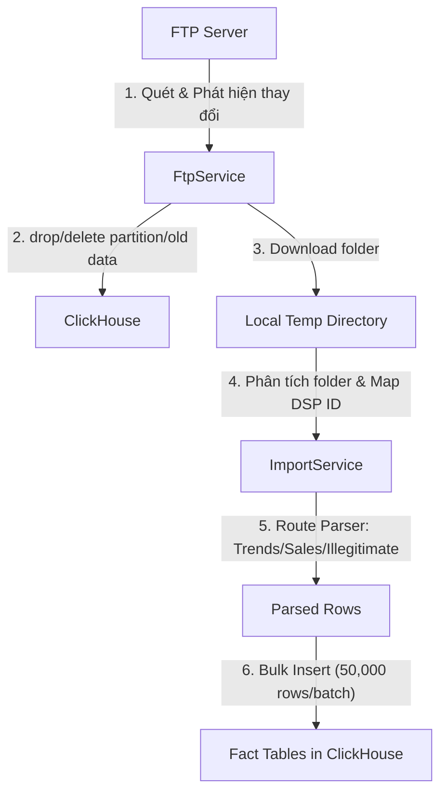
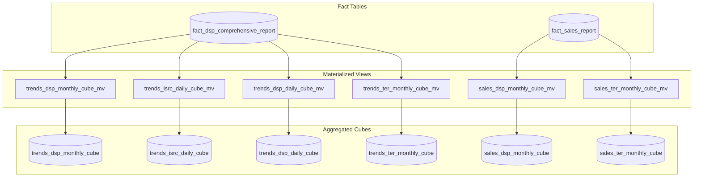
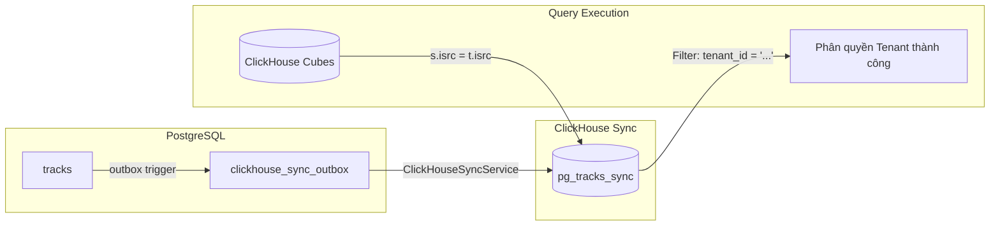

# Tài Liệu Hướng Xử Lý Dữ Liệu và Hệ Thống Analytics (ClickHouse & NestJS)

Tài liệu này mô tả chi tiết luồng xử lý dữ liệu (ETL) từ FTP đến các bảng thực tế (Fact Tables), cơ chế tổng hợp dữ liệu thành các khối lập phương (Cubes) thông qua Materialized Views trong ClickHouse, các API Analytics hiện tại và logic phân quyền Multi-Tenant.

---

## 1. Luồng Xử Lý Dữ Liệu (ETL): FTP -> Fact Tables

Hệ thống sử dụng dịch vụ `SyncService` kết hợp với `FtpService` và `ImportService` để thực hiện việc đồng bộ và lưu trữ dữ liệu từ FTP. Dưới đây là chi tiết từng bước:



### Bước 1: Quét FTP và Phát Hiện Thay Đổi (Change Detection)
* Dịch vụ được kích hoạt thủ công qua API hoặc tự động thông qua **Cron Job** (`0 2 * * *`).
* `FtpService` kết nối tới máy chủ FTP (sử dụng giao thức FTPS Explicit TLS) và thực hiện liệt kê các thư mục dạng chu kỳ `YYYYMM` (ví dụ: `202606`) nằm trong các nhóm danh mục:
  * `/root/trends/` (Dữ liệu xu hướng - lượt nghe thô hàng ngày)
  * `/root/usage/` (Dữ liệu lượt nghe thô)
  * `/root/sales/` (Dữ liệu doanh thu và lượt nghe đối soát chính thức)
  * `/root/illegitimate_activity/` (Dữ liệu lượt nghe gian lận/ảo)
* **Smart Incremental Sync (Cơ chế đồng bộ thông minh)**:
  * Đối với từng thư mục DSP (ví dụ: `/root/trends/202606/spotify`), hệ thống so sánh danh sách tệp hiện tại trên FTP với trường `files_list` được lưu trong bảng `etl_import_history` (ReplacingMergeTree).
  * Nếu danh sách tệp giống nhau và không sử dụng tham số `force = true`, hệ thống sẽ **bỏ qua (skip)** không tải lại.
  * Nếu danh sách tệp khác biệt, hệ thống sẽ tiến hành xóa dữ liệu cũ của phân đoạn đó bằng câu lệnh `ALTER TABLE DELETE` để tránh trùng lặp dữ liệu, sau đó tải thư mục đó về thư mục tạm cục bộ (`os.tmpdir()/etl-import`).
* **Trường hợp Force Re-sync (`force = true`)**:
  * Thay vì sử dụng câu lệnh `ALTER TABLE DELETE` (là thao tác mutation dòng khá chậm trong ClickHouse), hệ thống tối ưu bằng cách trực tiếp drop toàn bộ partition tháng đó thông qua lệnh:
    ```sql
    ALTER TABLE music_analytics.fact_dsp_comprehensive_report DROP PARTITION 'YYYYMM';
    ALTER TABLE music_analytics.fact_sales_report DROP PARTITION 'YYYYMM';
    ```
    Đây là thao tác siêu nhanh ở mức hệ thống tệp tin của ClickHouse.

### Bước 2: Chuẩn Hóa DSP ID (DSP Resolution)
* Do cấu trúc thư mục trên FTP chứa các tên DSP không đồng nhất (như `spotify`, `dzr-deezer`), hệ thống sử dụng `DspMappingService.resolveOrCreateDspReport(folderName, 'ftp_folder')` để phân giải và ánh xạ tên thư mục sang một UUID duy nhất (`id_dsps_report` thuộc bảng `dsps_report`).
* Trường `dsp_id` trong tất cả các bảng Fact sau đó sẽ lưu UUID chuẩn này thay vì lưu tên thư mục thô.

### Bước 3: Phân Tích File (Parsing) & Import
`ImportService` quét thư mục tạm và tự động chuyển tiếp tới các parser tương ứng tùy theo danh mục:
1. **Trends / Usage**:
   * Gọi parser tương ứng qua `getParserForFolder(folderName)`.
   * Chuyển đổi dữ liệu và bulk insert vào bảng **`fact_dsp_comprehensive_report`** theo từng lô (batch) tối đa 50,000 dòng.
2. **Sales / Revenue**:
   * Gọi parser qua `getSalesParserForFolder(folderName)`.
   * Trích xuất thêm các thông tin tài chính (`revenue_usd`, `revenue_local`, `revenue_currency`).
   * Bulk insert vào bảng **`fact_sales_report`**.
3. **Illegitimate Activity (Lượt nghe ảo)**:
   * Sử dụng parser đặc thù cho từng nền tảng (`SpotifyIllegitimateParser`, `TiktokIllegitimateParser`, v.v.).
   * Import trực tiếp vào bảng **`fact_dsp_comprehensive_report`** nhưng dữ liệu lượt nghe sẽ được ghi nhận vào cột **`quantity_invalid`**.

Sau khi hoàn tất, hệ thống cập nhật trạng thái trong `etl_import_history` sang `done`, xóa thư mục tạm trên ổ đĩa và xóa toàn bộ cache Redis có tiền tố `analytics:*`.

---

## 2. Tổng Hợp Từ Fact Tables Ra Cubes (Materialized Views)

ClickHouse sử dụng cơ chế **Materialized Views (MV)** kết hợp với engine **SummingMergeTree** để tự động tổng hợp dữ liệu từ các bảng Fact phẳng (Flat Tables) sang các khối lập phương (Cubes) pre-aggregated. 

Mỗi khi có dữ liệu mới được chèn vào bảng Fact, Materialized View sẽ tự động chạy lệnh `SELECT` trên khối dữ liệu vừa chèn và ghi kết quả vào Cube đích. ClickHouse sẽ tiến hành gộp (merge) các dòng có cùng khóa sắp xếp (`ORDER BY`) ở chế độ nền để cộng dồn các cột số.



### Chi Tiết Cấu Trúc Các Cubes:

| Tên Cube (ClickHouse Table) | Bảng Nguồn (Fact Table) | Khóa Sắp Xếp (`ORDER BY`) | Mục Đích Sử Dụng |
| :--- | :--- | :--- | :--- |
| **`sales_dsp_monthly_cube`** | `fact_sales_report` | `(isrc, dsp_id, period)` | API Timeline doanh số theo DSP hàng tháng |
| **`trends_dsp_monthly_cube`** | `fact_dsp_comprehensive_report` | `(isrc, dsp_id, period)` | API Timeline xu hướng lượt nghe theo DSP hàng tháng |
| **`trends_isrc_daily_cube`** | `fact_dsp_comprehensive_report` | `(isrc, reporting_date)` | API Bảng xếp hạng Top Tracks/Releases/Labels toàn cục |
| **`trends_dsp_daily_cube`** | `fact_dsp_comprehensive_report` | `(isrc, dsp_id, reporting_date)` | API Bảng xếp hạng lọc theo DSP & API Timeline ngày |
| **`sales_ter_monthly_cube`** | `fact_sales_report` | `(isrc, territory_code, period)` | API Timeline doanh số theo quốc gia hàng tháng |
| **`trends_ter_monthly_cube`** | `fact_dsp_comprehensive_report` | `(isrc, territory_code, period)` | API Timeline xu hướng theo quốc gia hàng tháng |

#### Lớp View Tích Hợp DSP (DSP Cube Integration Views)
Để tránh việc JOIN thủ công phức tạp trong code ứng dụng, hệ thống định nghĩa các View trong ClickHouse giúp tự động ánh xạ thông tin DSP từ PostgreSQL sang dữ liệu Cube:
* `v_sales_dsp_monthly`
* `v_trends_dsp_daily`
* `v_trends_dsp_monthly`

Các view này liên kết Cube với bảng đồng bộ `dsps_report` và `pg_dsps_sync` bằng lệnh `LEFT JOIN`, trả ra các trường định danh như `dsp_name` (tên hiển thị), `pg_uuid` (ID trên Postgres) và `pg_dsp_code`.

---

## 3. Các API Analytics Hiện Tại & Logic Chi Tiết

Hệ thống cung cấp 2 nhóm API Analytics chính:

### A. Nhóm API Bảng Xếp Hạng (Ranking) — `RankingController`
Nhóm API này sử dụng dữ liệu từ nguồn Trends để xếp hạng hiệu năng của các đối tượng. Toàn bộ thao tác tính toán, gom nhóm và sắp xếp đều được thực hiện **native 100% trong ClickHouse**. NestJS chỉ làm nhiệm vụ lấy thêm thông tin chi tiết (enrich metadata) từ PostgreSQL cho **Top N dòng kết quả đã phân trang**.

1. **Top Tracks (`POST /analytics/ranking/tracks`)**:
   * **Cube sử dụng**: `trends_dsp_daily_cube` (nếu lọc theo DSP) hoặc `trends_isrc_daily_cube` (nếu truy vấn toàn bộ).
   * **Logic**: Cộng tổng lượt nghe `sum(total_quantity)` gom nhóm theo `isrc` trong khoảng thời gian yêu cầu, sắp xếp giảm dần và lấy phân trang (`LIMIT / OFFSET`).
   * **Enrichment**: Lấy thông tin bài hát (tên bài, phiên bản) từ Postgres thông qua `IsrcResolverService` dựa trên danh sách `isrc` trả về.

2. **Top Releases (`POST /analytics/ranking/releases`)**:
   * **Cube sử dụng**: `trends_dsp_daily_cube` / `trends_isrc_daily_cube` liên kết với bảng đồng bộ `pg_tracks_sync`.
   * **Logic**: Gom nhóm theo `release_id` (lấy từ bảng `pg_tracks_sync`). Tính toán số lượng bài hát trong release bằng `uniq(isrc)` và tổng lượt nghe bằng `sum(total_quantity)`.
   * **Enrichment**: Lấy thông tin tiêu đề album/single và UPC từ Postgres.

3. **Top Labels (`POST /analytics/ranking/labels`)**:
   * **Cube sử dụng**: Liên kết Cube với bảng đồng bộ `pg_tracks_sync`.
   * **Logic**: Gom nhóm theo `label_id`. Tính tổng số lượt nghe, số lượng tracks (`uniq(isrc)`) và số lượng phát hành (`uniq(release_id)`).
   * **Enrichment**: Lấy tên Label từ Postgres.

4. **Top Artists (`POST /analytics/ranking/artists`)**:
   * **Cube sử dụng**: Liên kết Cube với bảng đồng bộ `pg_tracks_sync` (chứa cột `artist_ids Array(String)`).
   * **Logic**: Sử dụng hàm `arrayJoin(t.artist_ids)` của ClickHouse để phân rã mảng danh sách nghệ sĩ của bài hát thành các dòng độc lập, sau đó thực hiện gom nhóm (`GROUP BY`) theo từng `artistId` và tính `sum(total_quantity)`.
   * **Enrichment**: Lấy tên nghệ sĩ và ảnh đại diện từ Postgres.

---

### B. Nhóm API Biểu Đồ Thời Gian (Timeline) — `TimelineAnalyticsController`
Dùng để vẽ các biểu đồ tăng trưởng theo chu kỳ thời gian (tháng hoặc ngày).

1. **DSP Sales Timeline (`POST /analytics/sales-view/dsp/timeline`)**:
   * Lấy dữ liệu lượt nghe chính thức từ `sales_dsp_monthly_cube` (thông qua view `v_sales_dsp_monthly`).
   * **Bước 1**: Tìm Top N DSPs có lượt nghe cao nhất của tenant trong khoảng thời gian đó.
   * **Bước 2**: Thực hiện gom nhóm dữ liệu theo tháng (`YYYY-MM`) và DSP. Những DSP không nằm trong Top N sẽ được tự động đưa vào nhóm chung là `'Other'` (nếu cấu hình `includeOther` là true).

2. **DSP Trends Timeline (`POST /analytics/trend-view/dsp/timeline`)**:
   * Logic tương tự Sales Timeline nhưng sử dụng nguồn dữ liệu Trends hàng tháng (`trends_dsp_monthly_cube`).

3. **DSP Trends Daily Timeline (`POST /analytics/trend-view/dsp/timeline/daily`)**:
   * Sử dụng nguồn dữ liệu Trends hàng ngày (`trends_dsp_daily_cube`). Gom nhóm dữ liệu theo ngày (`YYYY-MM-DD`).

4. **Territory Sales/Trends Timeline (`POST /analytics/sales-view/ter/timeline` và `/analytics/trend-view/ter/timeline`)**:
   * Tương tự DSP Timeline nhưng dữ liệu được tổng hợp theo mã quốc gia ISO-2 (`territory_code`) bằng cách sử dụng các Cube `sales_ter_monthly_cube` và `trends_ter_monthly_cube`.

---

## 4. Cơ Chế Phân Quyền Multi-Tenant Trong ClickHouse Analytics

Để đảm bảo tính bảo mật, các Tenant thông thường chỉ được xem số liệu thuộc về các bài hát (`isrc`) do chính họ phát hành.



### Cơ Chế Đồng Bộ Metadata (Outbox Pattern)
1. Trong PostgreSQL, khi một bản ghi bài hát (`tracks`) hoặc phát hành (`releases`) được thêm mới, cập nhật hoặc xóa, một trigger sẽ ghi nhận thông tin thay đổi vào bảng hàng đợi `clickhouse_sync_outbox`.
2. Dịch vụ `ClickHouseSyncService` lang nghe sự kiện thời gian thực từ Postgres thông qua kết nối `LISTEN clickhouse_sync_channel`.
3. Khi nhận được thông báo, dịch vụ sẽ quét bảng outbox và tiến hành đồng bộ dữ liệu metadata sang bảng **`pg_tracks_sync`** trong ClickHouse.
4. Bảng `pg_tracks_sync` đóng vai trò là danh mục ánh xạ:
   * `isrc` $\rightarrow$ `(tenant_id, release_id, label_id, artist_ids, is_deleted)`.

### Cơ Chế Lọc Dữ Liệu Theo Tenant Khi Query (Query Scoping)
Khi xây dựng câu lệnh SQL truy vấn ClickHouse, hệ thống gọi hàm `buildTenantFilters(tenantId, query)` để sinh các điều kiện lọc:

* **Đối với Tenant thông thường**:
  * Luôn thực hiện một phép `INNER JOIN` giữa bảng Cube và bảng đồng bộ `pg_tracks_sync` dựa trên trường `isrc`:
    ```sql
    INNER JOIN pg_tracks_sync t ON s.isrc = t.isrc
    ```
  * Áp dụng điều kiện lọc tenant:
    ```sql
    WHERE t.is_deleted = 0 AND t.tenant_id = {tenantId:String}
    ```
  * Nếu người dùng truyền thêm tham số lọc theo nhãn đĩa (`labelId`) hoặc album (`releaseId`), hệ thống sẽ thêm điều kiện lọc tương ứng (`AND t.label_id = ...`).

* **Đối với Super-Admin (System Tenant)**:
  * **Trường hợp không lọc theo Sub-Filter (Label/Release)**: Để tối ưu hóa hiệu năng, hệ thống **bỏ hoàn toàn (bypass)** phép `INNER JOIN pg_tracks_sync`. Câu lệnh SELECT sẽ quét trực tiếp trên Cubes của ClickHouse mà không tốn chi phí JOIN với bảng metadata, giúp tăng tốc truy vấn thống kê toàn hệ thống lên gấp nhiều lần.
  * **Trường hợp có lọc theo Sub-Filter**: Hệ thống vẫn thực hiện `INNER JOIN pg_tracks_sync` để lọc theo `label_id` hoặc `release_id` nhưng bỏ qua bước lọc `tenant_id`.
