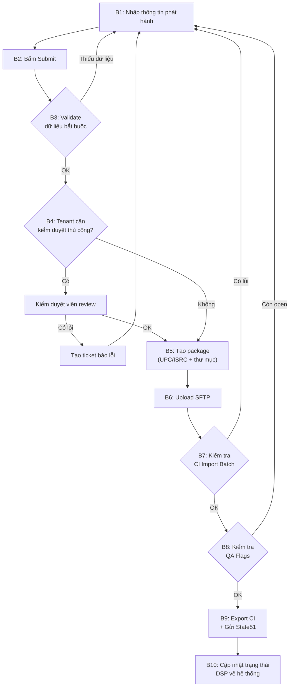

# Phát hành nhạc — Luồng phân phối (Distribution Flow)

## Mục lục

1. [Tổng quan luồng](#1-tổng-quan-luồng)
2. [Chi tiết từng bước](#2-chi-tiết-từng-bước)
3. [API Reference](#3-api-reference)
4. [Lưu ý vận hành](#4-lưu-ý-vận-hành)
5. [Mục tiêu hệ thống](#5-mục-tiêu-hệ-thống)

---

## 1. Tổng quan luồng



### Bảng tóm tắt các bước

| Bước | Tên | Mô tả ngắn | Actor |
|------|-----|-------------|-------|
| B1 | Nhập thông tin | Người dùng điền thông tin bản phát hành | User |
| B2 | Submit | Gửi bản phát hành | User |
| B3 | Validate | Kiểm tra trường bắt buộc → đẩy vào hàng đợi | System |
| B4 | Kiểm duyệt | Tenant thuộc diện duyệt thủ công → Reviewer kiểm tra | System / Reviewer |
| B5 | Tạo package | Sinh UPC/ISRC (nếu chưa có), tạo cấu trúc thư mục + XML | System |
| B6 | Upload SFTP | Upload package lên SFTP các DSP trực tiếp + aggregator (CI) | System |
| B7 | Kiểm tra Import | Gọi CI API kiểm tra import batch có lỗi không | System |
| B8 | Kiểm tra QA | Gọi CI API kiểm tra QA Flags còn open không | System |
| B9 | Export / Gửi mail | Chạy export CI (deal Merlin) + gửi email State51 (không deal) | System |
| B10 | Sync trạng thái | Cập nhật trạng thái phân phối DSP từ CI về hệ thống | System |

---

## 2. Chi tiết từng bước

### B1 — Nhập thông tin phát hành

Người dùng điền đầy đủ thông tin bản phát hành trên giao diện: metadata (tiêu đề, nghệ sĩ, label…), ảnh bìa, file audio các track.

### B2 — Submit

Người dùng bấm **Submit** để gửi bản phát hành.

### B3 — Validate dữ liệu

- Hệ thống kiểm tra các **trường bắt buộc** đã được điền chưa.
- **Nếu thiếu** → quay lại B1 để bổ sung.
- **Nếu đủ** → đẩy bản phát hành vào **hàng đợi chờ xử lý** (queue).

### B4 — Kiểm duyệt thủ công (Manual Review)

- Hệ thống kiểm tra tenant có thuộc diện **cần kiểm duyệt thủ công** không.
- **Nếu có**: Kiểm duyệt viên review thông tin bản phát hành.
  - Nếu phát hiện lỗi → tạo **ticket báo lỗi** cho user sửa → quay lại B1.
  - Nếu OK → tiếp tục B5.
- **Nếu không**: Bỏ qua, tiếp tục B5.

### B5 — Tạo package (UPC/ISRC + cấu trúc thư mục)

#### 5.1. Sinh UPC/ISRC

Nếu bản phát hành **chưa có** UPC hoặc ISRC → gọi **gRPC** đến server quản lý mã định danh để tạo mới.

#### 5.2. Cấu trúc thư mục

Tạo thư mục theo format `YYYYMMDDHHmmssSSS` (timestamp chính xác tới mili-giây):

```
20251211111052955/                          ← Thư mục gốc (= external_id dùng ở CI & Spotify)
├── 850080651025/                            ← Thư mục UPC
│   ├── resources/
│   │   ├── 850080651056.jpg                 ← Ảnh bìa (ISRC.jpg)
│   │   ├── QT6KL2500034_T0S.wav            ← Track 0
│   │   ├── QT6KL2500030_T1S.wav            ← Track 1
│   │   ├── QT6KL2500033_T2S.wav            ← Track 2
│   │   ├── QT6KL2500035_T3S.wav            ← Track 3
│   │   └── QT6KL2500036_T4S.wav            ← Track 4
│   └── 850080651025.xml                     ← Metadata XML cho UPC này
└── BatchComplete_20260331110238223.xml      ← Batch complete signal
```

#### 5.3. Quy tắc quan trọng

- **Không cho thay đổi thứ tự audio** sau khi bấm Submit. Nếu cần thêm audio → chỉ được thêm vào **cuối cùng**.
- Giá trị `20251211111052955` (timestamp) sẽ được sử dụng làm **`external_id`** ở cả CI và Spotify.

### B6 — Upload lên SFTP

#### 6.1. Phân nhóm DSP

| Loại DSP | Hành động | Ví dụ |
|----------|-----------|-------|
| **Deal trực tiếp** | Upload lên SFTP riêng của DSP đó | Spotify |
| **Deal Merlin** | Upload lên SFTP của aggregator (hiện tại là **CI**) | Facebook, SoundCloud |
| **Không có deal** | Upload lên SFTP của aggregator (hiện tại là **CI**) | Apple Music, Amazon |

#### 6.2. Xử lý upload

- **Retry**: Tối đa **3 lần**. Nếu vẫn thất bại → bỏ qua, chuyển sang bản phát hành tiếp theo.
- Sau khi upload thành công → **đánh dấu trạng thái** đã upload SFTP.

#### 6.3. Quy tắc riêng theo DSP

| DSP | Quy tắc sau upload |
|-----|---------------------|
| **Spotify** | Upload file `BatchComplete_*.xml` lên **cuối cùng** (làm tín hiệu hoàn thành) |
| **CI** | Tạo thư mục `20251211111052955.done` sau khi upload xong (đánh dấu done) |

### B7 — Kiểm tra CI Import Batch

Sau khi upload SFTP xong, **chờ CI xử lý** (khoảng **1–5 phút**), rồi gọi API kiểm tra.

#### 7.1. API kiểm tra

```
GET {{baseUrl}}/imports/v1/organisations/:organisation_id/batch
    ?import_external_identifier={{ci_import_external_id}}
```

#### 7.2. Cách đọc kết quả

Trong response, mỗi phần tử trong mảng `_embedded[].import_file[]` chứa:
- **`description`**: mảng mô tả kết quả import cho từng package (theo UPC).
- **`description[].warnings`**: mảng cảnh báo/lỗi.

**Quy tắc xử lý:**

| Điều kiện | Kết luận | Hành động |
|-----------|----------|-----------|
| `description.length === 1` VÀ `warnings.length === 0` | ✅ Không lỗi | Tiếp tục B8 |
| `warnings.length > 0` HOẶC `import_status === "problem"` | ❌ Có lỗi | Lưu lỗi vào DB, thông báo user → quay về B1 |

#### 7.3. Ví dụ lỗi thường gặp

```json
{
  "import_status": "problem",
  "status_cause": "MetadataProblem",
  "description": [{
    "title": "Warm Light",
    "barcode": "7316480526484",
    "warnings": [
      "ISRC update is not allowed, track 1 would be updated by import from ARC572503620 to ARC572503615",
      "ISRC update is not allowed, track 2 would be updated by import from ARC572503623 to ARC572503616"
    ]
  }]
}
```

> **Giải thích**: CI không cho phép thay đổi ISRC của track đã tồn tại. Cần kiểm tra lại ISRC mapping.

### B8 — Kiểm tra QA Flags

Sau khi import batch OK, cần kiểm tra xem bản phát hành còn **QA Flags đang open** trên CI không.

#### 8.1. Bước 1: Lấy Release ID

```
GET {{baseUrl}}/releases/v1/organisations/:organisation_id/releases
    ?gtin={{release_upc}}&page_size=1
```

Kết quả trả về `release_id` (VD: `"117827288390032"`), dùng cho bước tiếp theo.

#### 8.2. Bước 2: Lấy danh sách QA Flags

```
GET {{baseUrl}}/releases/v2/organisations/:organisation_id/releaseformats/:release_id/qaflags
    ?page_size=200
```

#### 8.3. Cách đọc kết quả

Mỗi QA Flag trong `_embedded[]` có các trường quan trọng:

| Trường | Mô tả |
|--------|--------|
| `closed_date` | Ngày flag được đóng. **`null` = chưa fix** |
| `qa_flag_type.public_name` | Tên lỗi (VD: `"Missing Lyricist"`, `"Invisible whitespace"`) |
| `qa_flag_type.severity` | Mức độ: `Critical`, `Warning`… |
| `qa_flag_type.is_blocker` | `true` = chặn phân phối |
| `qa_flag_type.is_closeable` | `true` = có thể tự đóng bằng API |
| `track_number` | Track bị lỗi (VD: `"1"`, `"2"`…). `null` = lỗi ở level album |

**Quy tắc xử lý:**

| Điều kiện | Hành động |
|-----------|-----------|
| Tất cả `closed_date !== null` | ✅ Không còn lỗi open → tiếp tục B9 |
| Có bất kỳ `closed_date === null` | ❌ Còn lỗi open → lưu lỗi vào DB, thông báo user → quay về B1 |

#### 8.4. Các loại QA Flag thường gặp

| QA Advice ID | Tên | Mô tả | Cách fix |
|-------------|-----|--------|----------|
| `MISSINGLYRICIST` | Missing Lyricist | Track có vocal nhưng thiếu metadata lyricist | Bổ sung lyricist metadata cho track |
| `FEATANDWITH` | "Featuring" Artist | Title chứa "feat", "ft"… không đúng chuẩn | Chỉ dùng `feat.` và chỉ trong Display Artist |
| `WHITESPACE` | Invisible whitespace | Có ký tự khoảng trắng ẩn trong Artist/Title/Version | Xóa khoảng trắng thừa đầu/cuối |

### B9 — Export CI & Gửi State51

Sau khi vượt qua B7 + B8, thực hiện phân phối đến các DSP.

#### 9.1. DSP có deal Merlin → Export qua CI

1. Tạo file **Excel** chứa danh sách: `UPC`, `DSP code`.
2. Gọi đến [https://export.antmusic.net/](https://export.antmusic.net/) để thực hiện **automation browser** tự động export trên CI.

#### 9.2. DSP không có deal → Gửi State51

1. Tạo file **Excel** chứa danh sách: `UPC`, `DSP code`.
2. Gửi file đính kèm qua email đến **support@state51.com**.

#### 9.3. Quy tắc gom batch

- **Không gửi từng file riêng lẻ**. Gom nhiều UPC vào **1 file Excel** rồi gửi 1 lần.
- Cấu hình **thời gian gửi** (VD: tổng hợp cả ngày, gửi 1 lần vào cuối ngày).

### B10 — Cập nhật trạng thái phân phối DSP

Sau khi gửi export / email, cần **chờ 1–5 ngày** để các DSP review và xử lý.

#### 10.1. API kiểm tra trạng thái

```
GET {{baseUrl}}/exports/v1/organisations/:organisation_id/deliver_desire
    ?gtin={{release_upc}}
    &page_size=200
    &status=complete
    &transfer_batch_status=transferred
```

#### 10.2. Cách đọc kết quả

Mỗi phần tử trong `_embedded[]` đại diện cho **1 DSP đã phân phối thành công**, bao gồm:

| Trường | Mô tả |
|--------|--------|
| `musicService.name` | Tên DSP (VD: `"Facebook Audio Library"`, `"Anghami"`) |
| `musicService.dpc` | Mã DSP (VD: `"FBL"`, `"ANG"`) |
| `status` | Trạng thái: `complete` = thành công |
| `exportBatch.batch_transfer_status` | `"transferred"` = đã chuyển xong |
| `exportBatch.transfer_end_time` | Thời gian hoàn thành chuyển |

Hệ thống sẽ sync danh sách DSP đã phân phối thành công về database nội bộ để user theo dõi tiến độ.

---

## 3. API Reference

### 3.1. Bảng tổng hợp API

| Bước | Method | Endpoint | Mục đích |
|------|--------|----------|----------|
| B5 | gRPC | Server quản lý mã định danh | Tạo mới UPC, ISRC |
| B7 | GET | `/imports/v1/organisations/:org_id/batch?import_external_identifier=...` | Kiểm tra import batch |
| B8a | GET | `/releases/v1/organisations/:org_id/releases?gtin=...&page_size=1` | Lấy Release ID |
| B8b | GET | `/releases/v2/organisations/:org_id/releaseformats/:release_id/qaflags?page_size=200` | Kiểm tra QA Flags |
| B10 | GET | `/exports/v1/organisations/:org_id/deliver_desire?gtin=...&status=complete&transfer_batch_status=transferred` | Lấy trạng thái phân phối DSP |

### 3.2. Response mẫu đầy đủ

<details>
<summary><strong>B7 — Import Batch Response</strong> (click để mở)</summary>

```json
{
    "page": 0,
    "pageSize": 10,
    "total": null,
    "organisation_id": 52978127640016,
    "type": "ImportBatchCollection",
    "queryParams": {
        "import_external_identifier": "20260704183607027"
    },
    "_embedded": [
        {
            "type": "ImportBatch",
            "batch_size": 2,
            "external_identifier": "20260704183607027",
            "status": "problem",
            "status_cause": "Success",
            "importEntity": {
                "type": "Import",
                "name": "Autogenerated feed import 20260704183607027 for ANT MUSIC LLC",
                "asset_type": "audio",
                "status": "complete",
                "number_of_releases": 1,
                "import_external_identifier": "20260704183607027",
                "releaseFormats": [
                    {
                        "barcode": "7316480684573",
                        "status": "live",
                        "title": "Flash",
                        "track_count": 11,
                        "format_type": "Album",
                        "display_artist": "Phonk Playa"
                    }
                ]
            },
            "import_file": [
                {
                    "status": "live",
                    "import_status": "complete",
                    "status_cause": "Success",
                    "package_id": "7316480684573",
                    "description": [{ "warnings": [] }]
                },
                {
                    "status": "live",
                    "import_status": "problem",
                    "status_cause": "MetadataProblem",
                    "package_id": "7316480526484",
                    "description": [
                        {
                            "artists": "Zen Record",
                            "title": "Warm Light",
                            "barcode": "7316480526484",
                            "warnings": [
                                "ISRC update is not allowed, track 1 would be updated by import from ARC572503620 to ARC572503615",
                                "ISRC update is not allowed, track 11 would be updated by import from ARC572503628 to ARC572503625"
                            ]
                        }
                    ]
                }
            ],
            "notes": "2 packages: 1 complete, 1 with problems at least one package failed"
        }
    ]
}
```

</details>

<details>
<summary><strong>B8a — Release Lookup Response</strong> (click để mở)</summary>

```json
{
    "page": 0,
    "pageSize": 1,
    "organisation_id": 52978127640016,
    "type": "ReleasesCollection",
    "_embedded": [
        {
            "type": "ReleaseFormat",
            "qa_flag": 9,
            "barcode": "701798205454",
            "gtin": "701798205454",
            "status": "live",
            "title": "Ojumo Ire",
            "track_count": 9,
            "format_type": "Album",
            "display_artist": "Femi Leye",
            "release_id": "117827288390032",
            "_links": {
                "metadata/qa_flags": {
                    "href": "https://api.openimp.com/releases/v1/organisations/52978127640016/releases/117827288390032/metadata/qa_flags"
                }
            }
        }
    ]
}
```

</details>

<details>
<summary><strong>B8b — QA Flags Response</strong> (click để mở)</summary>

```json
{
    "page": 0,
    "pageSize": 200,
    "total": 11,
    "organisation_id": 52978127640016,
    "release_id": 117827288390032,
    "type": "QaFlagCollection",
    "_embedded": [
        {
            "type": "qaflag",
            "closed_date": "2026-07-08T08:46:27.000Z",
            "track_number": null,
            "qa_flag_type": {
                "category": "DPRule",
                "is_blocker": true,
                "is_closeable": true,
                "public_name": "\"Featuring\" Artist",
                "qa_advice_id": "FEATANDWITH",
                "severity": "Critical"
            }
        },
        {
            "type": "qaflag",
            "closed_date": null,
            "track_number": "1",
            "qa_flag_type": {
                "category": "Metadata",
                "is_blocker": true,
                "is_closeable": false,
                "public_name": "Missing Lyricist",
                "qa_advice_id": "MISSINGLYRICIST",
                "severity": "Critical"
            }
        },
        {
            "type": "qaflag",
            "closed_date": null,
            "track_number": "2",
            "qa_flag_type": {
                "category": "Metadata",
                "is_blocker": true,
                "is_closeable": false,
                "public_name": "Missing Lyricist",
                "qa_advice_id": "MISSINGLYRICIST",
                "severity": "Critical"
            }
        },
        {
            "type": "qaflag",
            "closed_date": "2026-07-08T08:46:27.000Z",
            "track_number": null,
            "qa_flag_type": {
                "category": "Metadata",
                "is_blocker": true,
                "is_closeable": true,
                "public_name": "Invisible whitespace",
                "qa_advice_id": "WHITESPACE",
                "severity": "Critical"
            }
        }
    ]
}
```

> **Đọc**: Track 1, 2 có `closed_date: null` → **Missing Lyricist** chưa fix → release bị block.

</details>

<details>
<summary><strong>B10 — Deliver Desire Response</strong> (click để mở)</summary>

```json
{
    "page": 0,
    "pageSize": 2,
    "total": "38",
    "organisation_id": 52978127640016,
    "type": "DeliverDesireCollection",
    "_embedded": [
        {
            "type": "DeliverDesire",
            "status": "complete",
            "musicService": {
                "name": "Facebook Audio Library",
                "dpc": "FBL"
            },
            "exportBatch": {
                "batch_transfer_status": "transferred",
                "transfer_end_time": "2026-07-04T15:34:09.000Z"
            }
        },
        {
            "type": "DeliverDesire",
            "status": "complete",
            "musicService": {
                "name": "Anghami",
                "dpc": "ANG"
            },
            "exportBatch": {
                "batch_transfer_status": "transferred",
                "transfer_end_time": "2026-07-07T18:06:04.000Z"
            }
        }
    ]
}
```

</details>

---

## 4. Lưu ý vận hành

### 4.1. Kênh thông báo lỗi

- CI thường báo lỗi phát hành qua email **distro@antmusic.net**.
- Admin có thể tạo **ticket lỗi** thủ công, đánh dấu DSP phát hành lỗi / không duyệt.

### 4.2. Vòng lặp review

- Khi user cập nhật bản phát hành → kiểm duyệt viên cần **review lại**, nhưng **chỉ áp dụng** đối với các tenant thuộc diện cần kiểm duyệt thủ công. Các tenant không thuộc diện này sẽ bỏ qua bước review.
- Nếu release đã **live** mà update metadata → vẫn có trường hợp admin duyệt OK nhưng CI báo lỗi.

### 4.3. Điều kiện để export

Bản phát hành chỉ được export khi **cả 2 điều kiện** thỏa mãn:

1. ✅ **Import batch gần nhất** không có lỗi (`warnings` rỗng).
2. ✅ **QA Flags** không còn flag nào open (`closed_date` đều khác `null`).

### 4.4. Tính bất đồng bộ

- Toàn bộ quá trình phát hành + lấy status từ các bên đều là **bất đồng bộ**.
- Upload SFTP mất khoảng **2–10 phút/release**. Cần thiết kế luồng upload song song (không chờ tuần tự).
- Từ lúc gửi export đến khi DSP duyệt xong: **1–5 ngày**.

### 4.5. Cơ chế retry & error handling

- Retry **n lần** cho các thao tác: lấy UPC/ISRC, tạo file trên server, upload SFTP.
- SFTP upload cụ thể retry **3 lần**, nếu vẫn fail → skip, xử lý release tiếp theo.

### 4.6. Batch processing & tối ưu

- **Gom batch**: Export CI + email State51 đều gom nhiều UPC vào **1 file Excel**, gửi 1 lần.
- **Cấu hình lịch gửi**: Tổng hợp cả ngày, gửi 1 lần (configurable).
- **Mục tiêu throughput**: Xử lý **100 releases/ngày** mà không block server.
- Thiết kế pipeline cho phép **upload song song** + thực hiện các step khác đồng thời thay vì chờ tuần tự.

---

## 5. Mục tiêu hệ thống

1. **Trải nghiệm theo dõi**: Xây dựng luồng nghiệp vụ để dev, kiểm duyệt viên, user đều dễ dàng theo dõi tiến độ phát hành từng bản release.
2. **Hiệu năng**: Áp dụng system design phù hợp để xử lý **100 releases/ngày**, không block server (queue-based, parallel upload, batch export).
3. **Observability**: Theo dõi dễ dàng luồng batch export CI, email State51, và trạng thái từng step của từng release.