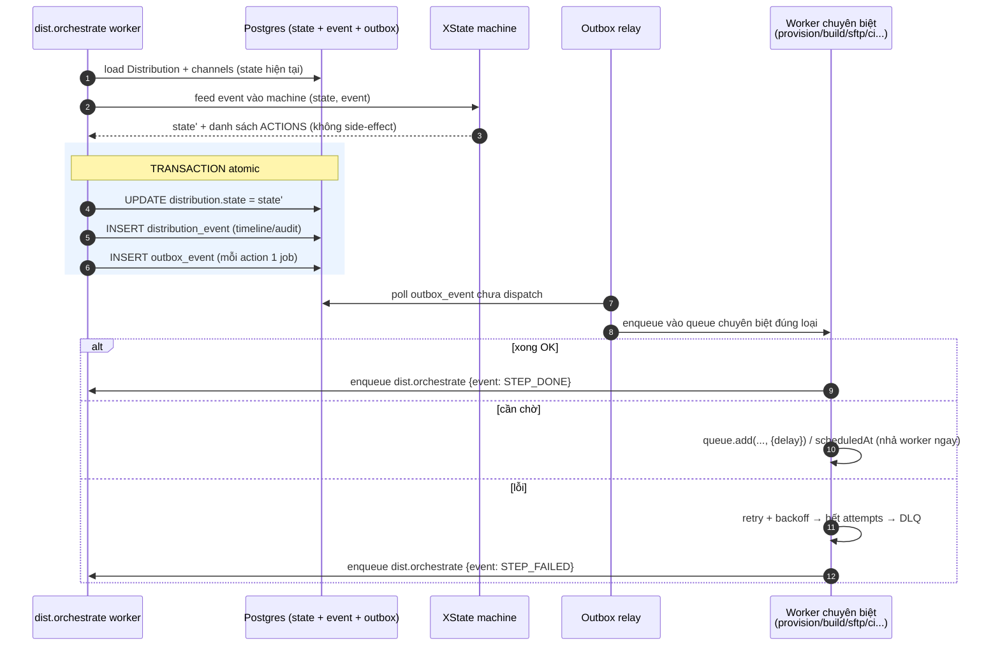
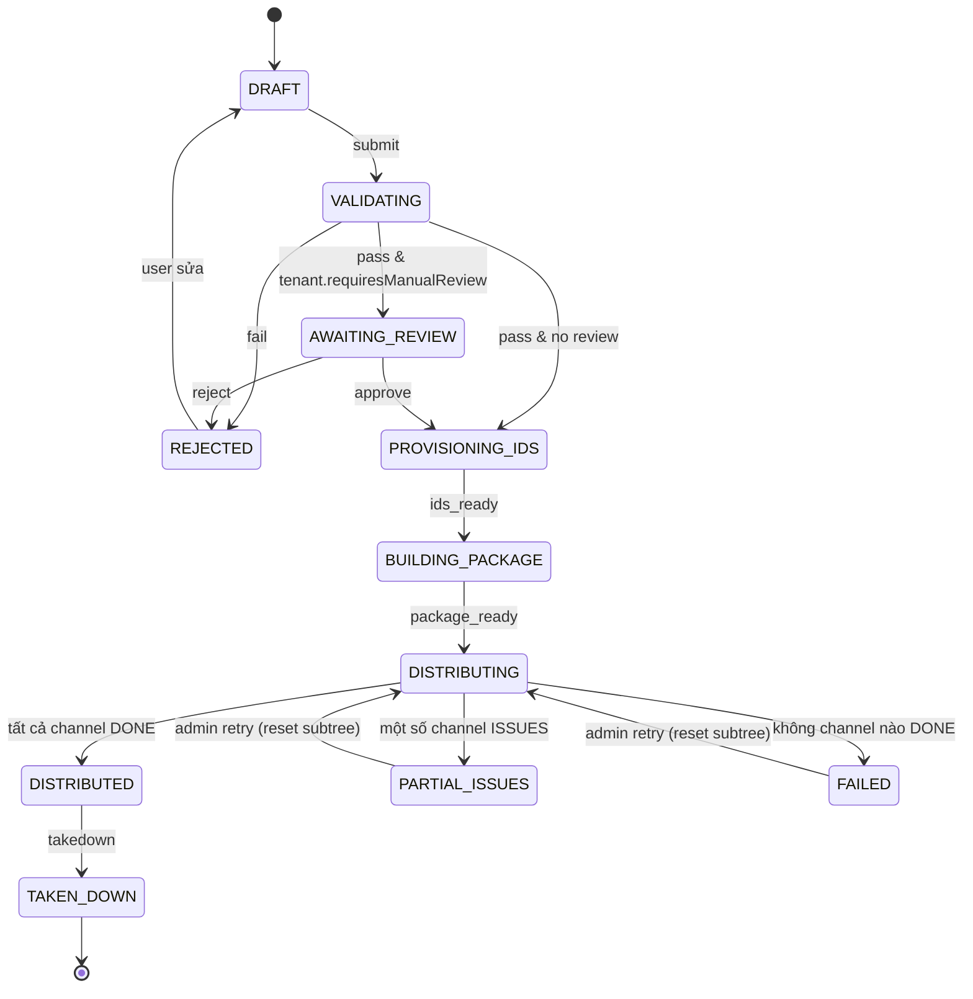
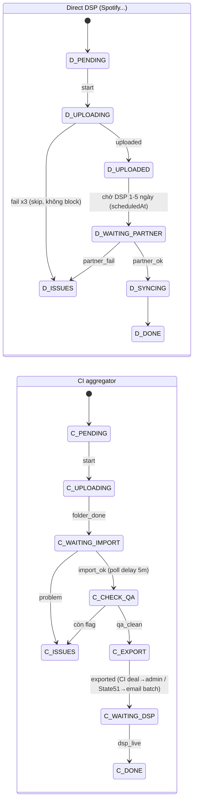

# Sơ đồ end-to-end — BullMQ + XState

> Đi kèm `kien-truc-luong-phat-hanh-moi.md`. Mô tả một release chạy xuyên qua hệ thống.
> Insight cốt lõi: **XState quyết định *bước kế tiếp*, BullMQ *thực thi* bước đó**.
> Hai lớp không gọi nhau trực tiếp — nối qua `distribution_event` + outbox. Mỗi vòng lặp = 1 transition.

## A. Cơ chế lặp — "một vòng" của orchestrator

```text
                          ┌───────────────────────────────────────────────┐
                          │  dist.orchestrate  (queue điều phối, nhẹ)       │
                          └───────────────┬───────────────────────────────┘
                                          │ job {distributionId, event}
                                          ▼
        (1) load Distribution + channels từ Postgres (state hiện tại)
                                          │
                                          ▼
        (2) interpret XState machine với state đã load ──┐  KHÔNG chạy side-effect ở đây
                     feed event vào machine              │  XState thuần: (state,event)→(state',actions)
                                          │              │
                                          ▼              │
        (3) machine trả về: state' + danh sách ACTIONS (bước cần làm)
                                          │
                     ┌────────────────────┴─────────────────────┐
              TRANSACTION (atomic)                               │
              ┌──────────────────────────────────────────┐      │
              │  UPDATE distribution.state = state'        │      │
              │  INSERT distribution_event (audit/timeline)│      │
              │  INSERT outbox_event (mỗi action 1 job)    │      │
              └──────────────────────────────────────────┘      │
                                          │                       │
                                          ▼                       │
        (4) Outbox relay đọc outbox_event → enqueue vào ĐÚNG queue chuyên biệt
                    (dist.provision-id / dist.build-package / dist.sftp-upload ...)
                                          │
                                          ▼
        (5) Worker chuyên biệt LÀM side-effect thật (gọi port: gRPC/SFTP/CI...)
                    ├─ xong OK  → enqueue dist.orchestrate {event: STEP_DONE}   ──┐
                    ├─ cần chờ  → queue.add(..., {delay}) hoặc scheduledAt        │  vòng lặp
                    └─ lỗi      → retry/backoff → hết attempts → DLQ + event FAIL │  quay lại (1)
                                                                                  │
                          ◀───────────────────────────────────────────────────── ┘
```

Ba tính chất rơi ra từ mô hình:
- **Worker luôn stateless** — state đọc từ DB đầu mỗi vòng (bước 1), không giữ gì giữa các vòng.
- **Chờ không tốn tài nguyên** — bước 5 "cần chờ" chỉ là `delay`/`scheduledAt`, worker nhả ngay.
- **Không mất transition** — state' và outbox ghi *cùng 1 transaction* (bước 3); relay bắn queue *sau* commit.

## B. Một release chạy xuyên qua (INITIAL — Spotify direct + CI aggregator)

Cột trái = XState state; cột phải = queue BullMQ đang xử lý. Mỗi `▼` là một vòng lặp ở sơ đồ A.

```text
 HTTP POST /distributions:submit
   └─ tạo release_snapshot (jsonb, bất biến) + distribution(state=VALIDATING)
      + outbox → dist.orchestrate            ················· SSE: "Đã nhận, đang kiểm tra"

 ══ DISTRIBUTION MACHINE (release-level) ══════════════ QUEUE ══════════════════════
 DRAFT
   ▼ submit
 VALIDATING ───────────────────────────────────────── dist.orchestrate
   │  (guard: metadata hợp lệ? cover/audio đủ?)
   ▼ pass          [tenant.requiresManualReview?]
 AWAITING_REVIEW ──(chỉ khi tenant bật cờ)──────────── (không queue: chờ người)
   │  ▲                                                 human signal: review.approve
   ▼  │ approve                                          → enqueue dist.orchestrate
 PROVISIONING_IDS ──────────────────────────────────── dist.provision-id  (gRPC UPC/ISRC)
   │  idempotent: đã có UPC → skip                       ⏱ retry/backoff nếu gRPC lỗi
   ▼ ids_ready
 BUILDING_PACKAGE ──────────────────────────────────── dist.build-package (DDEX XML + folder→GCS/S3)
   ▼ package_ready
 DISTRIBUTING ──── fan-out song song 2 channel ──────── (spawn 2 channel machine)
        │
        ├───────────────► CHANNEL: Spotify (DIRECT) ─────────────────────────────┐
        │                                                                          │
        └───────────────► CHANNEL: CI (AGGREGATOR) ─────────────────────┐         │
                                                                          │         │
 ── CHANNEL MACHINE: Spotify (direct) ──────────────── QUEUE ──          │         │
 PENDING                                                                  │         │
   ▼ start                                                                │         │
 UPLOADING ─────────────────────────────────────────── dist.sftp-upload  │         │
   │  ⏱ rate-limited PER HOST (bulkhead) · retry ≤3      (nút cổ chai)     │         │
   ▼ uploaded         3 lần fail → ISSUES → skip, không block hàng đợi     │         │
 WAITING_PARTNER ───────────────────────────────────── delayed job / status-sync    │
   │  (Spotify duyệt 1–5 ngày — CHỜ bằng scheduledAt, KHÔNG giữ worker)   │         │
   ▼ partner_ok                                                           │         │
 SYNCING → DONE ─────────────────────────────────────── dist.status-sync ◀┘         │
                                                                                    │
 ── CHANNEL MACHINE: CI (aggregator) ───────────────── QUEUE ──                      │
 PENDING                                                                             │
   ▼ start                                                                           │
 UPLOADING ─────────────────────────────────────────── dist.sftp-upload             │
   ▼ folder_done                                                                     │
 WAITING_IMPORT ────────────────────────────────────── dist.ci-import-check         │
   │  queue.add(check, {delay: 5m}) → poll, chưa xong thì re-delay ⏱                 │
   ▼ import_ok           problem → ISSUES (lưu lỗi, báo user)                        │
 CHECK_QA ──────────────────────────────────────────── dist.ci-qa-check             │
   ▼ qa_clean            còn flag → ISSUES                                           │
 EXPORT ─┬─ CI deal   → WAITING_ADMIN_EXPORT ── dist.export-batch (admin/RBAC) ──┐   │
         └─ State51   → WAITING_EMAIL_BATCH  ── dist.export-batch (gom, gửi mail)─┤   │
   ▼ exported                                                                     │   │
 WAITING_DSP ───────────────────────────────────────── dist.status-sync ◀────────┘   │
   ▼ dsp_live                                                                         │
 DONE ───────────────────────────────────────────────────────────────────────────────┘
        │
        ▼ (mỗi channel DONE/ISSUES → bắn event về distribution machine tổng hợp)
 ══ DISTRIBUTION MACHINE tổng hợp lại ════════════════════════════════════
   tất cả DONE ──────► DISTRIBUTED        ········· SSE: "Đã phân phối 2/2"
   một số ISSUES ────► PARTIAL_ISSUES     ········· SSE: "1/2 kênh gặp lỗi"
   không kênh nào ───► FAILED
        │
        │ (sau này) admin gọi retry → RESET subtree ISSUES về state trước → resume
        │           takedown → channel đi hướng gỡ → TAKEN_DOWN
        ▼
```

Điểm đáng chú ý:
- **`dist.orchestrate` là trạm trung chuyển duy nhất.** Mọi `STEP_DONE` quay về đây để XState quyết bước kế — không worker nào tự quyết luồng.
- **Ba điểm `⏱` là ba kiểu "chờ", cùng nguyên tắc nhả tài nguyên**: SFTP retry (backoff), CI import (delayed re-poll), DSP duyệt (scheduledAt nhiều ngày). Không chỗ nào `sleep`.
- **Fan-out ở `DISTRIBUTING`**: mỗi channel là sub-machine độc lập, chạy song song, có DLQ riêng — Spotify fail không cản CI.
- **SSE** đọc `distribution_event` → user thấy timeline realtime mà không cần biết gì về queue bên dưới.
- **Biến thể theo execution type**: UPDATE = cắt `PROVISIONING_IDS`; TAKEDOWN = bỏ `BUILDING_PACKAGE`/`UPLOADING`, channel đi nhánh gỡ; RETRY = bơm event `RESET` vào subtree ISSUES thay vì vào từ `DRAFT`.

## C. Bản Mermaid (render trong browser / GitHub)

### C.1. Vòng lặp orchestrator (sequence)



### C.2. State machine cấp Distribution



### C.3. State machine cấp Channel



> Mermaid v11: mở bằng `/preview` hoặc GitHub. Nếu cần chỉnh cú pháp v11, dùng skill `/mermaidjs-v11`.

