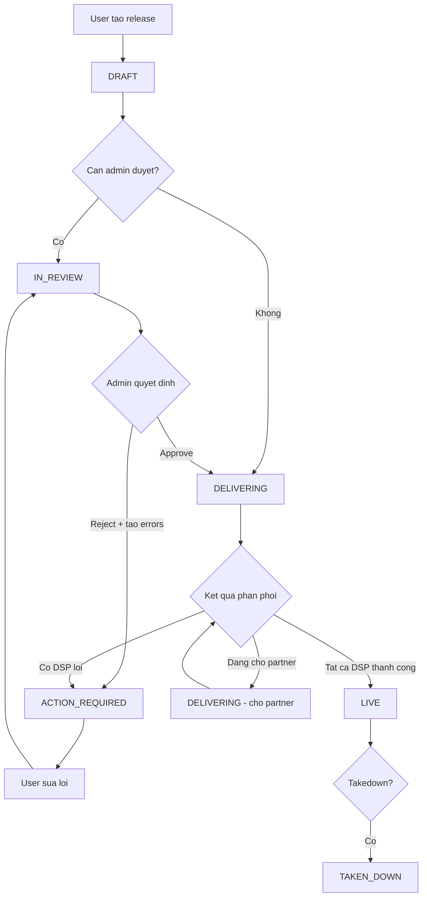

# 🧠 Brainstorm: Xây Dựng Lại Chức Năng Phát Hành Release

## Context

Hệ thống phát hành hiện tại (`Release Execution 3`) hoạt động đúng nghiệp vụ nhưng có nhiều vấn đề về **trải nghiệm, khả năng theo dõi, và độ phức tạp**. Mục tiêu là:

1. **Người dùng bình thường** hiểu được tiến độ bản phát hành
2. **Lỗi từ bên thứ 3** (CI, DSP, SFTP) phải rõ ràng, dễ xem
3. **Admin** dễ dàng duyệt, tạo lỗi, và track tiến độ
4. **Developer** dễ debug và mở rộng

---

## Phân Tích Vấn Đề Hiện Tại

### 🔴 Vấn đề 1: Quá nhiều enum status rải rác

Hiện tại có **10 hệ thống status** khác nhau, khiến cả dev lẫn user lẫn lộn:

| Layer | Enum | Số status | Source |
|-------|------|-----------|--------|
| Release | `ReleaseStatus` | 8 (gồm 2 deprecated: `awaiting_action`, `partial_done`) | [release.enum.ts](file:///e:/CODE/ag-release/ag-release-server/src/modules/release/enum/release.enum.ts#L1-L10) |
| DSP Delivery | `ReleaseDspStatus` | 6 (`draft`, `never_distributed`, `processing`, `issues`, `distributed`, `taken_down`) | [release-dsp.enum.ts](file:///e:/CODE/ag-release/ag-release-server/src/modules/release/enum/release-dsp.enum.ts#L1-L9) |
| Execution | `ReleaseExecutionStatus` | 7 (`NEW`, `PROCESSING`, `WAITING_ACTION`, `WAITING_PARTNER`, `DONE`, `FAILED`, `CANCELLED`) | [release-execution3.enum.ts](file:///e:/CODE/ag-release/ag-release-server/src/modules/release/modules/release-executions3/enums/release-execution3.enum.ts#L1-L10) |
| Execution Step | `ReleaseExecutionStepStatus` | 8 (`NEW`, `PROCESSING`, `WAITING_ACTION`, `WAITING_PARTNER`, `SKIPPED`, `DONE`, `FAILED`, `CANCELLED`) | [release-execution3.enum.ts](file:///e:/CODE/ag-release/ag-release-server/src/modules/release/modules/release-executions3/enums/release-execution3.enum.ts#L19-L29) |
| Review | `ReleaseReviewStatus` | 5 (`PENDING`, `PROCESSING`, `COMPLETED`, `FAILED`, `CANCEL`) | [release-review.entity.ts](file:///e:/CODE/ag-release/ag-release-server/src/modules/release/modules/release-reviews/entities/release-review.entity.ts#L9-L15) |
| Error (submission) | `ErrorSubmissionStatus` | 2 (`OPEN`, `FIXED`) | [release-error.entity.ts](file:///e:/CODE/ag-release/ag-release-server/src/modules/release/modules/release-errors/entities/release-error.entity.ts#L15-L18) |
| Error (approval) | `ErrorApprovalStatus` | 3 (`PENDING`, `APPROVED`, `REJECTED`) | [release-error.entity.ts](file:///e:/CODE/ag-release/ag-release-server/src/modules/release/modules/release-errors/entities/release-error.entity.ts#L20-L24) |
| CI Data | `ReleaseCiDataStatus` | 2 (`EXISTS_ON_CI`, `NOT_FOUND_ON_CI`) | [release-ci-data.entity.ts](file:///e:/CODE/ag-release/ag-release-server/src/modules/release/modules/release-ci-data/entities/release-ci-data.entity.ts#L5-L8) |
| CI Job | `CiJobStatus3` | 5 (`PENDING`, `PROCESSING`, `COMPLETED`, `FAILED`, `CANCEL`) | [release-execution3.enum.ts](file:///e:/CODE/ag-release/ag-release-server/src/modules/release/modules/release-executions3/enums/release-execution3.enum.ts#L87-L93) |
| Log | `ReleaseLogStatus` | 3 (`PENDING`, `SUCCESS`, `FAILED`) | [release-log.entity.ts](file:///e:/CODE/ag-release/ag-release-server/src/modules/release/modules/release-log/entities/release-log.entity.ts#L7-L11) |

> **Tổng: ~49 giá trị status** trải trên 10 enum. Người dùng phải hiểu ít nhất 3-4 layer để biết "bản phát hành đang ở đâu".

### 🔴 Vấn đề 2: Release status bị "derive" ngầm

- `release.status` không được set trực tiếp mà **derive từ DSP deliveries** qua [resolveReleaseStatusByDspDeliveries()](file:///e:/CODE/ag-release/ag-release-server/src/modules/release/services/release.service.ts#L1034-L1090)
- Logic derive phức tạp (8 nhánh if/else), có trường hợp **giữ nguyên status cũ** — status có thể bị "stuck"
- Hàm [syncReleaseStatus()](file:///e:/CODE/ag-release/ag-release-server/src/modules/release/services/release.service.ts#L1007-L1032) gọi derive rồi update trực tiếp vào DB
- `awaiting_action` và `partial_done` deprecated nhưng vẫn nằm trong [ReleaseStatus enum](file:///e:/CODE/ag-release/ag-release-server/src/modules/release/enum/release.enum.ts#L5-L7) — gây confuse

### 🔴 Vấn đề 3: Error có 2 status song song

[ReleaseError entity](file:///e:/CODE/ag-release/ag-release-server/src/modules/release/modules/release-errors/entities/release-error.entity.ts) có cả `submissionStatus` (OPEN/FIXED) lẫn `approvalStatus` (PENDING/APPROVED/REJECTED):
- Khi admin tạo error: `OPEN` + `PENDING`
- Khi user sửa: `FIXED` + `PENDING`
- Khi admin approve: `FIXED` + `APPROVED`
- Khi admin reject: `OPEN` + `REJECTED`
- **Tổ hợp 6 trạng thái** nhưng chỉ 4 hợp lệ, dễ bị inconsistent
- Logic xử lý nằm ở [processStatusList()](file:///e:/CODE/ag-release/ag-release-server/src/modules/release/modules/release-errors/services/release-error.service.ts#L89-L109)

### 🔴 Vấn đề 4: Review gắn chặt vào Execution step

- [ReleaseReview entity](file:///e:/CODE/ag-release/ag-release-server/src/modules/release/modules/release-reviews/entities/release-review.entity.ts) có `stepId` — gắn trực tiếp vào execution step
- Khi admin quyết định review thì gọi [handleResultReviewRelease()](file:///e:/CODE/ag-release/ag-release-server/src/modules/release/modules/release-reviews/services/release-review.service.ts#L155-L188) — bên trong gọi `updateStatusStepAndRerunPipeline()` để step chuyển DONE/FAILED
- Khi admin approve thì [bulkUpdateErrorsByReviewResult()](file:///e:/CODE/ag-release/ag-release-server/src/modules/release/modules/release-errors/services/release-error.service.ts#L56-L86) cập nhật tất cả errors
- Nếu execution bị cancel (submit mới) thì review cũ vẫn tồn tại với step đã CANCELLED — trạng thái orphan

### 🔴 Vấn đề 5: Người dùng không biết "đang chờ gì"

Pipeline có thể dừng ở nhiều chỗ — xem [docs Section 6.4-6.5](file:///e:/CODE/ag-release/ag-release-server/src/modules/release/modules/release-executions3/release-execution3.docs.md):
- `WAITING_PARTNER` (chờ CI xử lý) — user không biết chờ bao lâu
- `WAITING_ACTION` (chờ admin export CI / gửi email) — user không biết cần admin làm gì
- `FAILED` ở step con — user thấy release vẫn "processing" hoặc "failed" nhưng không biết lỗi cụ thể
- Logic dừng pipeline nằm ở [shouldStopSequential()](file:///e:/CODE/ag-release/ag-release-server/src/modules/release/modules/release-executions3/services/release-execution3.service.ts#L270-L277)

### 🔴 Vấn đề 6: Không có timeline/history thống nhất

Muốn xem "chuyện gì đã xảy ra với release" phải query 4 bảng khác nhau:

| Bảng | Mục đích | Entity |
|------|----------|--------|
| `release_logs` | Log kỹ thuật, kiểu cũ (trước v3) | [release-log.entity.ts](file:///e:/CODE/ag-release/ag-release-server/src/modules/release/modules/release-log/entities/release-log.entity.ts) |
| `release_errors` | Lỗi admin tạo hoặc CI QA | [release-error.entity.ts](file:///e:/CODE/ag-release/ag-release-server/src/modules/release/modules/release-errors/entities/release-error.entity.ts) |
| `release_reviews` | Phiên duyệt | [release-review.entity.ts](file:///e:/CODE/ag-release/ag-release-server/src/modules/release/modules/release-reviews/entities/release-review.entity.ts) |
| `release_execution_steps3` | Step engine | [release-execution3-step.entity.ts](file:///e:/CODE/ag-release/ag-release-server/src/modules/release/modules/release-executions3/entites/release-execution3-step.entity.ts) |

---

## Các Entity và Service chính liên quan

| File | Vai trò |
|------|---------|
| [release.entity.ts](file:///e:/CODE/ag-release/ag-release-server/src/modules/release/entities/release.entity.ts) | Entity chính — chứa metadata album/single/EP |
| [release-dsp-delivery.entity.ts](file:///e:/CODE/ag-release/ag-release-server/src/modules/release/entities/release-dsp-delivery.entity.ts) | Liên kết release với DSP — status phân phối từng DSP |
| [release.service.ts](file:///e:/CODE/ag-release/ag-release-server/src/modules/release/services/release.service.ts) | Service chính — submit, takedown, sync status, derive status |
| [release-dsp-delivery.service.ts](file:///e:/CODE/ag-release/ag-release-server/src/modules/release/services/release-dsp-services/release-dsp-delivery.service.ts) | Quản lý DSP delivery — upsert status, mark distributed/issues |
| [release-execution3.service.ts](file:///e:/CODE/ag-release/ag-release-server/src/modules/release/modules/release-executions3/services/release-execution3.service.ts) | Execution engine — tạo, chạy, cancel pipeline |
| [release-execution3.builder.ts](file:///e:/CODE/ag-release/ag-release-server/src/modules/release/modules/release-executions3/services/release-execution3.builder.ts) | Build cây step cho execution |
| [release-execution3.engine.ts](file:///e:/CODE/ag-release/ag-release-server/src/modules/release/modules/release-executions3/services/release-execution3.engine.ts) | Engine xử lý step tree — sequential/parallel |
| [release-execution3.worker.ts](file:///e:/CODE/ag-release/ag-release-server/src/modules/release/modules/release-executions3/services/release-execution3.worker.ts) | Worker thực thi từng step (leaf) |
| [release-review.service.ts](file:///e:/CODE/ag-release/ag-release-server/src/modules/release/modules/release-reviews/services/release-review.service.ts) | Admin duyệt release — tạo/cập nhật review, resume pipeline |
| [release-error.service.ts](file:///e:/CODE/ag-release/ag-release-server/src/modules/release/modules/release-errors/services/release-error.service.ts) | Quản lý lỗi — bulk create/update, sync với review |
| [release.controller.ts](file:///e:/CODE/ag-release/ag-release-server/src/modules/release/controllers/release.controller.ts) | API endpoints cho release |
| [release-execution3.docs.md](file:///e:/CODE/ag-release/ag-release-server/src/modules/release/modules/release-executions3/release-execution3.docs.md) | Tài liệu chi tiết luồng execution v3 |

---

## Các Hàm Quan Trọng (clickable)

| Hàm | Vai trò | File |
|-----|---------|------|
| [submit3()](file:///e:/CODE/ag-release/ag-release-server/src/modules/release/services/release.service.ts#L779-L797) | Entry point submit release — set `submitted`, tạo execution | release.service.ts |
| [takedown()](file:///e:/CODE/ag-release/ag-release-server/src/modules/release/services/release.service.ts#L799-L806) | Gỡ release khỏi DSP | release.service.ts |
| [syncReleaseStatus()](file:///e:/CODE/ag-release/ag-release-server/src/modules/release/services/release.service.ts#L1007-L1032) | Sync release status từ DSP deliveries | release.service.ts |
| [resolveReleaseStatusByDspDeliveries()](file:///e:/CODE/ag-release/ag-release-server/src/modules/release/services/release.service.ts#L1034-L1090) | Logic derive release status (8 nhánh if/else) | release.service.ts |
| [mapCiDspStatusToReleaseDspStatus()](file:///e:/CODE/ag-release/ag-release-server/src/modules/release/services/release.service.ts#L979-L1004) | Map CI status sang ReleaseDspStatus | release.service.ts |
| [updateDeliveryStatus()](file:///e:/CODE/ag-release/ag-release-server/src/modules/release/services/release-dsp-services/release-dsp-delivery.service.ts#L40-L100) | Upsert DSP delivery status — core của sync | release-dsp-delivery.service.ts |
| [resolveHasLiveVersion()](file:///e:/CODE/ag-release/ag-release-server/src/modules/release/services/release-dsp-services/release-dsp-delivery.service.ts#L375-L388) | Tính `hasLiveVersion` từ status | release-dsp-delivery.service.ts |
| [startProcessing()](file:///e:/CODE/ag-release/ag-release-server/src/modules/release/modules/release-executions3/services/release-execution3.service.ts#L93-L118) | Bắt đầu xử lý execution — cancel cũ, parse metadata, build tree | release-execution3.service.ts |
| [runPipeline()](file:///e:/CODE/ag-release/ag-release-server/src/modules/release/modules/release-executions3/services/release-execution3.service.ts#L120-L147) | Chạy pipeline — duyệt step tree, sync output | release-execution3.service.ts |
| [parseMetadata()](file:///e:/CODE/ag-release/ag-release-server/src/modules/release/modules/release-executions3/services/release-execution3.service.ts#L153-L256) | Phân loại DSP: direct vs CI deal vs State51 | release-execution3.service.ts |
| [handleResultReviewRelease()](file:///e:/CODE/ag-release/ag-release-server/src/modules/release/modules/release-reviews/services/release-review.service.ts#L155-L188) | Admin approve/reject review — resume pipeline | release-review.service.ts |
| [bulkCreateErrors()](file:///e:/CODE/ag-release/ag-release-server/src/modules/release/modules/release-errors/services/release-error.service.ts#L33-L47) | Admin tạo errors hàng loạt cho release | release-error.service.ts |
| [processStatusList()](file:///e:/CODE/ag-release/ag-release-server/src/modules/release/modules/release-errors/services/release-error.service.ts#L89-L109) | Logic xử lý 2 status song song (submission + approval) | release-error.service.ts |

---

## Các Trường Hợp Cần Xử Lý

### Happy Path
| # | Scenario | Kỳ vọng user thấy |
|---|----------|--------------------|
| 1 | Submit rồi tất cả DSP thành công | ✅ "Đã phát hành" + danh sách DSP live |
| 2 | Submit rồi một số DSP thành công, một số chưa | ⏳ "Đang xử lý" + DSP nào xong, DSP nào chưa |
| 3 | Submit rồi chờ CI partner xử lý | ⏳ "Đang chờ đối tác" + thời gian ước tính |

### Error Paths — Lỗi từ bên thứ 3
| # | Scenario | Kỳ vọng user thấy |
|---|----------|--------------------|
| 4 | CI QA flag lỗi metadata | ❌ "Có lỗi cần sửa" + chi tiết lỗi cụ thể (field nào, track nào) |
| 5 | SFTP upload thất bại | ❌ "Lỗi kỹ thuật" + nút retry |
| 6 | CI import trả "problem" | ❌ "Đối tác báo lỗi" + thông tin lỗi |
| 7 | DSP direct timeout/fail | ❌ DSP cụ thể bị lỗi, DSP khác không ảnh hưởng |
| 8 | Partner trả lỗi sau thời gian dài (async) | ❌ Thông báo lỗi mới + không mất context |

### Admin Actions
| # | Scenario | Kỳ vọng user thấy |
|---|----------|--------------------|
| 9 | Admin tạo lỗi cho release (qua [bulkCreateErrors](file:///e:/CODE/ag-release/ag-release-server/src/modules/release/modules/release-errors/services/release-error.service.ts#L33-L47)) | ❌ "Cần sửa lỗi" + danh sách lỗi từ admin |
| 10 | User sửa lỗi, đánh dấu "Fixed" | ⏳ "Chờ admin duyệt" |
| 11 | Admin approve (qua [handleResultReviewRelease](file:///e:/CODE/ag-release/ag-release-server/src/modules/release/modules/release-reviews/services/release-review.service.ts#L155-L188)) rồi tiếp tục pipeline | ⏳ "Đang xử lý tiếp" |
| 12 | Admin reject rồi user phải sửa lại | ❌ "Bị từ chối, cần sửa lại" |
| 13 | Admin duyệt release trước khi phát hành | ⏳ "Chờ duyệt" |

### Edge Cases
| # | Scenario | Xử lý |
|---|----------|-------|
| 14 | Submit lại khi đang processing — [cancelPendingExecutions()](file:///e:/CODE/ag-release/ag-release-server/src/modules/release/modules/release-executions3/services/release-execution3.service.ts#L100-L105) cancel cũ | Chỉ execution mới nhất là active |
| 15 | Takedown một DSP đang live (qua [takedown()](file:///e:/CODE/ag-release/ag-release-server/src/modules/release/services/release.service.ts#L799-L806)) | DSP đó chuyển "Đang gỡ", DSP khác không ảnh hưởng |
| 16 | Update metadata sau khi đã distributed | Re-submit, DSP distributed giữ `hasLiveVersion` |
| 17 | Release từ import report rồi user chỉnh rồi submit | Chuyển sang release trực tiếp ([isImportedFromReport = false](file:///e:/CODE/ag-release/ag-release-server/src/modules/release/services/release.service.ts#L344)) |

---

## Option A: Simplify and Flatten — "2-Layer Status"

> **Triết lý**: Người dùng chỉ cần biết 2 thứ: (1) Release đang ở đâu, (2) Mỗi DSP đang ở đâu. Gom mọi thứ khác vào **timeline events**.

### Thiết kế status mới

**Release Status (6 trạng thái, user-facing):**

Thay thế [ReleaseStatus hiện tại](file:///e:/CODE/ag-release/ag-release-server/src/modules/release/enum/release.enum.ts#L1-L10):

```
DRAFT -- IN_REVIEW -- DELIVERING -- LIVE -- TAKEN_DOWN
              ^            |
              +-- ACTION_REQUIRED --+
```

| Status | Ý nghĩa cho user | Mapping cũ |
|--------|-------------------|------------|
| `DRAFT` | Đang soạn | `draft` |
| `IN_REVIEW` | Chờ admin duyệt | `submitted` + [ReleaseReviewStatus.PENDING](file:///e:/CODE/ag-release/ag-release-server/src/modules/release/modules/release-reviews/entities/release-review.entity.ts#L10) |
| `DELIVERING` | Đang phân phối lên các nền tảng | `processing` |
| `LIVE` | Đã phát hành | `distributed` |
| `ACTION_REQUIRED` | Có vấn đề cần giải quyết | `failed` + `awaiting_action` |
| `TAKEN_DOWN` | Đã gỡ | `taken_down` |

**DSP Delivery Status (4 trạng thái, rõ ràng):**

Thay thế [ReleaseDspStatus hiện tại](file:///e:/CODE/ag-release/ag-release-server/src/modules/release/enum/release-dsp.enum.ts#L1-L9):

| Status | Ý nghĩa | Icon gợi ý |
|--------|---------|------------|
| `QUEUED` | Đang chờ xử lý | ⏳ |
| `DELIVERING` | Đang gửi lên DSP | 🔄 |
| `LIVE` | Đã phát hành trên DSP | ✅ |
| `FAILED` | Có lỗi | ❌ |

> Bỏ `draft`, `never_distributed`, `issues`. Nếu DSP chưa bao giờ submit thì đơn giản là **không có record** trong [release_dsp_delivery](file:///e:/CODE/ag-release/ag-release-server/src/modules/release/entities/release-dsp-delivery.entity.ts).

### Gom timeline — `release_events`

Thay vì 4 bảng riêng ([release_logs](file:///e:/CODE/ag-release/ag-release-server/src/modules/release/modules/release-log/entities/release-log.entity.ts), [release_errors](file:///e:/CODE/ag-release/ag-release-server/src/modules/release/modules/release-errors/entities/release-error.entity.ts), [release_reviews](file:///e:/CODE/ag-release/ag-release-server/src/modules/release/modules/release-reviews/entities/release-review.entity.ts), [execution steps](file:///e:/CODE/ag-release/ag-release-server/src/modules/release/modules/release-executions3/entites/release-execution3-step.entity.ts)), tạo **1 bảng timeline duy nhất**:

```typescript
@Entity('release_events')
export class ReleaseEvent {
  id: string;
  releaseId: string;
  dspId?: string;           // null = release-level event
  
  type: ReleaseEventType;   // 'STATUS_CHANGE' | 'ERROR' | 'REVIEW' | 'INFO' | 'USER_ACTION'
  
  severity: 'info' | 'warning' | 'error' | 'success';
  
  title: string;            // "Lỗi metadata: thiếu ISRC cho track 3"
  detail?: string;          // Chi tiết kỹ thuật
  
  // Error-specific
  errorCode?: string;       // Machine-readable: 'MISSING_ISRC', 'CI_QA_FAILED'
  field?: string;           // 'tracks[2].isrc'
  trackId?: string;
  
  // Review-specific  
  actionRequired?: 'USER_FIX' | 'ADMIN_APPROVE' | 'ADMIN_REVIEW';
  actionStatus?: 'OPEN' | 'RESOLVED';  // Thay 2 enum rieng
  actorId?: string;         // Ai tạo event
  resolvedById?: string;    // Ai resolve
  
  source: 'SYSTEM' | 'ADMIN' | 'CI' | 'DSP' | 'USER';
  
  createdAt: Date;
}
```

### Luồng hoạt động mới



### Xử lý lỗi từ bên thứ 3

Thay thế logic phức tạp hiện tại ở [mapCiDspStatusToReleaseDspStatus()](file:///e:/CODE/ag-release/ag-release-server/src/modules/release/services/release.service.ts#L979-L1004):

```typescript
// Khi CI QA tra ve loi
async handleCiQaError(releaseId: string, qaFlags: QaFlag[]) {
  // 1. Cap nhat DSP status
  await this.updateDspStatus(releaseId, ciDspIds, 'FAILED');
  
  // 2. Tao events ro rang cho user
  for (const flag of qaFlags) {
    await this.createEvent({
      releaseId,
      type: 'ERROR',
      severity: 'error',
      source: 'CI',
      title: `Loi QA: ${flag.description}`,
      detail: flag.rawMessage,
      errorCode: 'CI_QA_FAILED',
      field: flag.field,
      trackId: flag.trackId,
      actionRequired: 'USER_FIX',
      actionStatus: 'OPEN',
    });
  }
  
  // 3. Chuyen release status
  await this.updateReleaseStatus(releaseId, 'ACTION_REQUIRED');
}
```

### User nhìn thấy gì

```
📦 Album "Summer Vibes"
Status: ⚠️ Có vấn đề cần giải quyết

Tiến độ phân phối:
  ✅ Spotify — Đã phát hành (2 giờ trước)
  ✅ Apple Music — Đã phát hành (2 giờ trước)  
  ❌ Deezer — Lỗi metadata
  ⏳ TikTok — Đang chờ xử lý

Timeline:
  🔴 14:30 — Lỗi QA từ CI: "Thiếu ISRC cho track 3" [Cần sửa]
  🔴 14:30 — Lỗi QA từ CI: "Cover art dưới 3000x3000" [Cần sửa]
  ✅ 14:25 — Spotify đã phát hành thành công
  ✅ 14:20 — Apple Music đã phát hành thành công
  🔄 14:00 — Bắt đầu phân phối (5 DSP)
  ✅ 13:55 — Admin đã duyệt release
  📝 13:50 — Release được submit
```

✅ **Pros:**
- User chỉ cần hiểu 6 status release + 4 status DSP
- Timeline thống nhất — xem 1 chỗ biết hết
- Error/Review/Log gom thành events — bớt bảng, bớt query
- `ACTION_REQUIRED` rõ ràng — user biết mình cần làm gì
- Dễ build UI progress tracker

❌ **Cons:**
- Refactor lớn — phải viết lại [resolveReleaseStatusByDspDeliveries()](file:///e:/CODE/ag-release/ag-release-server/src/modules/release/services/release.service.ts#L1034-L1090), event creation
- `release_events` table có thể rất lớn theo thời gian
- Mất granularity của execution step tree (nhưng step tree vẫn giữ ở [engine](file:///e:/CODE/ag-release/ag-release-server/src/modules/release/modules/release-executions3/services/release-execution3.engine.ts), chỉ không expose cho user)
- Migration data từ hệ thống cũ sang phức tạp

📊 **Effort:** Medium-High (2-3 tuần cho backend, không tính FE)

---

## Option B: Event Sourcing Light — "Mọi thay đổi là event"

> **Triết lý**: Không lưu trạng thái, lưu **sự kiện**. Trạng thái hiện tại luôn được **tính toán** từ chuỗi events. Full audit trail.

### Thiết kế

```typescript
// Moi thay doi tao 1 event
interface ReleaseEvent {
  id: string;
  releaseId: string;
  dspId?: string;
  
  eventType: string;  // 'SUBMITTED' | 'DSP_ENQUEUED' | 'DSP_DELIVERED' | 'ERROR_REPORTED' ...
  
  payload: Record<string, any>;  // Data cu the cho event type
  
  actorId?: string;   // Ai gay ra event
  actorType: 'USER' | 'ADMIN' | 'SYSTEM' | 'PARTNER';
  
  createdAt: Date;
}

// Status duoc compute tu events
function computeReleaseStatus(events: ReleaseEvent[]): ReleaseStatus {
  // Duyet events theo thu tu, tinh ra status hien tai
  // Deterministic, testable, debuggable
}
```

✅ **Pros:**
- Full audit trail — không bao giờ mất data
- Status luôn consistent vì được compute, không bị stuck
- Dễ debug — replay events để hiểu chuyện gì xảy ra
- Extensible — thêm event type mới không ảnh hưởng gì

❌ **Cons:**
- **Phức tạp nhất** — paradigm shift lớn
- Performance concern: compute status mỗi lần query (cần snapshot/cache)
- Team phải quen event sourcing pattern
- Overkill cho quy mô hiện tại?

📊 **Effort:** High (4-6 tuần)

---

## Option C: Incremental Refactor — "Giữ engine, thêm view layer"

> **Triết lý**: [Engine execution 3](file:///e:/CODE/ag-release/ag-release-server/src/modules/release/modules/release-executions3/services/release-execution3.service.ts) hoạt động tốt, không đập đi. Thêm **user-facing view layer** lên trên để đơn giản hóa UX.

### Thiết kế

**1. Chuẩn hóa [ReleaseStatus](file:///e:/CODE/ag-release/ag-release-server/src/modules/release/enum/release.enum.ts#L1-L10) — bỏ deprecated:**

```typescript
export enum ReleaseStatus {
  DRAFT = 'draft',
  IN_REVIEW = 'in_review',    // thay cho submitted khi can review
  SUBMITTED = 'submitted',     // submitted, cho execution
  PROCESSING = 'processing',
  DISTRIBUTED = 'distributed',
  ACTION_REQUIRED = 'action_required', // thay cho failed + awaiting_action
  TAKEN_DOWN = 'taken_down',
}
// Bo: awaiting_action, partial_done
```

**2. Thêm `release_status_summary` computed view:**

```typescript
interface ReleaseStatusSummary {
  releaseId: string;
  statusLabel: string;         // "Dang phan phoi (3/5 DSP)"
  progressPercent: number;     // 60%
  hasErrors: boolean;
  errorCount: number;
  dspSummary: {
    total: number;
    live: number;
    processing: number;
    failed: number;
    queued: number;
  };
  pendingActions: {
    type: 'USER_FIX_ERROR' | 'ADMIN_REVIEW' | 'WAITING_PARTNER';
    description: string;
    since: Date;
  }[];
}
```

**3. Gom [ErrorSubmissionStatus](file:///e:/CODE/ag-release/ag-release-server/src/modules/release/modules/release-errors/entities/release-error.entity.ts#L15-L18) + [ErrorApprovalStatus](file:///e:/CODE/ag-release/ag-release-server/src/modules/release/modules/release-errors/entities/release-error.entity.ts#L20-L24) vào single status:**

```typescript
export enum ReleaseErrorStatus {
  OPEN = 'OPEN',               // Admin tao hoac CI bao
  SUBMITTED_FIX = 'SUBMITTED_FIX', // User da sua, cho admin
  APPROVED = 'APPROVED',       // Admin approved
  REJECTED = 'REJECTED',       // Admin rejected
}
// Thay cho 2 enum rieng (submissionStatus + approvalStatus)
```

**4. Giữ nguyên execution step tree** — chỉ admin/dev thấy chi tiết step, user thấy summary.

✅ **Pros:**
- **Ít breaking change nhất** — [engine v3](file:///e:/CODE/ag-release/ag-release-server/src/modules/release/modules/release-executions3/services/release-execution3.engine.ts) giữ nguyên
- Incremental migration — chạy song song cũ/mới
- Thêm summary view không ảnh hưởng logic hiện tại

❌ **Cons:**
- Vẫn còn nhiều layer status — chỉ "giấu" đi, không giải quyết gốc
- Summary view cần sync liên tục với engine status
- `release_events` timeline không có — vẫn phải query nhiều bảng
- Technical debt vẫn tồn tại, chỉ thêm layer mới lên trên

📊 **Effort:** Low-Medium (1-2 tuần)

---

## So sánh tổng quan

| Tiêu chí | Option A (Simplify) | Option B (Event Sourcing) | Option C (Incremental) |
|----------|--------------------|--------------------------|-----------------------|
| **User UX** | ⭐⭐⭐⭐⭐ | ⭐⭐⭐⭐⭐ | ⭐⭐⭐ |
| **Độ phức tạp dev** | ⭐⭐⭐ | ⭐⭐ | ⭐⭐⭐⭐⭐ |
| **Extensibility** | ⭐⭐⭐⭐ | ⭐⭐⭐⭐⭐ | ⭐⭐⭐ |
| **Breaking changes** | Medium | High | Low |
| **Timeline/Audit** | ✅ Unified events | ✅ Full event stream | ❌ Vẫn phân tán |
| **Performance** | ✅ Direct status | ⚠️ Cần projection | ✅ Direct status |
| **Migration effort** | Medium | High | Low |
| **Technical debt** | ✅ Giải quyết gốc | ✅ Giải quyết gốc | ⚠️ Thêm layer |

---

## 💡 Recommendation

**Option A (Simplify and Flatten)** vì:

1. **Giải quyết gốc rễ** — giảm từ 10 enum/49 status xuống còn 2 enum/10 status user-facing
2. **Timeline thống nhất** — `release_events` giải quyết vấn đề "query 4 bảng để biết chuyện gì xảy ra"
3. **Cân bằng** — không quá đơn giản như Option C (chỉ đắp thêm), không quá phức tạp như Option B (paradigm shift)
4. **User-first** — `ACTION_REQUIRED` là status rõ ràng nhất cho user: "bạn cần làm gì đó"
5. **Giữ engine** — step tree [engine](file:///e:/CODE/ag-release/ag-release-server/src/modules/release/modules/release-executions3/services/release-execution3.engine.ts) vẫn chạy bên trong, chỉ output ra events + status rõ ràng hơn

### Các files cần thay đổi chính

| File | Thay đổi |
|------|----------|
| [release.enum.ts](file:///e:/CODE/ag-release/ag-release-server/src/modules/release/enum/release.enum.ts) | Đổi enum ReleaseStatus mới |
| [release-dsp.enum.ts](file:///e:/CODE/ag-release/ag-release-server/src/modules/release/enum/release-dsp.enum.ts) | Đổi enum ReleaseDspStatus mới |
| [release.service.ts](file:///e:/CODE/ag-release/ag-release-server/src/modules/release/services/release.service.ts) | Viết lại derive logic, thêm event creation |
| [release-dsp-delivery.service.ts](file:///e:/CODE/ag-release/ag-release-server/src/modules/release/services/release-dsp-services/release-dsp-delivery.service.ts) | Đổi status mapping |
| [release-error.entity.ts](file:///e:/CODE/ag-release/ag-release-server/src/modules/release/modules/release-errors/entities/release-error.entity.ts) | Gom 2 status thành 1 |
| [release-execution3.engine.ts](file:///e:/CODE/ag-release/ag-release-server/src/modules/release/modules/release-executions3/services/release-execution3.engine.ts) | Hook tạo events khi step đổi status |
| NEW: `release-event.entity.ts` | Tạo entity mới cho timeline events |
| NEW: `release-event.service.ts` | Service quản lý events |

### Migration Strategy đề xuất

```
Phase 1: Thêm release_events table + event creation hooks
Phase 2: Thêm status mới (IN_REVIEW, ACTION_REQUIRED) song song
Phase 3: Đổi derive logic dùng status mới
Phase 4: Deprecate + cleanup bảng/enum cũ
```

> [!IMPORTANT]
> **Cần quyết định:** Chọn hướng nào? Hoặc kết hợp? Ví dụ lấy event timeline từ Option A + giữ incremental approach của Option C?

Bạn muốn đi theo hướng nào, hoặc cần explore sâu hơn option nào?
