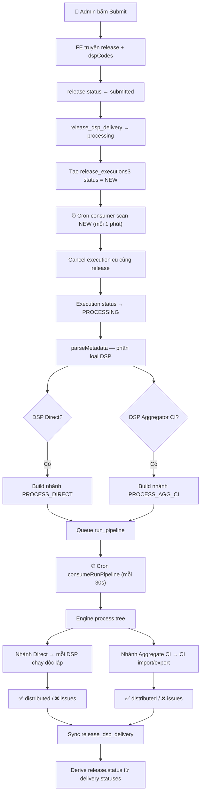
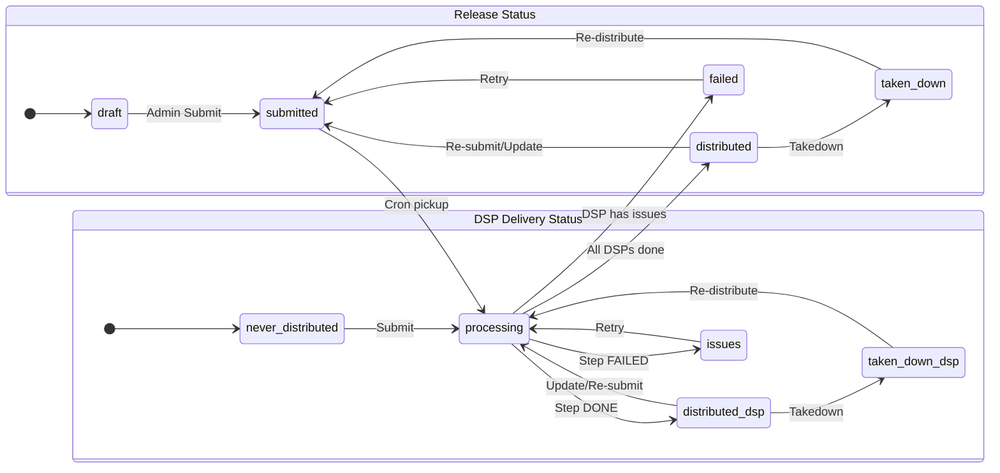

# Phân Tích Luồng Phát Hành Release & Trạng Thái DSP

## 1. Tổng Quan Luồng Phát Hành (Release Flow)

Luồng phát hành release sử dụng **Release Execution 3** — một hệ thống phân phối release tới các DSP (Digital Service Provider) dựa trên cây step, queue DB, và cron consumer.



---

## 2. Các Trạng Thái Release (`ReleaseStatus`)

> Source: [release.enum.ts](file:///e:/CODE/ag-release/ag-release-server/src/modules/release/enum/release.enum.ts)

| Status | Value | Ý nghĩa | Ghi chú |
|--------|-------|---------|---------|
| **DRAFT** | `draft` | Release mới tạo, chưa submit | Trạng thái mặc định |
| **SUBMITTED** | `submitted` | Đã submit, chờ xử lý | Set bởi `submit3()` |
| **PROCESSING** | `processing` | Đang phân phối | Khi có DSP delivery đang `processing` |
| **DISTRIBUTED** | `distributed` | Phân phối thành công | Khi tất cả DSP selected đều `distributed` |
| **FAILED** | `failed` | Thất bại | Khi có DSP delivery ở trạng thái `issues` |
| **TAKEN_DOWN** | `taken_down` | Đã gỡ xuống | Khi tất cả DSP delivery đều `taken_down` |
| ~~AWAITING_ACTION~~ | `awaiting_action` | _Deprecated_ | Comment ghi "bỏ" — không nên dùng |
| ~~PARTIAL_DONE~~ | `partial_done` | _Deprecated_ | Comment ghi "bỏ" — không nên dùng |

### Logic Derive Release Status từ DSP Deliveries

> Source: [resolveReleaseStatusByDspDeliveries](file:///e:/CODE/ag-release/ag-release-server/src/modules/release/services/release.service.ts#L1034-L1090)

```
Ưu tiên kiểm tra (từ cao → thấp):
1. Có DSP PROCESSING          → release = PROCESSING
2. Có DSP ISSUES              → release = FAILED
3. Tất cả DISTRIBUTED         → release = DISTRIBUTED
4. Tất cả TAKEN_DOWN          → release = TAKEN_DOWN
5. Có ít nhất 1 DISTRIBUTED   → release = DISTRIBUTED
6. Có ít nhất 1 TAKEN_DOWN    → release = TAKEN_DOWN
7. Tất cả NEVER_DISTRIBUTED   → giữ nguyên status cũ
8. Mặc định                   → giữ nguyên status cũ
```

---

## 3. Trạng Thái Phát Hành Lên DSP (`ReleaseDspStatus`)

> Source: [release-dsp.enum.ts](file:///e:/CODE/ag-release/ag-release-server/src/modules/release/enum/release-dsp.enum.ts)

| Status | Value | Ý nghĩa | Khi nào xảy ra |
|--------|-------|---------|----------------|
| **DRAFT** | `draft` | Bản nháp | Chưa được xử lý gì |
| **NEVER_DISTRIBUTED** | `never_distributed` | Chưa từng phân phối | Mặc định khi tạo delivery record |
| **PROCESSING** | `processing` | Đang xử lý phân phối | Khi submit hoặc enqueue DSP |
| **DISTRIBUTED** | `distributed` | Phân phối thành công | Step direct/agg CI hoàn thành `DONE` |
| **ISSUES** | `issues` | Có lỗi | Step `FAILED/CANCELLED/SKIPPED` |
| **TAKEN_DOWN** | `taken_down` | Đã gỡ xuống | Sau khi takedown thành công |

### Entity `ReleaseDspDelivery` — Các trường quan trọng

> Source: [release-dsp-delivery.entity.ts](file:///e:/CODE/ag-release/ag-release-server/src/modules/release/entities/release-dsp-delivery.entity.ts)

| Trường | Ý nghĩa |
|--------|---------|
| `releaseId` + `dspId` | Unique key — mỗi release chỉ có 1 record/DSP |
| `status` | Trạng thái phân phối hiện tại |
| `isSelected` | DSP có được chọn để phân phối không |
| `hasLiveVersion` | DSP có version đang live từ lần distribute trước |
| `lastEnqueuedAt` | Lần cuối đưa vào queue (không đảm bảo thành công) |
| `lastDeliveredAt` | Lần cuối phân phối thành công |
| `logs` | Chi tiết lỗi |
| `issues` | QA flags, validation errors (JSONB) |
| `metadataPath` | Đường dẫn folder metadata trên server |
| `batchId` | Batch ID của lần delivery |

---

## 4. Trạng Thái Execution & Step

### 4.1 Release Execution Status

> Source: [release-execution3.enum.ts](file:///e:/CODE/ag-release/ag-release-server/src/modules/release/modules/release-executions3/enums/release-execution3.enum.ts)

| Status | Ý nghĩa |
|--------|---------|
| `NEW` | Vừa tạo, chờ cron pick |
| `PROCESSING` | Đang build/run pipeline |
| `WAITING_ACTION` | Chờ admin thao tác (export CI, email) |
| `WAITING_PARTNER` | Chờ đối tác xử lý (tới `scheduledAt`) |
| `DONE` | Tất cả root steps hoàn thành |
| `FAILED` | Root step thất bại |
| `CANCELLED` | Bị hủy (khi submit mới, execution cũ bị cancel) |

### 4.2 Execution Step Status

| Status | Ý nghĩa |
|--------|---------|
| `NEW` | Step mới tạo hoặc retry |
| `PROCESSING` | Engine đang xử lý |
| `WAITING_ACTION` | Chờ admin (export CI, gửi State51) |
| `WAITING_PARTNER` | Chờ partner tới `scheduledAt` |
| `DONE` | Hoàn thành |
| `FAILED` | Lỗi |
| `SKIPPED` | Bị bỏ qua |
| `CANCELLED` | Bị hủy |

### 4.3 Execution Types

| Type | Ý nghĩa |
|------|---------|
| `INITIAL_RELEASE` | Phát hành lần đầu |
| `UPDATE` | Cập nhật release đã phát hành |
| `TAKEDOWN` | Gỡ xuống khỏi DSP |
| `RETRY` | Thử lại |

---

## 5. Phân Loại DSP & Routing

DSP được phân thành **2 nhóm chính** sau khi `parseMetadata()`:

### 5.1 Direct DSP
- DSP đi thẳng qua routing config riêng (SFTP hoặc S3)
- Mỗi DSP là nhánh `PROCESS_DIRECT_CHILD` độc lập
- Kết quả: mỗi DSP được cập nhật status riêng lẻ

### 5.2 Aggregator CI
- DSP đi qua aggregator CI (Creative Intell)
- Gom thành nhánh `PROCESS_AGG_CI` chung
- Sau đó tách thành 2 sub-group:
  - **CI Deal** (`EXPORT_AGG_CI_CI`) → Gửi qua CI Tool, chờ admin export
  - **State51** (`EXPORT_AGG_CI_STATE51`) → Gửi email

### Cây Step đầy đủ

```
ROOT (sequential)
├── GEN_UPC
├── GEN_ISRCS (parallel)
│   └── GEN_ISRC (per track)
├── VALIDATE
├── REVIEW_RELEASE
└── PROCESS_DSPS (parallel)
    ├── PROCESS_DIRECT (parallel)
    │   └── PROCESS_DIRECT_CHILD (sequential, per DSP) [isDeliveryStep]
    │       ├── CREATE_METADATA_ON_SERVER
    │       ├── UPLOAD_METADATA_TO_SFTP
    │       ├── WAIT_PARTNER_PROCESS
    │       └── SYNC_DATA_PARTNER
    └── PROCESS_AGG_CI (sequential) [isDeliveryStep]
        ├── IMPORT_CI
        ├── CREATE_METADATA_ON_SERVER
        ├── UPLOAD_METADATA_TO_SFTP
        ├── CREATE_FOLDER_DONE_CI
        ├── WAIT_PARTNER_PROCESS
        ├── GET_RESULT_IMPORT_CI
        ├── VALIDATE_QA_CI
        └── EXPORT_CI (parallel)
            ├── EXPORT_AGG_CI_CI (sequential)
            │   └── WAITING_ADMIN_EXPORT → CI Job ADMIN_EXPORT
            └── EXPORT_AGG_CI_STATE51 (sequential)
                └── SEND_EMAIL_STATE51 → CI Job EMAIL_STATE51
```

---

## 6. Mapping Step Status → DSP Delivery Status

```
submit3(dspCodes)
  → Tất cả DSP selected → PROCESSING

PROCESS_DIRECT_CHILD DONE
  → DSP direct đó → DISTRIBUTED

PROCESS_DIRECT_CHILD FAILED/CANCELLED/SKIPPED
  → DSP direct đó → ISSUES

PROCESS_AGG_CI DONE
  → Toàn bộ DSP trong nhóm CI → DISTRIBUTED

PROCESS_AGG_CI FAILED/CANCELLED/SKIPPED
  → Toàn bộ DSP trong nhóm CI → ISSUES
```

---

## 7. `hasLiveVersion` Logic

> Source: [resolveHasLiveVersion](file:///e:/CODE/ag-release/ag-release-server/src/modules/release/services/release-dsp-services/release-dsp-delivery.service.ts#L375-L388)

| DSP Status | hasLiveVersion |
|------------|---------------|
| `DISTRIBUTED` | `true` |
| `TAKEN_DOWN` | `false` |
| `NEVER_DISTRIBUTED` | `false` |
| `PROCESSING` / `ISSUES` | Giữ nguyên giá trị cũ |

---

## 8. CI Import Action (Override)

> Source: [ci-import-action.enum.ts](file:///e:/CODE/ag-release/ag-release-server/src/modules/release/enum/ci-import-action.enum.ts)

| Action | Ý nghĩa |
|--------|---------|
| `KEEP_CURRENT_STATUS` | Giữ nguyên trạng thái CI hiện tại |
| `SKIP_CI_IMPORT` | Bỏ qua bước import CI |
| `FORCE_CI_IMPORT` | Ép import lại CI dù đã tồn tại |

---

## 9. Sơ Đồ Tổng Quan Lifecycle


