# 🔄 Toàn cảnh luồng phát hành Release (Submit → Distribution)

Tài liệu phân tích toàn bộ luồng hoạt động sau khi submit một bản phát hành, bao gồm cả **client** và **server**.

---

## 1. Tổng quan kiến trúc

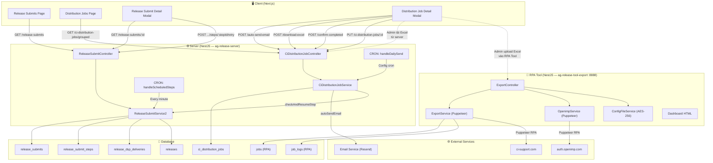

---

## 2. Luồng Submit Release (Server-side Pipeline)

### 2.1. Khởi tạo Submit

Khi user bấm "Submit Release" trên client, request `POST /release-submits` được gửi:

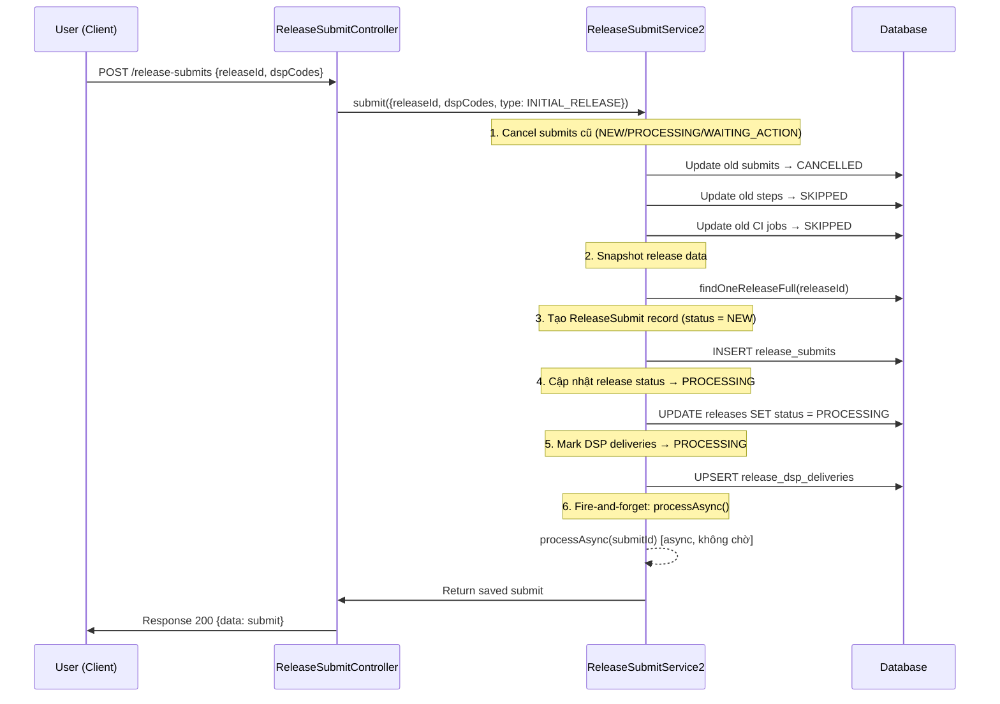

### 2.2. Pipeline Processing (Async)

Sau khi trả response cho client, server bắt đầu xử lý bất đồng bộ:

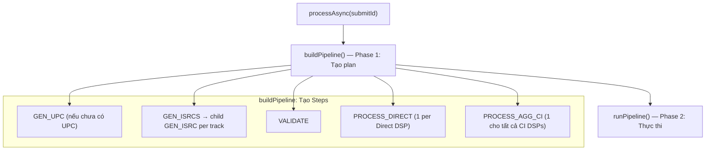

### 2.3. Cấu trúc Steps (Pipeline Tree)

```
ReleaseSubmit
├── GEN_UPC (parent, critical)
├── GEN_ISRCS (parent, critical)
│   ├── GEN_ISRC (child — track 1)
│   ├── GEN_ISRC (child — track 2)
│   └── ...
├── VALIDATE (parent, critical)
├── PROCESS_DIRECT — DSP "Apple Music" (parent, distribution)
│   ├── CREATE_AND_UPLOAD_DIRECT (child)
│   ├── WAIT_PARTNER_PROCESS (child — delay N phút)
│   └── SYNC_DATA_FROM_DSP (child)
├── PROCESS_DIRECT — DSP "Spotify" (parent, distribution)
│   ├── CREATE_AND_UPLOAD_DIRECT
│   ├── WAIT_PARTNER_PROCESS
│   └── SYNC_DATA_FROM_DSP
└── PROCESS_AGG_CI — CI Aggregator (parent, distribution)
    ├── CREATE_AND_UPLOAD_CI (child)
    ├── CREATE_FOLDER_DONE_CI (child)
    ├── WAIT_PARTNER_PROCESS (child — delay N phút)
    ├── VALIDATE_QA_CI (child)
    ├── EXPORT_CI (child — tạo CiDistributionJobs → WAITING_ACTION)
    ├── WAIT_PARTNER_PROCESS (child — delay 12h)
    └── SYNC_DATA_DSP_CI (child)
```

### 2.4. Luồng thực thi `runPipeline`

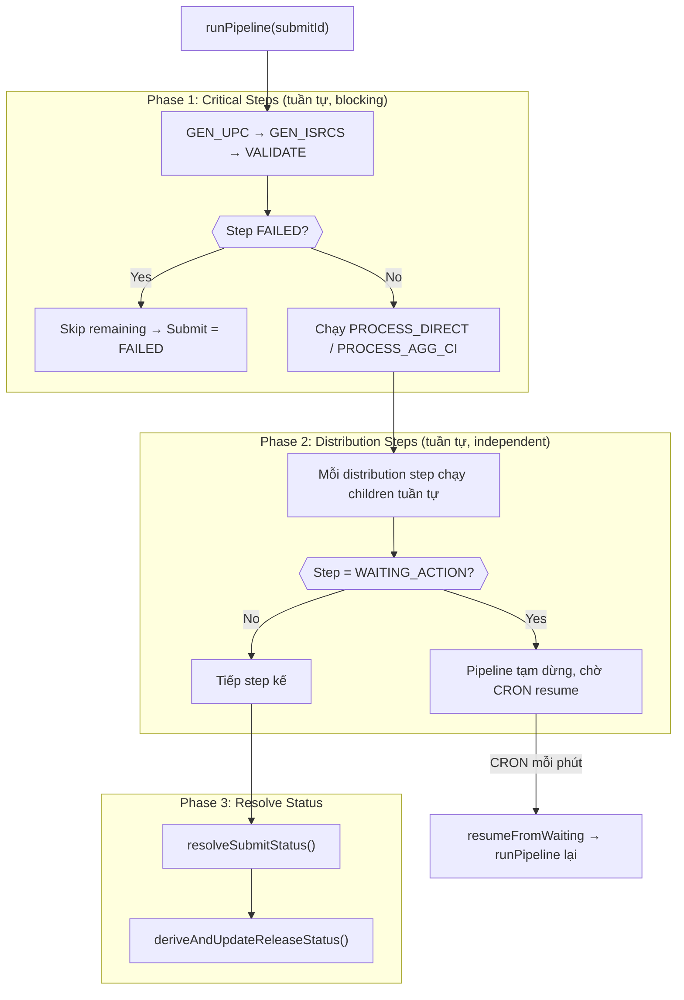

---

## 3. Máy trạng thái (State Machine)

### 3.1. ReleaseSubmit Status

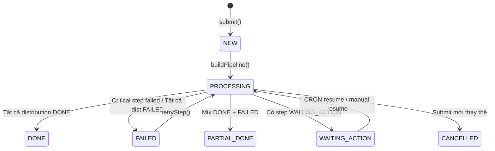

### 3.2. SubmitStep Status

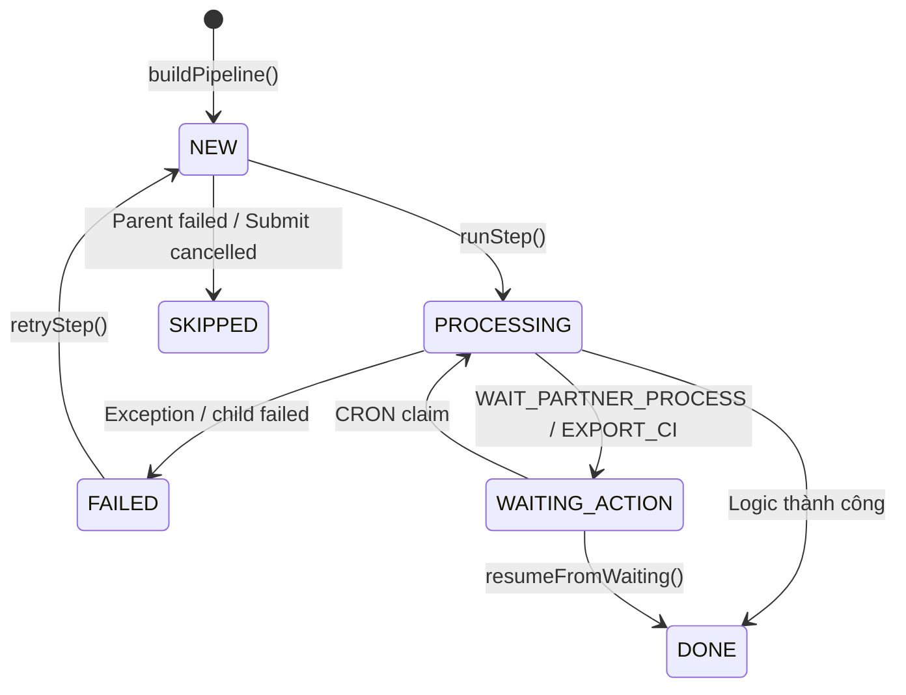

### 3.3. CiDistributionJob Status

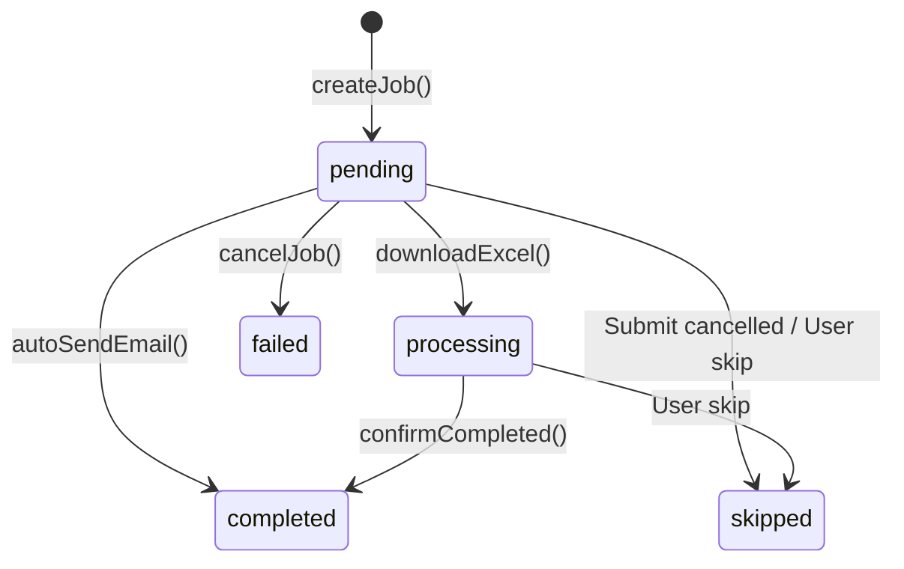

### 3.4. Release Status (derived)

| Điều kiện DSP Deliveries | Release Status |
|---|---|
| Tất cả `DISTRIBUTED` | `DISTRIBUTED` |
| Tất cả `ISSUES` | `FAILED` |
| Có `PROCESSING` + submit `WAITING_ACTION` | `AWAITING_ACTION` |
| Có `PROCESSING` | `PROCESSING` |
| Mix `DISTRIBUTED` + `ISSUES` | `PARTIAL_DONE` |

---

## 4. CRON Jobs & Auto-resume

### 4.1. `handleScheduledSteps` — Mỗi phút

Tìm steps có `status = WAITING_ACTION` và `scheduledAt <= now` → atomic claim → `resumeFromWaiting()`.

> Dùng cho `WAIT_PARTNER_PROCESS` steps (delay N phút trước khi tiếp tục).

### 4.2. `handleDailySend` — Theo lịch config `partners.ci.dailySendCron`

Tự động gom tất cả pending `email_state51` jobs → tạo Excel → gửi email → mark completed → resume pipeline.

### 4.3. CI Job `checkAndResumeStep`

Sau mỗi lần complete job (`autoSendEmail` / `confirmCompleted`), check nếu **tất cả** jobs cùng stepId đã xong → `resumeFromWaiting()` để tiếp tục pipeline.

---

## 5. Luồng CI Distribution Jobs (EXPORT_CI)

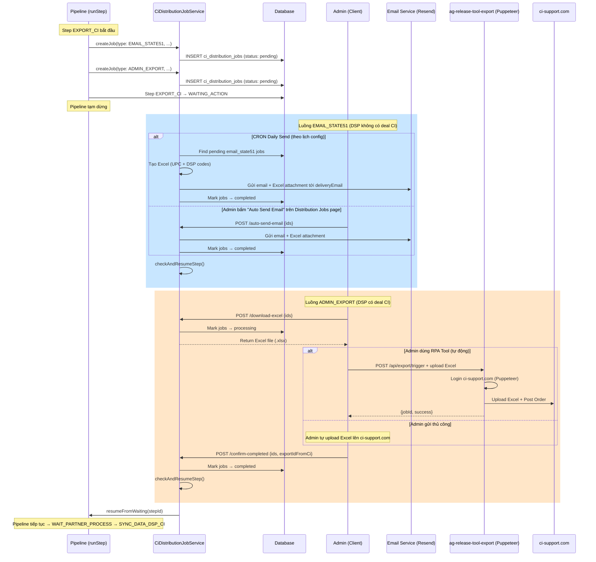

---

## 6. Client-side Architecture

### 6.1. Release Submits Page

**File**: [page.tsx](file:///d:/CODE/ag-release/ag-release-client/app/[locale]/(cms)/release-submits/page.tsx)

```
ReleaseSubmitsPage
├── ReleaseSubmitHeader        — Filter/Search
├── ReleaseSubmitTable         — Bảng danh sách submits
│   ├── Columns: iNo, UPC, Release Name, Type, Status, Target DSPs, Since, Created At
│   ├── Action: View Snapshot (FileJson icon) → ReleaseSubmitSnapshotModal
│   └── Action: View Detail (Eye icon) → ReleaseSubmitDetailModal
├── AppPagination              — Phân trang
├── ReleaseSubmitDetailModal   — Chi tiết submit + step table
│   ├── ReleaseSubmitStepTable — Bảng các steps
│   └── ReleaseSubmitStepDetailModal — Chi tiết step
└── ReleaseSubmitSnapshotModal — Xem JSON snapshot release
```

**API Calls (React Query)**:

| Hook | API Endpoint | Mô tả |
|---|---|---|
| [useGetListReleaseSubmits](file:///d:/CODE/ag-release/ag-release-client/modules/release-submit/hooks/use-get-list.ts) | `GET /release-submits` | Lấy danh sách submits (phân trang, filter) |
| [useGetDetailReleaseSubmit](file:///d:/CODE/ag-release/ag-release-client/modules/release-submit/hooks/use-get-detail.ts) | `GET /release-submits/:id` | Lấy chi tiết submit + steps + logs |
| [useRetryReleaseSubmitStep](file:///d:/CODE/ag-release/ag-release-client/modules/release-submit/hooks/use-retry-step.ts) | `POST /release-submits/steps/:stepId/retry` | Retry step bị failed |

---

### 6.2. Distribution Jobs Page

**File**: [page.tsx](file:///d:/CODE/ag-release/ag-release-client/app/[locale]/(cms)/distribution-jobs/page.tsx)

```
DistributionJobsPage
├── DistributionJobsHeader          — Filter/Search
├── DistributionJobsGroupedTable    — Bảng grouped (theo email + date + type)
│   └── Expand row → chi tiết từng job (UPC, DSP codes, status)
├── AppPagination                   — Phân trang
└── DistributionJobDetailModal      — Modal chi tiết + actions
```

**API Calls (React Query)**:

| Hook | API Endpoint | Mô tả |
|---|---|---|
| [useGetListDistributionJobsGrouped](file:///d:/CODE/ag-release/ag-release-client/modules/distribution-jobs/hooks/use-get-list-grouped.ts) | `GET /ci-distribution-jobs/grouped` | Lấy danh sách grouped jobs |
| [useAutoSendEmailDistributionJobs](file:///d:/CODE/ag-release/ag-release-client/modules/distribution-jobs/hooks/use-auto-send-email.ts) | `POST /ci-distribution-jobs/auto-send-email` | Auto gửi email (chọn jobs → tạo Excel → gửi) |
| [useDownloadExcelDistributionJobs](file:///d:/CODE/ag-release/ag-release-client/modules/distribution-jobs/hooks/use-download-excel.ts) | `POST /ci-distribution-jobs/download-excel` | Tải file Excel (mark → processing) |
| [useConfirmCompletedDistributionJobs](file:///d:/CODE/ag-release/ag-release-client/modules/distribution-jobs/hooks/use-confirm-completed.ts) | `POST /ci-distribution-jobs/confirm-completed` | Xác nhận đã gửi (mark → completed → resume pipeline) |
| [useUpdateDistributionJob](file:///d:/CODE/ag-release/ag-release-client/modules/distribution-jobs/hooks/use-update-distribution-job.ts) | `PUT /ci-distribution-jobs/:id` | Update job (email, dspCodes, subject, cancel) |

---

## 7. Mapping API Endpoints ↔ Server Handlers

### Release Submits

| Method | Endpoint | Controller | Service Method |
|---|---|---|---|
| `POST` | `/release-submits` | [ReleaseSubmitController](file:///d:/CODE/ag-release/ag-release-server/src/modules/release/modules/release-submit/controllers/release-submit.controller.ts#L24-L32) | `submit()` |
| `GET` | `/release-submits` | [ReleaseSubmitController](file:///d:/CODE/ag-release/ag-release-server/src/modules/release/modules/release-submit/controllers/release-submit.controller.ts#L35-L39) | `getList()` |
| `GET` | `/release-submits/:id` | [ReleaseSubmitController](file:///d:/CODE/ag-release/ag-release-server/src/modules/release/modules/release-submit/controllers/release-submit.controller.ts#L42-L46) | `findOne()` |
| `POST` | `/release-submits/steps/:stepId/retry` | [ReleaseSubmitController](file:///d:/CODE/ag-release/ag-release-server/src/modules/release/modules/release-submit/controllers/release-submit.controller.ts#L56-L60) | `retryStep()` |

### CI Distribution Jobs

| Method | Endpoint | Controller | Service Method |
|---|---|---|---|
| `GET` | `/ci-distribution-jobs` | [CiDistributionJobController](file:///d:/CODE/ag-release/ag-release-server/src/modules/release/modules/release-submit/controllers/ci-distribution-job.controller.ts#L37-L41) | `getList()` |
| `GET` | `/ci-distribution-jobs/grouped` | [CiDistributionJobController](file:///d:/CODE/ag-release/ag-release-server/src/modules/release/modules/release-submit/controllers/ci-distribution-job.controller.ts#L49-L56) | `getGrouped()` |
| `POST` | `/ci-distribution-jobs/auto-send-email` | [CiDistributionJobController](file:///d:/CODE/ag-release/ag-release-server/src/modules/release/modules/release-submit/controllers/ci-distribution-job.controller.ts#L72-L76) | `autoSendEmail()` |
| `POST` | `/ci-distribution-jobs/download-excel` | [CiDistributionJobController](file:///d:/CODE/ag-release/ag-release-server/src/modules/release/modules/release-submit/controllers/ci-distribution-job.controller.ts#L93-L109) | `downloadExcel()` |
| `POST` | `/ci-distribution-jobs/confirm-completed` | [CiDistributionJobController](file:///d:/CODE/ag-release/ag-release-server/src/modules/release/modules/release-submit/controllers/ci-distribution-job.controller.ts#L117-L124) | `confirmCompleted()` |
| `POST` | `/ci-distribution-jobs/daily-send` | [CiDistributionJobController](file:///d:/CODE/ag-release/ag-release-server/src/modules/release/modules/release-submit/controllers/ci-distribution-job.controller.ts#L78-L85) | `handleDailySend()` |
| `POST` | `/ci-distribution-jobs/:id/cancel` | [CiDistributionJobController](file:///d:/CODE/ag-release/ag-release-server/src/modules/release/modules/release-submit/controllers/ci-distribution-job.controller.ts#L128-L132) | `cancelJob()` |
| `PUT` | `/ci-distribution-jobs/:id` | [CiDistributionJobController](file:///d:/CODE/ag-release/ag-release-server/src/modules/release/modules/release-submit/controllers/ci-distribution-job.controller.ts#L141-L148) | `updateJob()` |

---

## 8. Phân loại DSP: Direct vs CI Aggregator

Server phân loại DSPs dựa trên `DspRoutingConfig`:

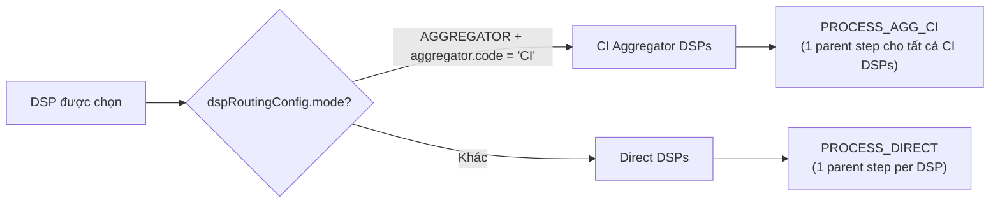

**CI DSPs** được chia thêm theo `hasDeal`:
- `hasDeal = false` → **State51 DSPs** → tạo `CiDistributionJob` type `EMAIL_STATE51` (tự động gửi email)
- `hasDeal = true` → **Deal DSPs** → tạo `CiDistributionJob` type `ADMIN_EXPORT` (admin tải Excel + gửi thủ công)

---

## 9. Retry & Error Recovery

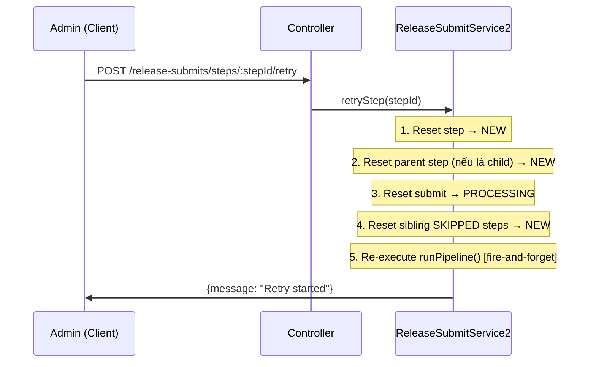

---

## 10. RPA Tool: `ag-release-tool-export` (Port 8888)

Microservice NestJS riêng biệt, sử dụng **Puppeteer** để tự động hóa các tác vụ trên nền tảng bên thứ ba.

### 10.1. Chức năng chính

| Chức năng | Mô tả |
|---|---|
| **CI-Support RPA** | Tự động đăng nhập ci-support.com → upload Excel → click "Post Order" |
| **OpenIMP Token** | Tự động đăng nhập auth.openimp.com → trích xuất Access Token + Refresh Token |
| **Config Management** | Lưu/đọc credentials được mã hóa AES-256 trên server |
| **Dashboard** | Giao diện HTML quản trị tích hợp (Glassmorphism) |
| **Job Tracking** | Lưu logs chi tiết từng bước RPA vào PostgreSQL |

### 10.2. Luồng RPA ci-support.com

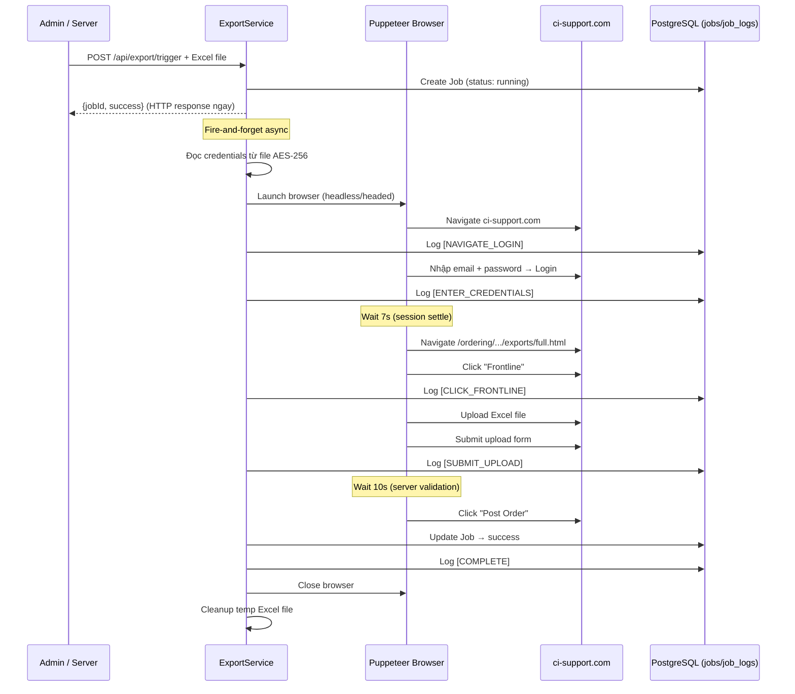

### 10.3. API Endpoints

| Method | Endpoint | Auth | Mô tả |
|---|---|---|---|
| `POST` | `/api/auth/login` | Auth0 | Xác thực Auth0 → trả API Key |
| `GET` | `/api/export/config` | Auth0/API Key | Đọc config (credentials) |
| `POST` | `/api/export/config` | Auth0/API Key | Lưu config vào file mã hóa |
| `POST` | `/api/export/trigger` | Auth0/API Key | Upload Excel → kích hoạt RPA (async) |
| `GET` | `/api/export/status` | Auth0/API Key | Poll trạng thái + live logs |
| `GET` | `/api/export/job/:jobId` | Auth0/API Key | Lấy logs Job từ PostgreSQL |
| `POST` | `/api/export/clear-logs` | Auth0 | Xóa logs in-memory |
| `POST` | `/api/openimp/token` | Auth0/API Key | Puppeteer lấy OpenIMP token (đồng bộ) |
| `GET` | `/` | Public | Serve Dashboard HTML |

### 10.4. Auth System

- **Dual Auth**: API Key (`x-api-key` header) hoặc Auth0 Bearer Token
- API Key = full admin bypass (dùng cho machine-to-machine)
- Auth0 = RBAC fine-grained permissions:
  - `release-tool.export.config.view/edit`
  - `release-tool.export.trigger`
  - `release-tool.export.status`
  - `release-tool.openimp.token`
  - `release-tool.admin` (full access)

### 10.5. Vị trí trong luồng tổng thể

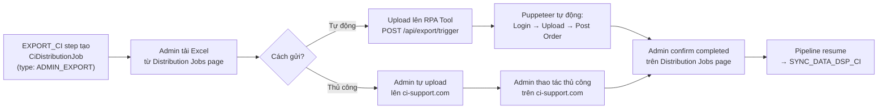

---

## 11. File References

### Client (`ag-release-client`)

| Module | Path |
|---|---|
| Release Submit Module | [modules/release-submit/](file:///d:/CODE/ag-release/ag-release-client/modules/release-submit) |
| Distribution Jobs Module | [modules/distribution-jobs/](file:///d:/CODE/ag-release/ag-release-client/modules/distribution-jobs) |
| Release Submit Types | [types/index.ts](file:///d:/CODE/ag-release/ag-release-client/modules/release-submit/types/index.ts) |
| Distribution Jobs Types | [types/index.ts](file:///d:/CODE/ag-release/ag-release-client/modules/distribution-jobs/types/index.ts) |
| Release Submit Enums | [enums/index.ts](file:///d:/CODE/ag-release/ag-release-client/modules/release-submit/enums/index.ts) |

### Server (`ag-release-server`)

| Module | Path |
|---|---|
| Release Submit Service | [release-submit2.service.ts](file:///d:/CODE/ag-release/ag-release-server/src/modules/release/modules/release-submit/services/release-submit2.service.ts) |
| CI Distribution Job Service | [ci-distribution-job.service.ts](file:///d:/CODE/ag-release/ag-release-server/src/modules/release/modules/release-submit/services/ci-distribution-job.service.ts) |
| Release Submit Controller | [release-submit.controller.ts](file:///d:/CODE/ag-release/ag-release-server/src/modules/release/modules/release-submit/controllers/release-submit.controller.ts) |
| CI Job Controller | [ci-distribution-job.controller.ts](file:///d:/CODE/ag-release/ag-release-server/src/modules/release/modules/release-submit/controllers/ci-distribution-job.controller.ts) |
| Entity: ReleaseSubmit | [release-submit.entity.ts](file:///d:/CODE/ag-release/ag-release-server/src/modules/release/modules/release-submit/entities/release-submit.entity.ts) |
| Enums (Server) | [release-submit.enum.ts](file:///d:/CODE/ag-release/ag-release-server/src/modules/release/modules/release-submit/release-submit.enum.ts) |

### RPA Tool (`ag-release-tool-export`)

| Module | Path |
|---|---|
| Export Controller | [export.controller.ts](file:///d:/CODE/ag-release/ag-release-tool-export/src/modules/export/export.controller.ts) |
| Export Service (Puppeteer RPA) | [export.service.ts](file:///d:/CODE/ag-release/ag-release-tool-export/src/modules/export/services/export.service.ts) |
| OpenIMP Service (Puppeteer) | [openimp.service.ts](file:///d:/CODE/ag-release/ag-release-tool-export/src/modules/export/services/openimp.service.ts) |
| Config File Service (AES-256) | [config-file.service.ts](file:///d:/CODE/ag-release/ag-release-tool-export/src/modules/export/services/config-file.service.ts) |
| Dashboard Controller | [dashboard.controller.ts](file:///d:/CODE/ag-release/ag-release-tool-export/src/modules/dashboard/dashboard.controller.ts) |
| Dashboard HTML | [dashboard.html](file:///d:/CODE/ag-release/ag-release-tool-export/src/modules/dashboard/views/dashboard.html) |
| Job Entity | [job.entity.ts](file:///d:/CODE/ag-release/ag-release-tool-export/src/modules/export/entities/job.entity.ts) |
| Job Log Entity | [job-log.entity.ts](file:///d:/CODE/ag-release/ag-release-tool-export/src/modules/export/entities/job-log.entity.ts) |
| Auth Guard (Unified) | [unified-auth.guard.ts](file:///d:/CODE/ag-release/ag-release-tool-export/src/common/guards/unified-auth.guard.ts) |
| Permissions | [permissions.constant.ts](file:///d:/CODE/ag-release/ag-release-tool-export/src/common/constants/permissions.constant.ts) |
