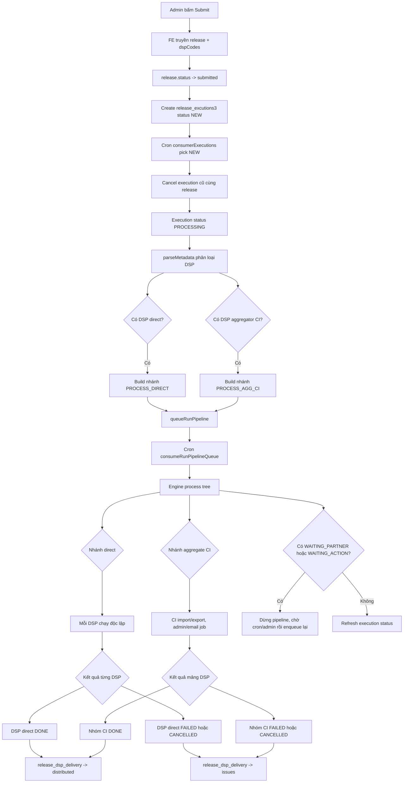
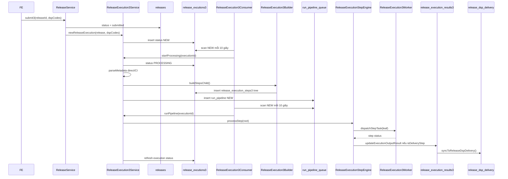
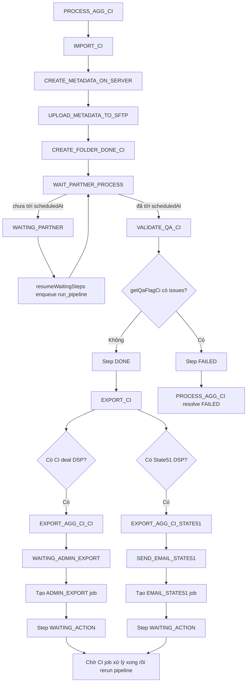
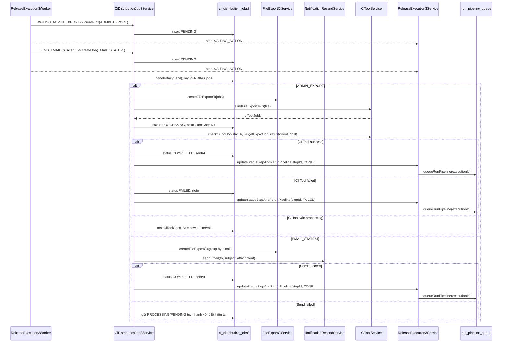

# Release Execution 3

Tài liệu này mô tả luồng nghiệp vụ từ lúc admin bấm submit release tới khi status được đồng bộ vào bảng `release_dsp_delivery`, kèm logic cây step, retry, cancel, queue, CI job và logs.

## 1. Tổng quan nghiệp vụ

Release Execution 3 dùng để phân phối một `Release` tới danh sách DSP do FE truyền lên.

Input chính khi submit:

```ts
{
  release: Release,
  dspCodes: string[],
  type: INITIAL_RELEASE | UPDATE | TAKEDOWN | RETRY
}
```

Sau submit, `submit3()` cập nhật `release.status = submitted`, reset `releaseEndDate = null`, áp dụng `ciImportAction` lên snapshot release nếu FE truyền lên, rồi tạo một bản ghi `release_excutions3` ở status `NEW`. Code hiện tại không gọi trực tiếp `ReleaseDspDeliveryService.updateDeliveryStatus()` trong `submit3()`. Cron consumer sẽ lấy execution `NEW`, đổi sang `PROCESSING`, phân loại DSP, build cây step và đẩy một job vào queue `run_pipeline`.

DSP được phân thành 2 nhóm:

| Nhóm          | Ý nghĩa                                             | Cách xử lý                                                                                 | Kết quả sync về `release_dsp_delivery`                              |
| ------------- | --------------------------------------------------- | ------------------------------------------------------------------------------------------ | ------------------------------------------------------------------- |
| Direct        | DSP đi thẳng qua routing config riêng, SFTP hoặc S3 | Mỗi DSP là một nhánh độc lập `PROCESS_DIRECT_CHILD`                                        | Mỗi DSP được cập nhật status độc lập                                |
| Aggregator CI | DSP đi qua aggregator CI                            | Gom lại thành một nhánh `PROCESS_AGG_CI`, sau đó tách `CI Deal` và `State51` ở bước export | Kết quả là một mảng DSP trong delivery metadata của nhánh aggregate |

Status ở bảng `release_dsp_delivery` không được cập nhật trực tiếp ngay trong `submit3()`. Status DSP được đồng bộ gián tiếp qua `ReleaseExecution3ResultService`: `parseMetadata()` khởi tạo result cho các DSP trong execution, engine cập nhật result theo các step có `isDeliveryStep = true`, rồi result service sync latest-state sang `release_dsp_delivery`.

Với các step này, `metadata.input.delivery` chứa `releaseId` và danh sách `items` theo dạng `{ id }`, `{ dspId }` hoặc `{ dspCode }`. Khi step đổi status, engine map status của step sang status của delivery, tạo lại danh sách `{ id | dspId | dspCode, status }`, rồi gọi `ReleaseExecution3ResultService.updateExecutionOutputResult()`. Service này upsert vào `release_execution_results3`, sau đó gọi `syncToReleaseDspDelivery()` để đẩy latest result sang `ReleaseDspDeliveryService.updateDeliveryStatus({ releaseIds, items })`. Vì vậy step direct có thể cập nhật từng DSP riêng lẻ, còn step aggregator có thể cập nhật cả nhóm DSP đi qua CI trong cùng một lần sync.

## 2. Sơ đồ nghiệp vụ

Flowchart tổng quan cho admin:



Sequence diagram kỹ thuật:



Flowchart luồng CI Aggregator:



Sequence diagram CI Job async:



## 3. Luồng status tổng quan

### 3.1 Release

Enum: `ReleaseStatus` trong `src/modules/release/enum/release.enum.ts`.

| Status        | Ý nghĩa                               |
| ------------- | ------------------------------------- |
| `draft`       | Release mới/chưa submit               |
| `submitted`   | Đã submit theo logic release hiện tại |
| `processing`  | Đang xử lý phân phối                  |
| `distributed` | Phân phối thành công                  |
| `failed`      | Thất bại                              |
| `taken_down`  | Đã takedown                           |

Note: enum release có thể có các status phục vụ UI/legacy như `awaiting_action` hoặc `partial_done`, nhưng v3 hiện đọc trạng thái chi tiết ở execution/step/delivery. Phần chờ thao tác nên đọc từ `ReleaseExecutionStatus.WAITING_ACTION` hoặc step/job liên quan.

Trong module v3 hiện tại, `submit3()` set `release.status = submitted`. Sau đó status từng DSP được cập nhật ở `release_dsp_delivery` thông qua `ReleaseExecution3ResultService`. Khi `ReleaseDspDeliveryService.updateDeliveryStatus()` chạy, service này cũng gọi `ReleaseService.syncReleaseStatus()` để derive lại status tổng của release từ delivery hiện có.

### 3.2 Release DSP Delivery

Enum: `ReleaseDspStatus`.

| Status              | Ý nghĩa                                         |
| ------------------- | ----------------------------------------------- |
| `draft`             | Chưa phân phối                                  |
| `processing`        | Đã enqueue/đang xử lý DSP                       |
| `issues`            | Có lỗi ở DSP đó hoặc nhóm aggregate chứa DSP đó |
| `never_distributed` | DSP chưa từng được phân phối                    |
| `distributed`       | DSP đã phân phối thành công                     |
| `taken_down`        | DSP đã takedown                                 |

Mapping từ submit/step sang delivery:

```text
submit3(dspCodes)
  -> không update trực tiếp release_dsp_delivery
  -> ReleaseExecution3Queue.queueExecution()
  -> insert release_excutions3 status NEW

startProcessing()
  -> parseMetadata()
  -> ReleaseExecution3ResultService.updateExecutionOutputResult()
  -> khởi tạo result các DSP trong execution với status never_distributed
  -> syncToReleaseDspDelivery()

PROCESS_DSPS PROCESSING
  -> không sync delivery vì trạng thái trung gian không map sang ReleaseDspStatus

PROCESS_DIRECT_CHILD DONE
  -> đúng DSP direct đó: distributed

PROCESS_DIRECT_CHILD FAILED/CANCELLED/SKIPPED
  -> đúng DSP direct đó: issues

PROCESS_AGG_CI DONE
  -> toàn bộ DSP trong nhóm CI của execution: distributed

PROCESS_AGG_CI FAILED/CANCELLED/SKIPPED
  -> toàn bộ DSP trong nhóm CI của execution: issues
```

### 3.3 Release Execution

Enum: `ReleaseExecutionStatus`.

| Status            | Khi nào xảy ra                                         |
| ----------------- | ------------------------------------------------------ |
| `NEW`             | Execution vừa tạo, chờ cron pick                       |
| `PROCESSING`      | Đang build/rerun pipeline                              |
| `WAITING_ACTION`  | Có step chờ admin hoặc tác vụ thủ công                 |
| `WAITING_PARTNER` | Có step chờ partner tới `scheduledAt`                  |
| `DONE`            | Tất cả root step `DONE`                                |
| `FAILED`          | Root step thất bại theo rule tổng                      |
| `CANCELLED`       | Execution bị hủy                                       |

Rule `deriveExecutionStatusFromSteps()`:

| Ưu tiên | Điều kiện root steps               | Execution status |
| ------- | ---------------------------------- | ---------------- |
| 1       | Có `WAITING_ACTION`                | `WAITING_ACTION` |
| 2       | Có `PROCESSING` hoặc `NEW`         | `PROCESSING`     |
| 3       | Tất cả `DONE`                      | `DONE`           |
| 4       | Tất cả `FAILED`                    | `FAILED`         |
| 5       | Tất cả `CANCELLED`                 | `CANCELLED`      |
| 6       | Có cả `FAILED` và `CANCELLED`      | `FAILED`         |
| 7       | Các trạng thái hỗn hợp còn lại     | `PROCESSING`     |

### 3.4 Release Execution Step

Enum: `ReleaseExecutionStepStatus`.

| Status            | Khi nào xảy ra                                       |
| ----------------- | ---------------------------------------------------- |
| `NEW`             | Step vừa build hoặc vừa retry                        |
| `PROCESSING`      | Engine đang xử lý step                               |
| `WAITING_ACTION`  | Chờ admin thao tác, ví dụ export CI hoặc gửi State51 |
| `WAITING_PARTNER` | Chờ đối tác xử lý tới `scheduledAt`                  |
| `DONE`            | Step hoàn thành                                      |
| `FAILED`          | Step lỗi                                             |
| `SKIPPED`         | Step bị bỏ qua                                       |
| `CANCELLED`       | Step bị hủy                                          |

Rule `resolveStatusByChild()` cho step cha:

| Ưu tiên | Điều kiện child steps | Parent status     |
| ------- | --------------------- | ----------------- |
| 1       | Có `WAITING_ACTION`   | `WAITING_ACTION`  |
| 2       | Có `WAITING_PARTNER`  | `WAITING_PARTNER` |
| 3       | Có `FAILED`           | `FAILED`          |
| 4       | Có `CANCELLED`        | `CANCELLED`       |
| 5       | Có `PROCESSING`       | `PROCESSING`      |
| 6       | Tất cả `DONE`         | `DONE`            |
| 7       | Mặc định              | `NEW`             |

### 3.5 CI Job

Enum: `CiJobStatus3`.

| Status       | Ý nghĩa                                              |
| ------------ | ---------------------------------------------------- |
| `PENDING`    | Job đã tạo, chờ cron/admin xử lý                     |
| `PROCESSING` | Đã gửi email hoặc gửi sang CI Tool, đang chờ kết quả |
| `COMPLETED`  | Job hoàn thành, step liên quan được resume           |
| `FAILED`     | Job thất bại                                         |
| `CANCEL`     | Job bị hủy                                           |

### 3.6 Queue

Enum: `RunPipelineQueueStatus`.

| Status       | Ý nghĩa                                                                |
| ------------ | ---------------------------------------------------------------------- |
| `NEW`        | Job chờ consumer                                                       |
| `PROCESSING` | Consumer đang chạy `runPipeline()`                                     |
| `DONE`       | Pipeline run xong                                                      |
| `FAILED`     | Pipeline run lỗi hoặc job bị superseded bởi job mới hơn cùng execution |

## 4. Entity và trường đặc biệt

### 4.1 `release_excutions3`

Entity: `ReleaseExecution3`.

| Field                                        | Ý nghĩa                                                             |
| -------------------------------------------- | ------------------------------------------------------------------- |
| `type`                                       | Loại execution: `INITIAL_RELEASE`, `UPDATE`, `TAKEDOWN`, `RETRY`    |
| `releaseId`                                  | Release đang được xử lý                                             |
| `releaseTitle`, `releaseUpc`                 | Snapshot nhanh để query/list                                        |
| `status`                                     | Status tổng của execution                                           |
| `completedAt`                                | Set khi status final: `DONE`, `FAILED`, `CANCELLED` |
| `summary`                                    | Summary/error message                                               |
| `metadata.input.releaseSnapshot`             | Snapshot release tại thời điểm submit                               |
| `metadata.input.dspCodes`                    | Mảng code DSP FE truyền vào                                         |
| `metadata.input.dspDirect`                   | DSP direct sau `parseMetadata()`                                    |
| `metadata.input.dspAggregator.ci.ci`         | DSP đi CI và có deal                                                |
| `metadata.input.dspAggregator.ci.state51`    | DSP đi CI nhưng route State51                                       |
| `metadata.input.dspAggregator.ci.primaryDsp` | DSP đại diện dùng để lấy routing config CI                          |
| `metadata.input.delivery`                    | Input để sync `release_dsp_delivery` theo all/direct/agg            |
| `metadata.output.result`                     | Kết quả tổng hợp nếu cần trả cho UI                                 |

### 4.2 `release_execution_steps3`

Entity: `ReleaseExecutionStep3`.

| Field                      | Ý nghĩa                                                                          |
| -------------------------- | -------------------------------------------------------------------------------- |
| `releaseExecutionId`       | Execution cha                                                                    |
| `parentStepId`             | Self-reference để tạo cây                                                        |
| `type`                     | Loại step                                                                        |
| `status`                   | Status của step                                                                  |
| `order`                    | Thứ tự trong cùng parent                                                         |
| `metadata.input`           | Input riêng cho step, ví dụ `dsp`, `trackId`, `delivery`, `waitMinutes`          |
| `metadata.output`          | Output riêng của step, ví dụ `upc`, `isrc`, `batchId`, `outputDir`, `jobCreated` |
| `metadata.scheduledAt`     | Thời điểm resume cho `WAIT_PARTNER_PROCESS`                                      |
| `isDeliveryStep`           | Nếu `true`, status step sẽ sync về `release_dsp_delivery`                        |
| `childExecutionMode`       | `sequential` hoặc `parallel` cho các child steps                                 |
| `startedAt`, `completedAt` | Timeline xử lý step                                                              |

### 4.3 `release_execution3_run_pipeline_queue`

Bảng queue DB cho các lần chạy lại pipeline.

| Field                      | Ý nghĩa                               |
| -------------------------- | ------------------------------------- |
| `releaseExecutionId`       | Execution cần chạy                    |
| `status`                   | `NEW`, `PROCESSING`, `DONE`, `FAILED` |
| `attempts`, `maxAttempts`  | Dự phòng retry queue                  |
| `error`                    | Lỗi khi consumer chạy pipeline        |
| `startedAt`, `completedAt` | Timeline job queue                    |

### 4.4 `ci_distribution_jobs3`

Bảng job phục vụ các bước CI cần xử lý theo batch hoặc thủ công.

| Field                                       | Ý nghĩa                                  |
| ------------------------------------------- | ---------------------------------------- |
| `type`                                      | `ADMIN_EXPORT` hoặc `EMAIL_STATE51`      |
| `upc`                                       | UPC của release                          |
| `dspCiCodes`                                | Mảng DSP code theo format CI             |
| `releaseExecutionId`, `stepId`, `releaseId` | Liên kết ngược về execution/step/release |
| `deliveryEmail`, `deliveryEmailSubject`     | Dùng cho State51 email                   |
| `ciToolJobId`, `nextCiToolCheckAt`          | Dùng cho CI Tool export async            |
| `status`                                    | Status CI job                            |
| `sentAt`                                    | Thời điểm gửi/hoàn thành                 |

## 5. Cây step

Builder tạo cây bằng đệ quy: gọi `buildStepsChild()` cho root, lưu các child vào DB, rồi gọi lại chính nó cho từng child vừa tạo. Step nào không match case trong builder thì là leaf, không sinh con nữa.

Tree đầy đủ:

```text
ROOT
├─ GEN_UPC                                      nếu releaseSnapshot.upc rỗng
├─ GEN_ISRCS                                   nếu có track chưa có ISRC
│  ├─ GEN_ISRC                                 track 1
│  ├─ GEN_ISRC                                 track 2
│  └─ GEN_ISRC                                 track n
├─ VALIDATE
└─ PROCESS_DSPS                                parallel, isDeliveryStep=true
   ├─ PROCESS_DIRECT                           nếu có dspDirect, parallel
   │  ├─ PROCESS_DIRECT_CHILD                  direct DSP 1, isDeliveryStep=true
   │  │  ├─ CREATE_METADATA_ON_SERVER
   │  │  ├─ UPLOAD_METADATA_TO_SFTP
   │  │  ├─ WAIT_PARTNER_PROCESS
   │  │  └─ SYNC_DATA_PARTNER
   │  ├─ PROCESS_DIRECT_CHILD                  direct DSP 2
   │  │  └─ ...
   │  └─ PROCESS_DIRECT_CHILD                  direct DSP n
   │     └─ ...
   └─ PROCESS_AGG                              nếu có dspAggregator.ci.ci, parallel
      └─ PROCESS_AGG_CI                        isDeliveryStep=true
         ├─ IMPORT_CI
         │  ├─ CREATE_METADATA_ON_SERVER
         │  ├─ UPLOAD_METADATA_TO_SFTP
         │  ├─ CREATE_FOLDER_DONE_CI
         │  ├─ WAIT_PARTNER_PROCESS
         │  └─ VALIDATE_QA_CI
         └─ EXPORT_CI                          parallel
            ├─ EXPORT_AGG_CI_CI                nếu có CI deal DSP
            │  └─ WAITING_ADMIN_EXPORT         tạo ADMIN_EXPORT job, WAITING_ACTION
            └─ EXPORT_AGG_CI_STATE51           nếu có State51 DSP
               └─ SEND_EMAIL_STATE51           tạo EMAIL_STATE51 job, WAITING_ACTION
```

Các step đồng bộ với `release_dsp_delivery`:

| Step                   | Phạm vi sync                                                      |
| ---------------------- | ----------------------------------------------------------------- |
| `PROCESS_DSPS`         | Tất cả DSP của submit, có thể re-sync `processing` trong pipeline |
| `PROCESS_DIRECT_CHILD` | Một DSP direct cụ thể                                             |
| `PROCESS_AGG_CI`       | Toàn bộ DSP đi qua CI aggregate                                   |

## 6. Logic engine

Class: `ReleaseExecutionStepEngine`.

### 6.1 Leaf step

Leaf là step không có `childSteps`.

```text
Nếu status đã final hoặc đang WAITING_ACTION:
  return status, không chạy lại

Nếu WAITING_PARTNER và scheduledAt chưa tới:
  return WAITING_PARTNER

Nếu WAITING_PARTNER và scheduledAt đã tới:
  chạy tiếp task

Ngược lại:
  set PROCESSING
  worker.dispatchStepTask()
  set status theo kết quả
  nếu isDeliveryStep thì sync release_dsp_delivery
```

Các status leaf được coi là dừng, không tự chạy lại: `DONE`, `FAILED`, `CANCELLED`, `SKIPPED`, `WAITING_ACTION`.

Lý do chỉ dừng ở các status này khi không có con: retry/cancel cần biết chính xác leaf nào đã kết thúc thật, leaf nào đang chờ external action. Nếu mỗi lần gọi pipeline đều chạy lại leaf đã hoàn tất thì sẽ tạo lại file, upload lại, tạo lại job hoặc sync trùng.

### 6.2 Parent step

Parent là step có `childSteps`.

```text
set parent PROCESSING

Nếu childExecutionMode = sequential:
  chạy con theo order
  gặp FAILED / WAITING_ACTION / WAITING_PARTNER / CANCELLED thì dừng nhánh
  resolve status cha từ status con

Nếu childExecutionMode = parallel:
  chạy hết các con
  không dừng nhánh khi một con fail
  resolve status cha từ status con
```

Ghi chú triển khai: code hiện tại của mode `parallel` vẫn duyệt bằng `for await` tuần tự để dễ kiểm soát side effect, nhưng không dừng khi một child fail. Vì vậy đây là "parallel về nghiệp vụ/isolation", chưa phải chạy đồng thời bằng `Promise.allSettled`. Nếu muốn tăng throughput có thể đổi phần này sang `Promise.allSettled` sau khi kiểm tra transaction, SFTP, file temp và rate limit.

### 6.3 Fail isolation

Nhánh direct nằm dưới `PROCESS_DIRECT` mode `parallel`. Mỗi `PROCESS_DIRECT_CHILD` là một DSP riêng, có delivery metadata riêng.

Khi một DSP direct fail:

```text
PROCESS_DIRECT_CHILD DSP A -> FAILED
release_dsp_delivery DSP A -> issues
PROCESS_DIRECT tiếp tục xử lý DSP B, C...
DSP B/C vẫn có thể DONE -> distributed
PROCESS_DIRECT resolve theo status con
PROCESS_DSPS resolve theo direct + agg
```

Nhờ vậy một DSP lỗi không làm các DSP độc lập khác mất cơ hội chạy. Đây là mục tiêu chính của cây step theo nhánh.

### 6.4 WAITING_PARTNER

`WAIT_PARTNER_PROCESS` chạy lần đầu:

```text
metadata.scheduledAt = now + waitMinutes
return WAITING_PARTNER
```

Cron `resumeWaitingSteps()` quét các step `WAITING_PARTNER` đã tới `scheduledAt`, gom theo `releaseExecutionId`, rồi enqueue `run_pipeline`. Khi pipeline chạy lại, step thấy đã tới giờ và trả `DONE`, sau đó nhánh tiếp tục chạy step kế tiếp.

### 6.5 WAITING_ACTION

Các step như `WAITING_ADMIN_EXPORT` và `SEND_EMAIL_STATE51` tạo `CiDistributionJob3`, set `metadata.output.jobCreated = true`, rồi trả `WAITING_ACTION`.

Pipeline dừng ở execution status `WAITING_ACTION` để chờ admin, cron daily send hoặc CI tool callback cập nhật job/step.

## 7. Run pipeline gọi lại full luồng

Khi một CI job hoàn thành, service không gọi "chạy tiếp đúng step kế tiếp" mà gọi lại `runPipeline(executionId)` qua queue. Cách này ổn vì engine idempotent theo status:

| Step cũ                        | Khi run lại                             |
| ------------------------------ | --------------------------------------- |
| `DONE`                         | Bỏ qua, không chạy lại                  |
| `FAILED`                       | Bỏ qua cho tới khi retry đổi về `NEW`   |
| `CANCELLED`                    | Bỏ qua                                  |
| `WAITING_ACTION`               | Bỏ qua cho tới khi admin/job đổi status |
| `WAITING_PARTNER` chưa tới giờ | Bỏ qua, vẫn waiting                     |
| `WAITING_PARTNER` đã tới giờ   | Chạy tiếp                               |
| `NEW`                          | Chạy                                    |

Vì vậy gọi lại full pipeline giúp đơn giản hóa resume: không cần tính chính xác parent/sibling kế tiếp. Engine tự duyệt từ root, bỏ qua phần đã xong, và tiếp tục tại điểm còn có thể xử lý.

## 8. Retry và cancel

### 8.1 Retry step

API: `POST /release-executions3/steps/:stepId/retry`.

`retryStep(stepId)`:

1. Tìm step.
2. Đặt step và toàn bộ con của nó về `NEW`.
3. Xóa `startedAt`, `completedAt`.
4. Set `metadata.output = null`.
5. Enqueue `run_pipeline`.

Retry không reset toàn bộ execution, chỉ reset subtree được chọn. Các step khác nếu đã `DONE` sẽ được engine bỏ qua.

### 8.2 Update status step rồi rerun

`updateStatusStepAndRerunPipeline({ stepId, status })` dùng cho admin/job external:

```text
update step.status
set completedAt nếu status final
queueRunPipeline(executionId)
```

Ví dụ:

| Case                         | Step                   | Status set                                                      | Sau đó                                  |
| ---------------------------- | ---------------------- | --------------------------------------------------------------- | --------------------------------------- |
| Admin confirm export CI xong | `WAITING_ADMIN_EXPORT` | `DONE`                                                          | Pipeline chạy tiếp và resolve parent    |
| State51 email gửi xong       | `SEND_EMAIL_STATE51`   | `NEW` hoặc `DONE` tùy nghiệp vụ muốn chạy lại hay xác nhận xong | Pipeline resume                         |
| Job external lỗi             | Step liên quan         | Nên set `FAILED`                                                | Delivery/execution chuyển lỗi theo rule |

Ghi chú code hiện tại: trong `checkCiToolJobStatus()`, branch CI Tool `failed` đang log "step FAILED" nhưng gọi `updateStatusStepAndRerunPipeline(... status: DONE)`. Nếu docs này dùng làm chuẩn nghiệp vụ, đoạn đó nên sửa thành `FAILED`.

### 8.3 Cancel execution cũ khi submit lại

Khi một execution mới được start, `cancelPendingExecutions()` sẽ:

1. Tìm execution cũ cùng `releaseId` ở status `NEW`, `PROCESSING`, `WAITING_PARTNER`, `WAITING_ACTION`.
2. Loại trừ execution hiện tại.
3. Chỉ cancel execution được tạo trước execution hiện tại.
4. Set execution cũ `CANCELLED`, `completedAt = now`.
5. Set step cũ đang `NEW` hoặc `WAITING_ACTION` sang `CANCELLED`.
6. Set CI job cũ `PENDING`, `PROCESSING`, `COMPLETED` sang `CANCEL`.

Mục tiêu: submit mới nhất của cùng một release là nguồn sự thật, các execution cũ không được tiếp tục đẩy status vào delivery.

## 9. Queue

Module dùng DB-backed queue, không dùng Bull/Kafka.

### 9.1 Execution queue

Bảng: `release_excutions3`.

Khi submit:

```text
insert execution status NEW
```

Cron `consumerExecutions()` chạy mỗi 10 giây:

```text
find executions where status = NEW order by createdAt ASC
group by releaseId, chỉ giữ execution mới nhất mỗi release
cancel các execution NEW trùng release nhưng cũ hơn
startProcessing() từng execution được chọn
```

"Cùng id" trong ngữ cảnh queue là cùng `releaseId`: nếu có nhiều submit cho cùng release, chỉ bản mới nhất được xử lý.

### 9.2 Run pipeline queue

Bảng: `release_execution3_run_pipeline_queue`.

`queueRunPipeline(executionId)` được gọi khi:

| Nguồn gọi                            | Lý do                                |
| ------------------------------------ | ------------------------------------ |
| `startProcessing()`                  | Sau khi build tree xong              |
| `retryStep()`                        | Retry subtree                        |
| `updateStatusStepAndRerunPipeline()` | Admin/job external vừa cập nhật step |
| `resumeWaitingSteps()`               | Step `WAITING_PARTNER` đã tới giờ    |

Cron `consumeRunPipelineQueue()` chạy mỗi 10 giây:

```text
find jobs where status = NEW order by createdAt ASC
group by releaseExecutionId, chỉ giữ job mới nhất mỗi execution
mark job cũ cùng execution = FAILED vì superseded
set selected job PROCESSING
runPipeline(executionId)
set selected job DONE hoặc FAILED
```

Tại sao cần queue `run_pipeline`:

1. `runPipeline()` nặng: load execution tree, resolve parent/child, chạy worker task, sync delivery.
2. Hàm được gọi nhiều lần do retry, waiting partner, admin action, CI job callback.
3. Một ngày có thể có nhiều release cùng sinh CI jobs. Ví dụ 10 release tạo 10 job gửi Excel qua mail State51 và 10 job export bằng CI Tool. Khi 20 job hoàn thành, mỗi job đều cần resume pipeline của release tương ứng.
4. Queue giúp gom duplicate theo `releaseExecutionId`; nếu cùng execution có nhiều tín hiệu resume, chỉ job mới nhất chạy.

## 10. CI job

CI job chỉ sinh ra khi pipeline đi tới nhánh `EXPORT_CI`. Các job này không chạy ngay trong step, mà được lưu vào `ci_distribution_jobs3` để cron/admin xử lý theo batch. Khi job external hoàn thành, service cập nhật lại status của step rồi gọi `updateStatusStepAndRerunPipeline()`. Hàm này enqueue `run_pipeline` để engine chạy lại full tree và tiếp tục từ điểm đang chờ.

### 10.1 ADMIN_EXPORT

Tree:

```text
EXPORT_AGG_CI_CI
└─ WAITING_ADMIN_EXPORT
```

`WAITING_ADMIN_EXPORT`:

1. Lấy `upc` và `dspCiCodes`.
2. Nếu chưa có `metadata.output.jobCreated`, tạo `CiDistributionJob3` type `ADMIN_EXPORT`.
3. Set `jobCreated = true`.
4. Return `WAITING_ACTION`.

Daily cron hoặc admin gửi batch sang CI Tool:

```text
PENDING -> PROCESSING
set ciToolJobId
set nextCiToolCheckAt
```

Cron check CI Tool:

```text
success -> job COMPLETED -> step DONE -> queueRunPipeline
failed  -> job FAILED    -> step FAILED -> queueRunPipeline
other   -> set nextCiToolCheckAt để check lại
```

Hàm liên quan:

| Hàm                                  | Vai trò                                                                                               |
| ------------------------------------ | ----------------------------------------------------------------------------------------------------- |
| `waitingAdminExport()`               | Tạo `CiDistributionJob3` type `ADMIN_EXPORT`, set step `WAITING_ACTION`                               |
| `handleDailySend()`                  | Cron batch lấy job `PENDING`                                                                          |
| `sendExportToCi(ids)`                | Tạo file Excel bằng `FileExportCiService`, gửi sang CI Tool bằng `ciToolService.sendFileExportToCi()` |
| `checkCiToolJobStatus()`             | Poll CI Tool bằng `ciToolService.getExportJobStatus()`                                                |
| `updateStatusStepAndRerunPipeline()` | Set status cho step chờ, rồi enqueue lại `run_pipeline`                                               |

Code hiện tại: branch CI Tool `failed` update job `FAILED` và gọi `updateStatusStepAndRerunPipeline(stepId, FAILED)`.

### 10.2 EMAIL_STATE51

Tree:

```text
EXPORT_AGG_CI_STATE51
└─ SEND_EMAIL_STATE51
```

`SEND_EMAIL_STATE51`:

1. Lấy `deliveryEmail` và subject từ aggregator config.
2. Tạo `CiDistributionJob3` type `EMAIL_STATE51`.
3. Return `WAITING_ACTION`.

Daily cron gom jobs theo email, tạo Excel, gửi email. Khi gửi thành công:

```text
job COMPLETED
step được update status
queueRunPipeline
```

Hàm liên quan:

| Hàm                                  | Vai trò                                                                                                  |
| ------------------------------------ | -------------------------------------------------------------------------------------------------------- |
| `sendEmailState51()`                 | Tạo `CiDistributionJob3` type `EMAIL_STATE51`, lưu email/subject vào metadata, set step `WAITING_ACTION` |
| `handleDailySend()`                  | Cron batch lấy job `PENDING`                                                                             |
| `autoSendEmail(ids)`                 | Group job theo email, tạo Excel, gửi mail bằng `notificationResendService.sendEmail()`                   |
| `updateStatusStepAndRerunPipeline()` | Sau khi gửi thành công, update step rồi enqueue lại `run_pipeline`                                       |

Code hiện tại khi gửi mail thành công gọi `updateStatusStepAndRerunPipeline(stepId, DONE)`, tức là step chờ email được xác nhận xong và pipeline được enqueue để chạy tiếp.

### 10.3 VALIDATE_QA_CI

`VALIDATE_QA_CI` nằm trong nhánh `IMPORT_CI`, sau các bước tạo metadata, upload SFTP, tạo folder `.done` và chờ partner xử lý.

Luồng xử lý:

```text
VALIDATE_QA_CI
-> releaseService.getQaFlagCi(releaseId)
-> lưu metadata.output.qaFlags
-> lưu metadata.output.hasIssues
-> nếu hasIssues = true: FAILED
-> nếu hasIssues = false: DONE
```

Ý nghĩa nghiệp vụ:

| Trường hợp           | Kết quả                                           |
| -------------------- | ------------------------------------------------- |
| CI không trả QA flag | Step `DONE`, pipeline tiếp tục sang `EXPORT_CI`   |
| CI có QA flag        | Step `FAILED`, nhánh CI dừng để admin xử lý/retry |
| API CI lỗi           | Step `FAILED`, log lỗi `[VALIDATE_QA_CI]`         |

## 11. Builder, engine, worker

### 11.1 Builder

Class: `ReleaseExecution3Builder`.

Trách nhiệm:

| Việc                 | Chi tiết                                                            |
| -------------------- | ------------------------------------------------------------------- |
| Build cây            | Sinh step theo `STEP?.type`                                         |
| Gán parent           | Set `parentStepId = STEP?.id ?? null`                               |
| Gán execution        | Set `releaseExecutionId` cho từng step                              |
| Đệ quy               | Sau khi save child, gọi `buildStepsChild()` cho từng child          |
| Không chạy nghiệp vụ | Builder chỉ tạo record DB, không upload, không validate, không sync |

### 11.2 Engine

Class: `ReleaseExecutionStepEngine`.

Trách nhiệm:

| Việc                | Chi tiết                                                          |
| ------------------- | ----------------------------------------------------------------- |
| Duyệt tree          | Phân biệt leaf/parent                                             |
| Quản lý status      | Set `PROCESSING`, final status, `startedAt`, `completedAt`        |
| Sequential/parallel | Quyết định dừng hay chạy hết child                                |
| Resolve parent      | Tính status cha từ status con                                     |
| Sync delivery       | Nếu `isDeliveryStep`, map step status sang `release_dsp_delivery` |

### 11.3 Worker

Class: `ReleaseExecution3Worker`.

Trách nhiệm:

| Step group      | Logic chính                                                        |
| --------------- | ------------------------------------------------------------------ |
| UPC/ISRC        | Gọi `releaseService.genUpcById()`, `trackService.genISRC()`        |
| Validate        | Gọi `releaseValidateService.getErrorsSchemaRelease()`              |
| Direct metadata | Tạo DDEX XML, upload SFTP/S3, chờ partner, sync DSP                |
| CI import       | Tạo metadata, upload CI SFTP, tạo folder `.done`, chờ, validate QA |
| CI export       | Tạo CI jobs cho admin export hoặc State51 email                    |
| Waiting         | Set `scheduledAt` hoặc tạo job và trả waiting status               |
| Logs            | Ghi success/error/log theo execution và step                       |

## 12. Metadata giải quyết vấn đề gì?

### 12.1 Execution metadata

`releaseExecution.metadata.input` giữ snapshot và routing decision tại thời điểm submit. Điều này giúp:

1. Pipeline chạy async vẫn dùng đúng dữ liệu lúc submit, không bị thay đổi bởi edit release sau đó.
2. Retry không cần FE gửi lại `dspCodes`.
3. Builder biết DSP nào direct, DSP nào CI, DSP nào State51.
4. Delivery sync có sẵn `releaseId` và `dspId` theo từng nhánh.

### 12.2 Step metadata

`step.metadata` giữ input/output riêng của từng step. Điều này giúp:

1. Step sau đọc output step trước, ví dụ `UPLOAD_METADATA_TO_SFTP` đọc `outputDir` và `dspCode` từ `CREATE_METADATA_ON_SERVER`.
2. Waiting step lưu `scheduledAt` để cron resume.
3. Job step lưu `jobCreated` để không tạo duplicate job khi pipeline chạy lại.
4. UI/debug xem được input/output của từng node trong tree.
5. Retry subtree có thể xóa output của subtree mà không ảnh hưởng step khác.

## 13. Logs

Entity: `logs`.

Các field quan trọng:

| Field                    | Ý nghĩa                              |
| ------------------------ | ------------------------------------ |
| `level`                  | `SUCCESS`, `LOG`, `ERROR`, `WARNING` |
| `type`                   | `BUSINESS` hoặc `SYSTEM`             |
| `message`                | Nội dung log                         |
| `data`                   | Payload debug                        |
| `releaseExecutionId`     | Log cấp execution v3                 |
| `releaseExecutionStepId` | Log cấp step v3                      |

Nên log theo nguyên tắc:

| Case                              | Log                                                                                 |
| --------------------------------- | ----------------------------------------------------------------------------------- |
| Step leaf bắt đầu external action | `LOG` kèm input chính                                                               |
| Step thành công                   | `SUCCESS` kèm output quan trọng như `batchId`, `upc`, `isrc`, `ciToolJobId`         |
| Step lỗi nghiệp vụ                | `ERROR`, `type=BUSINESS`, message dễ hiểu cho admin                                 |
| Step lỗi hệ thống                 | `ERROR`, `type=SYSTEM`, kèm stack/data nếu có                                       |
| Job external callback             | Log theo `releaseExecutionId` và `releaseExecutionStepId` để UI step tree show được |

## 14. Notes triển khai

1. `release_excutions3` đang bị typo tên bảng, nhưng docs giữ đúng tên hiện tại trong code.
2. `parallel` hiện là isolation mode, chưa phải concurrent runtime.
3. Nếu hệ thống chạy nhiều instance, flag `isConsumingExecutions` và `isConsumingRunPipeline` chỉ lock trong một process; cần distributed lock hoặc DB row locking để tránh nhiều instance cùng consume.
4. V3 hiện sync rõ status `release_dsp_delivery`; nếu cần release status tổng (`release.status`) phải thêm derive từ delivery hoặc execution.
5. `submit3()` hiện không update trực tiếp `release_dsp_delivery`; mọi sync DSP delivery của v3 đi qua `release_execution_results3` và `ReleaseExecution3ResultService.syncToReleaseDspDelivery()`.
