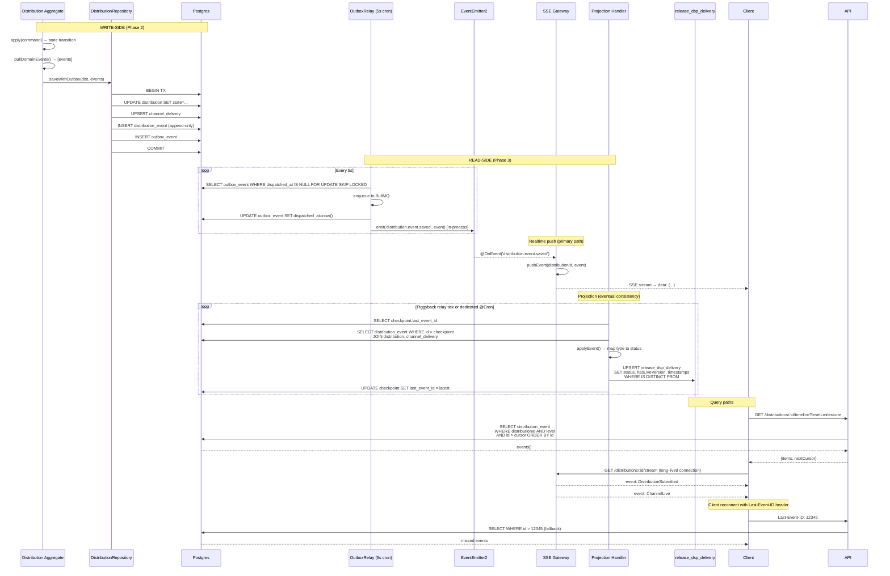

## Architecture Diagram — Phase 3 Timeline + SSE

### Flow giải thích

1. **Write-side (Phase 2):** Aggregate apply → repo saveWithOutbox → INSERT `distribution_event` + `outbox_event` cùng transaction
2. **OutboxRelay (bridge):** Poll outbox 5s → dispatch BullMQ → mark dispatched → **emit EventEmitter2** in-process
3. **SSE realtime (primary):** EventEmitter2 → SSE gateway catches → push to connected clients (<1s latency)
4. **Projection (eventual):** Poll `distribution_event WHERE id > checkpoint` → map event → UPSERT `release_dsp_delivery` status
5. **Query paths:**
   - Timeline API: keyset cursor pagination `WHERE id > cursor`
   - SSE stream: long-lived connection, auto-reconnect với `Last-Event-ID` fallback

### Key components

- **EventEmitter2:** In-process event bus (zero infra, single-instance)
- **SSE Gateway:** `Map<distributionId, Subject<MessageEvent>>` — one Subject per distribution
- **Projection Handler:** Checkpoint-based polling → idempotent UPSERT với `IS DISTINCT FROM` guard
- **Dual-path:** EventEmitter2 (fast) + poll `distribution_event` (fallback reconnect)

### Critical guards

- `response.on('close')` cleanup Subject → prevent memory leak
- `WHERE IS DISTINCT FROM` trong UPSERT → replay event cũ = no-op
- Checkpoint `last_event_id` bigint → at-most-once processing per batch
