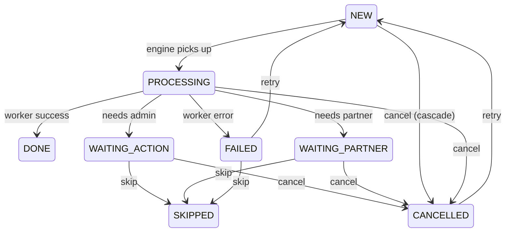

# Cancel / Retry / Skip cho Pipeline Execution

## Tổng quan

Thêm 3 operations cho pipeline execution system:
- **Cancel** — huỷ step hoặc toàn bộ execution
- **Retry** — chạy lại step bị FAILED/CANCELLED (+ các sibling phía sau)
- **Skip** — bỏ qua step đang stuck (WAITING_ACTION, WAITING_PARTNER, FAILED) để pipeline tiếp tục

## Status Transition Rules



> [!IMPORTANT]
> **Quy tắc cascade khi cancel/skip/retry:**
> - **Cancel step** → cancel step đó + toàn bộ children + siblings phía sau (nếu sequential)
> - **Skip step** → chỉ skip step đó (+ children), siblings phía sau vẫn chạy tiếp
> - **Retry step** → reset step đó + children + siblings phía sau về NEW, rồi re-run pipeline

## Proposed Changes

### Service Layer

#### [MODIFY] [release-execution3.service.ts](file:///Users/vinc02/Dev/ag-music-server/src/modules/release/modules/release-executions3/services/release-execution3.service.ts)

Uncomment + sửa `retryStep`, thêm `cancelStep`, `skipStep`, `cancelExecution`:

```typescript
// ========== CANCEL EXECUTION ==========
async cancelExecution(executionId: string): Promise<ReleaseExecution3> {
    const execution = await this.findOne(executionId);

    // Chỉ cancel nếu chưa final
    if (this.isFinalExecutionStatus(execution.status)) {
        throw new Error('Execution already completed, cannot cancel');
    }

    // Cancel tất cả step chưa final
    const allSteps = await this.stepRepo.find({
        where: { releaseExecutionId: executionId },
    });

    for (const step of allSteps) {
        if (this.engine.canOverrideStatus(step.status) 
            || step.status === ReleaseExecutionStepStatus.WAITING_ACTION
            || step.status === ReleaseExecutionStepStatus.WAITING_PARTNER) {
            step.status = ReleaseExecutionStepStatus.CANCELLED;
            step.completedAt = new Date();
        }
    }
    await this.stepRepo.save(allSteps);

    await this.updateExecutionStatus(execution, ReleaseExecutionStatus.CANCELLED);
    return this.findOne(executionId);
}

// ========== CANCEL STEP ==========
async cancelStep(stepId: string): Promise<ReleaseExecution3> {
    const step = await this.findStep(stepId);
    
    // Không cho cancel step đã DONE
    if (step.status === ReleaseExecutionStepStatus.DONE) {
        throw new Error('Cannot cancel a DONE step');
    }

    // Cancel step + children
    await this.engine.cancelStepAndChildren(step);

    // Cancel siblings phía sau (nếu sequential parent)
    await this.cancelSiblingsAfter(step);

    // Refresh execution status
    const execution = await this.findOne(step.releaseExecutionId);
    await this.refreshExecutionStatus(execution);
    return this.findOne(step.releaseExecutionId);
}

// ========== SKIP STEP ==========
async skipStep(stepId: string): Promise<ReleaseExecution3> {
    const step = await this.findStep(stepId);

    const skippableStatuses = [
        ReleaseExecutionStepStatus.FAILED,
        ReleaseExecutionStepStatus.WAITING_ACTION,
        ReleaseExecutionStepStatus.WAITING_PARTNER,
    ];

    if (!skippableStatuses.includes(step.status)) {
        throw new Error(`Cannot skip step with status ${step.status}`);
    }

    // Skip step + children
    await this.engine.skipStepAndChildren(step);

    // KHÔNG cancel siblings phía sau → pipeline tiếp tục
    // Re-run pipeline để pickup step tiếp theo
    await this.runPipeline(step.releaseExecutionId);
    return this.findOne(step.releaseExecutionId);
}

// ========== RETRY STEP ==========
async retryStep(stepId: string): Promise<ReleaseExecution3> {
    const step = await this.findStep(stepId);

    const retryableStatuses = [
        ReleaseExecutionStepStatus.FAILED,
        ReleaseExecutionStepStatus.CANCELLED,
        ReleaseExecutionStepStatus.SKIPPED,
    ];

    if (!retryableStatuses.includes(step.status)) {
        throw new Error(`Cannot retry step with status ${step.status}`);
    }

    // Reset step + children về NEW
    await this.engine.resetStepAndChildren(step);

    // Reset siblings phía sau (nếu sequential) về NEW
    await this.resetSiblingsAfter(step);

    // Reset execution status
    const execution = await this.findOne(step.releaseExecutionId);
    await this.updateExecutionStatus(execution, ReleaseExecutionStatus.PROCESSING);

    // Re-run pipeline
    await this.runPipeline(step.releaseExecutionId);
    return this.findOne(step.releaseExecutionId);
}

// ========== HELPERS ==========
private async findStep(stepId: string): Promise<ReleaseExecutionStep3> {
    const step = await this.stepRepo.findOne({ where: { id: stepId } });
    if (!step) throw new NotFoundException('Step not found');
    return step;
}

private async cancelSiblingsAfter(step: ReleaseExecutionStep3): Promise<void> {
    const siblings = await this.stepRepo.find({
        where: { 
            releaseExecutionId: step.releaseExecutionId,
            parentStepId: step.parentStepId ?? IsNull(),
        },
        order: { order: 'ASC' },
    });
    await this.engine.setRemaining(step, siblings, ReleaseExecutionStepStatus.CANCELLED);
}

private async resetSiblingsAfter(step: ReleaseExecutionStep3): Promise<void> {
    const siblings = await this.stepRepo.find({
        where: { 
            releaseExecutionId: step.releaseExecutionId,
            parentStepId: step.parentStepId ?? IsNull(),
        },
        order: { order: 'ASC' },
        relations: ['childSteps'],
    });
    await this.engine.setRemaining(step, siblings, ReleaseExecutionStepStatus.NEW);
}
```

---

### Engine Layer

#### [MODIFY] [release-execution3.engine.ts](file:///Users/vinc02/Dev/ag-music-server/src/modules/release/modules/release-executions3/services/release-execution3.engine.ts)

Thêm 3 methods public + sửa `canOverrideStatus` thành public:

```typescript
// Make public để service có thể dùng
public canOverrideStatus(status: ReleaseExecutionStepStatus): boolean {
    return [
        ReleaseExecutionStepStatus.NEW,
        ReleaseExecutionStepStatus.PROCESSING,
    ].includes(status);
}

// Cancel step + toàn bộ children
async cancelStepAndChildren(step: ReleaseExecutionStep3): Promise<void> {
    await this.setStepAndChildrenStatus(step, ReleaseExecutionStepStatus.CANCELLED);
}

// Skip step + toàn bộ children
async skipStepAndChildren(step: ReleaseExecutionStep3): Promise<void> {
    await this.setStepAndChildrenStatus(step, ReleaseExecutionStepStatus.SKIPPED);
}

// Reset step + children về NEW (cho retry)
async resetStepAndChildren(step: ReleaseExecutionStep3): Promise<void> {
    step.status = ReleaseExecutionStepStatus.NEW;
    step.startedAt = null;
    step.completedAt = null;
    await this.stepRepo.save(step);

    // Load children nếu chưa có
    if (!step.childSteps) {
        step.childSteps = await this.stepRepo.find({
            where: { parentStepId: step.id },
            order: { order: 'ASC' },
        });
    }

    for (const child of step.childSteps ?? []) {
        await this.resetStepAndChildren(child);
    }
}
```

Cũng cần update `setStepAndChildrenStatus` để handle thêm status WAITING_ACTION / WAITING_PARTNER khi cancel:

```diff
 private canOverrideStatus(status: ReleaseExecutionStepStatus): boolean {
-    return [
-        ReleaseExecutionStepStatus.NEW,
-        ReleaseExecutionStepStatus.PROCESSING,
-    ].includes(status);
+    return ![
+        ReleaseExecutionStepStatus.DONE,
+        ReleaseExecutionStepStatus.SKIPPED,
+    ].includes(status);
 }
```

> [!WARNING]
> `canOverrideStatus` hiện tại chỉ cho override NEW và PROCESSING. Khi cancel, ta cũng cần override WAITING_ACTION và WAITING_PARTNER. Cần quyết định: **mở rộng `canOverrideStatus`** hay tạo riêng `canCancelStatus`.
> 
> **Đề xuất:** Tạo riêng `canCancelStatus` để không ảnh hưởng logic `setRemaining` hiện tại, vì `setRemaining` dùng `canOverrideStatus` cho mục đích khác (cascade khi sequential fail).

---

### Controller Layer

#### [MODIFY] [release-execution3.controller.ts](file:///Users/vinc02/Dev/ag-music-server/src/modules/release/modules/release-executions3/controllers/release-execution3.controller.ts)

```typescript
@Post(':id/cancel')
async cancelExecution(@Param('id', ParseUUIDPipe) id: string) {
    const result = await this.releaseExecution3Service.cancelExecution(id);
    return new ResponseSuccess({ data: result });
}

@Post('steps/:stepId/cancel')
async cancelStep(@Param('stepId', ParseUUIDPipe) stepId: string) {
    const result = await this.releaseExecution3Service.cancelStep(stepId);
    return new ResponseSuccess({ data: result });
}

@Post('steps/:stepId/retry')
async retryStep(@Param('stepId', ParseUUIDPipe) stepId: string) {
    const result = await this.releaseExecution3Service.retryStep(stepId);
    return new ResponseSuccess({ data: result });
}

@Post('steps/:stepId/skip')
async skipStep(@Param('stepId', ParseUUIDPipe) stepId: string) {
    const result = await this.releaseExecution3Service.skipStep(stepId);
    return new ResponseSuccess({ data: result });
}
```

---

### Engine — processStep cần handle SKIPPED

#### [MODIFY] [release-execution3.engine.ts](file:///Users/vinc02/Dev/ag-music-server/src/modules/release/modules/release-executions3/services/release-execution3.engine.ts)

`processStep` hiện tại chỉ skip DONE, cần thêm skip SKIPPED:

```diff
 async processStep({ step: STEP, releaseExecution }): Promise<...> {
     if (STEP.status === ReleaseExecutionStepStatus.DONE) {
         return ReleaseExecutionStepStatus.DONE;
     }
+    if (STEP.status === ReleaseExecutionStepStatus.SKIPPED) {
+        return ReleaseExecutionStepStatus.SKIPPED;
+    }
```

Và `resolveStatusByChild` cần handle SKIPPED:

```diff
+    // SKIPPED — treat as "soft done" for pipeline continuation
+    if (children.every(c => 
+        c.status === ReleaseExecutionStepStatus.DONE 
+        || c.status === ReleaseExecutionStepStatus.SKIPPED
+    )) {
+        return children.some(c => c.status === ReleaseExecutionStepStatus.SKIPPED)
+            ? ReleaseExecutionStepStatus.DONE  // hoặc PARTIAL_DONE tuỳ business
+            : ReleaseExecutionStepStatus.DONE;
+    }
```

## Open Questions

> [!IMPORTANT]
> 1. **Skip behavior**: Khi skip 1 step, pipeline nên tiếp tục chạy step tiếp theo hay dừng hẳn? (Đề xuất: tiếp tục — đây là mục đích của skip vs cancel)
> 2. **Retry scope**: Khi retry 1 step FAILED, có nên reset siblings phía sau không? (Đề xuất: có — vì siblings sau có thể đã bị CANCELLED/FAILED do cascade)
> 3. **SKIPPED trong status derivation**: Step SKIPPED nên được coi như DONE (pipeline tiếp tục) hay như FAILED (pipeline dừng)? (Đề xuất: như DONE — để pipeline tiếp tục)
> 4. **Cancel execution**: Có cần cancel cả CI jobs liên quan không? (Jobs trong `ci_distribution_jobs3` table)

## Verification Plan

### Manual Testing
1. Tạo 1 execution mới → chạy đến step WAITING_ACTION → test cancel step → verify siblings sau bị CANCELLED
2. Tạo 1 execution → force fail 1 step → retry → verify step + siblings reset về NEW, pipeline chạy lại
3. Test skip step WAITING_PARTNER → verify pipeline tiếp tục chạy step tiếp theo
4. Test cancel toàn bộ execution → verify tất cả non-final steps bị CANCELLED
